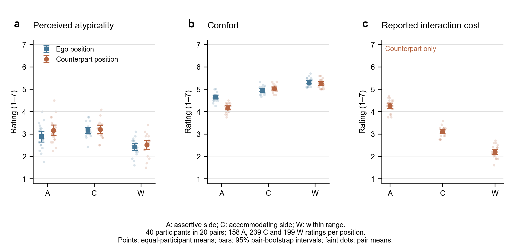
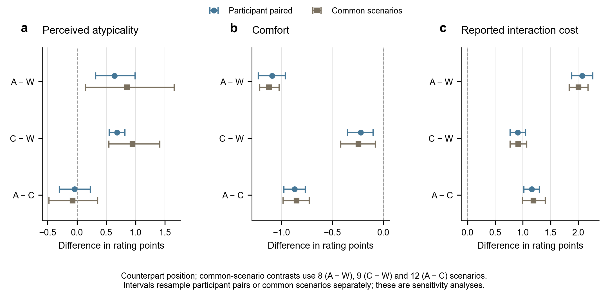

# 主观评价对当前论文的可用结果

本次任务先完整阅读当前论文 `main.tex`，再分析用户确认的最终评分版本。论文现有证据包括条件化人类范围、在线偏离判定、客观交互后果和人类驾驶对照；这批主观评价最适合补充“被监测到的行为差异是否也体现在人的感受中”。分析与提取已完成，以下为候选写作证据，尚未修改论文或任何已接受的决策记录。

**建议主线：在这组选定片段中，两侧越界均对应更高的主观不典型性；舒适性和交互代价进一步区分了越界方向，强势侧的差异更大。** 不应将此改写为“所有越界都是不适宜/有害的”，也不应声称识别了参与者的真实潜在 IPV。

## 1. 数据范围与分析单位

- 唯一研究数据来源：`/Volumes/ZHITAI 2T/.CloudStorage/Data/OneDrive-个人/Desktop/Projects/1_Codes/2_sociality_estimation/data/manually_organized/RQ028_v1_主观评分_20260914`。未读取研究目录中其他数据、旧版本、模型、冻结测试集或外部决策材料，也未用它们补齐缺失定义。
- 40 名参与者、20 对参与者、40 次会话；600 次正式尝试，其中596完成、4中止。完成试次形成1,192份评分：每试次 ego 与 cp 各一份；同一人重复评分，不能写成1,192个独立被试。
- 90个片段、15个场景：A 24片段/158完成试次，C 36片段/239完成试次，W 30片段/199完成试次。来源标签为45个 av、45个 human；每个片段由多名参与者评分，同一人没有重复评价同一片段。
- A/C/W 是刺激类别。`moments.verdict_replayed` 核对表明：A含下侧越界 `below`，C含上侧越界 `above`，W只有范围内与弃权时刻。因此采用论文术语：A=assertive side，C=accommodating side，W=within-range comparison。这是类别映射，不表示片段内每一帧均可判读或均越界。
- 596个 ego 的Q5/Q5b空白为“不适用”，未补零。4次中止未补问卷、未纳入完成试次分析，原始短旋钮序列仍保留。原有纳入标志完整保留。

对应来源：`data/ratings.csv` 的题项、位置及匿名被试/试次键；`segments.csv` 的类别/场景/来源标签；`trials.csv` 的状态与纳入标志；`subjects.csv` 和 `sessions.csv` 的参与者配对与位置。计数详见 `tables/design_counts.csv`。

## 2. 优先用于正文的三个结果

### R1：监测器的类别差异对应人的主观不典型性

Q1反向分数越高越不典型。在cp位置，A−W为+0.639 [+0.318, +0.992]分，C−W为+0.682 [+0.548, +0.817]分。两项通过本次30项探索性对比的Holm校正。共同场景内等权结果同方向，支持把“统计偏离”连接到“感知不典型性”。

ego位置的C−W也有清楚差异；A−W为+0.465 [+0.170, +0.759]，但Holm校正p=0.070，不能写成“A、C在两个视角下均显著更不典型”。不典型性本身仍不等于不接受、不适宜或实际伤害。不要将A/C间Q1的不显著差异解释为等效。

### R2：强势侧的主观交互代价更大，且舒适性更低

这是本包最适合展开的结果。cp位置相对W，A的舒适性低1.091分，交互代价评分高2.070分；直接与C比较，A的舒适性差-0.870 [-0.974, -0.766]，代价差+1.163 [+1.019, +1.300]。ego的舒适性也保持A低于C/W的方向。

共同场景内，cp舒适性A−W在8/8个场景为负，代价A−W在8/8为正；A−C的cp舒适性在12/12为负、代价在12/12为正。分子/分母来自 `tables/common_scenario_source.csv` 中相应metric、seat=cp和contrast的 `difference` 符号计数；每个场景先对片段等权，再对场景等权。来源标签分层及保留/去除alt27敏感性中，核心方向保持。

Q5完整题干及端点未附，因此可以保留“交互代价评分”这一已有定义，不能自行把它拆解为刹车代价、时间损失、风险或社会伤害。

### R3：过度礼让侧也存在较小的主观代价

cp位置C−W的舒适性差为-0.221 [-0.351, -0.100]，交互代价差为+0.908 [+0.771, +1.051]。ego舒适性差为-0.359 [-0.464, -0.255]。共同场景内这些方向保持。

这一结果能够补充当前论文中“礼让侧未检测到客观交互后果特征”的表述：现有客观指标未区分的行为，在本实验评分中仍可能对应感受差异。两项研究不是已核验的一一对应片段，也不是同一终点，故只能作为互补证据，不能据此宣布推翻既有结果或证明因果机制。

## 3. 可直接引用的数值表

以下均为cp位置、1–7分题项。A−W/C−W/A−C的正负意义随题项而变：Q1、Q5越高分别表示更不典型、更高的既有代价评分；Q4越高越舒适。

|指标（对方位置）|对比|平均差 [逐项95%区间]|Holm校正 p|共同场景内平均差|
|---|---|---:|---:|---:|
|不典型性 Q1|A-W|+0.639 [+0.318, +0.992]|0.0245|+0.850（8个场景）|
|不典型性 Q1|C-W|+0.682 [+0.548, +0.817]|1.99e-07|+0.949（9个场景）|
|舒适性 Q4|A-W|-1.091 [-1.226, -0.961]|6.11e-11|-1.120（8个场景）|
|舒适性 Q4|A-C|-0.870 [-0.974, -0.766]|5.18e-11|-0.851（12个场景）|
|舒适性 Q4|C-W|-0.221 [-0.351, -0.100]|0.0342|-0.245（9个场景）|
|交互代价 Q5|A-W|+2.070 [+1.885, +2.263]|3.95e-13|+2.005（8个场景）|
|交互代价 Q5|A-C|+1.163 [+1.019, +1.300]|6.93e-11|+1.191（12个场景）|
|交互代价 Q5|C-W|+0.908 [+0.771, +1.051]|3.49e-09|+0.915（9个场景）|

主分析先计算每位参与者在各类别内的均值，再作同一人的类别差，最后等权平均40人。95%区间以20对参与者整组重抽样10,000次；p值由20对内平均差的一样本双侧t检验（df=19）产生，对完整30项题项×位置×类别对比作Holm校正。区间为逐项区间，并非同时置信区间。它们条件于选定刺激集，不囊括未来场景或刺激抽样的不确定性。所有30项结果都已保留，未只提取显著项。

共同场景分析先平均同一片段的评分，再在场景内平均同类片段，最后对两类都存在的场景等权求差。A−W/C−W/A−C分别有8/9/12个共同场景。其区间单独重抽样场景，条件于现有评分者；它是组成敏感性核对，不是对参与者和刺激同时建模的联合区间，也不是独立实验复现。

## 4. 适合补充材料或暂缓写入的结果

|项目|用途|当前边界|
|---|---|---|
|Q3可预测性|A/C相对W均为较低分，可作支撑性题项|完整题干和端点缺失，先按“Q3可预测性评分”记录，暂不扩展为不可预测风险|
|Q2让行倾向|C相对A更偏让行，支持两侧感知差异|A相对W未显示明确更强势的评分差异；不能说两侧方向均已校准或IPV已获心理真值验证|
|Q5b自然程度|保留全部描述性及对比结果|未检出明确差异不等于自然程度相同、非劣或不可区分|
|av/human来源标签分层|核心Q1/Q4/Q5关系方向一致|只有包内标签，不能用于车辆优劣排名或识别来源的准确率|
|连续旋钮事件响应|已提取1,192条完整事件窗数据、类别汇总和共同场景敏感性|量尺含义、标准化方法不全，暂不称为即时不适、负担或偏好|

旋钮分析用原`t_since_onset`（先四舍五入至6位以消除采样边界浮点误差），比较[-2,0)与[0,2)秒的`dial_z`均值；每窗20点。W的伪起点附近也有升高，必须用A−W/C−W变化差而非单组前后差。8个三类共有场景内，按片段再按场景等权，A−W为+0.567，8/8场景为正；C−W只有+0.099，4/8为正、区间含零。分子/分母对应 `tables/dial_common_scenario_source.csv` 的A-W/C-W列差。不能据总体C−W结果推出跨场景规律，也未验证预警延迟、反应时间或持续不适。

## 5. 写入论文前需要补全的说明

这是材料补全清单，不阻止本次候选结果提取：

1. 主观研究自身的完整问卷、回答对象、两位置说明，尤其Q3/Q5/Q5b和旋钮端点；不可把舒适/不典型题当作已直接测量“接受度/偏好”。
2. 主观研究的招募、实验装置、练习/分配/顺序规则、实际伦理和知情同意范围。本包不能证明这些内容；不得套用论文现有20名驾驶员实车研究的协议。
3. 片段标签与论文中部署的同一个冻结监测器之间的版本关系、刺激选择规则。本次只在包内核对标签一致性，不越界读取旧数据，也没有重跑监测器。
4. 论文级推广如需同时覆盖新评分者与新刺激，需明确相应模型和推断目标；本次不把有限刺激上的配对区间夸大为普遍保证，也不宣称预注册。

文件核验：8个数据文件以及字段字典均匹配所附清单哈希。当前README与清单中的旧哈希不一致，清单列出的`metadata/dataset.json`不在当前文件夹内；已记录，未自行恢复。这是说明文件完整性问题，不改变用户对最终数据版本的确认，也没有据此改动评分。

## 6. 交付内容与检查

- `tables/paper_core_results.csv`：正文优先结果及图表映射。
- `tables/ratings_analysis_rows.csv`：1,192行可复算合并表，保留匿名键、原题项与条件空白。
- `tables/rating_descriptives.csv`：原始均值/标准差/分位数、等被试均值和区间。
- 其余CSV：完整30项对比、来源分层、共同场景、alt27敏感性、旋钮窗口和计数/哈希核验。
- `论文候选文字.md`：英文Results、统计方法、图注及明确缺项。
- `论文衔接位置.md`：当前稿件精确插入位置及需要同步处理的文字。
- `figures/`：两张候选图，各含PNG/PDF/SVG；源数据映射见`figure_manifest.csv`。
- `process/`：可复算代码、运行环境、检查结果及图形QA；全部来源读取均受本文件夹白名单限制。

已独立重算全部30项主要对比及其检验/区间、30项共同场景均值和60项来源分层均值；数值一致。分析是探索性二次提取，未把描述性关联写成因果结果。原始8个数据文件、论文正文和已冻结决策均未修改；本次没有提交、推送或发布。
