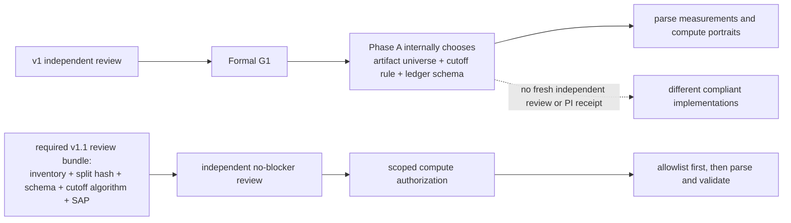

# RQ015A v1 独立技术复审——Reviewer 1

## Review setup

- 复审对象：`reports/plans/RQ015A_plan_v1_attempt_status_and_weight_concentration_audit_20260726.md`
- 冻结 SHA-256：`3c77f9713153a22772d92adfa7841f48a919ba10782b15baea3ecdc3e6367b04`（现场复算一致）。
- 基线 manifest：`reports/plans/RQ015A_plan_v1_checksums_20260726.sha256`，现场执行 `shasum -a 256 -c` 得到 **6/6 OK**。
- 复审日期：2026-07-26。
- 评审重心：technical soundness / technical failings；同时简要覆盖 originality、significance、interdisciplinary interest 和 readability。
- 独立性声明：本路未读取 Reviewer 2 / Reviewer 3 的 RQ015A v1 复审文件，也未与其他 Reviewer 交换判断。只使用冻结 v1、v0 综合/本 Reviewer 历史意见、已披露的 sealed 裁定、RQ007 绑定合同与相关一手 schema/产出代码。
- 评审边界：这是计划与可执行性复审，不是结果复审。全程本地只读；未触发 RQ015A 画像、未读取新的 held-out 测量列、未改估计器/数据/状态文件，未连接 HPC。

## Overall assessment

**Verdict: `BLOCKED`**

**Finding counts: 4 blocker / 4 major / 2 minor.**

- `formal_g1_eligible=false`
- `execution_authorized=false`

v1 已经修复了 v0 最重要的中心错误：它不再把 `K_eff` 单项称为 estimability，不再以 `ESTIMABLE / NOT_ESTIMABLE` 回答“是否测出 IPV”，而是收窄为“是否尝试估计 + 候选权重是否集中”（计划 `:14-40`）。它也用 `K_eff/K` 消除了 v0 在小 K 上的标签区间重叠，改用精确边界（`:42-69`），明确承认 sealed-informed cutoff 历史并降级为占位值（`:77-88,107-125`），还显式记录了 M3 的三倍计数陷阱与 WOD 的 `ipv_error` 缺失（`:90-105`）。这些都是实质修正，不是只换了措辞。

但 v1 仍未将中心交付物变成唯一算法。它把“阈值导出规则、权威输入宇宙、逐产物 D0 时钟、normalized ledger schema、case/perspective/configuration 聚合、variable-K 加权”都留到 Phase A 内部再冻结，却没有一个“冻结后、解析测量列前”的重新复审/授权闸。因此，按现文进入 Formal G1 后，执行者仍可在不违反文字的情况下选择不同分位点、不同配置/产物、不同 OnSite 序号和不同 episode 权重，得到不同画像。

## What v1 has genuinely closed

| v0 gate | v1 判定 | 理由 |
|---|---|---|
| 构念越界：`K_eff-only = estimability` | **CLOSED** | 标题、RQ、标签、下游措辞均收窄为 attempt + weight concentration（`:14-40,157-170`），符合 RQ007 对 concentration-only 较弱诊断的命名限制（`binding_execution_contract.md:53-81`）。 |
| K 较小时两档重叠；`0.61` 近似实现 | **CORE CLOSED / residual major** | `c` 的三区间在占位阈值下互斥，并明确要求精确式（`:46-69`）；但 invalid 域、阈值重导出后的顺序不变式和 K=1 语义未闭合。 |
| sealed 历史暴露未裁定 | **PI DECISION CLOSED / record residual major** | 两侧 disclosure 字节一致，SHA-256 均为 `e691d046...020238`，且有明确 PI 判读 A 和附加条件（`sealed_exposure_disclosure_20260726.md:62-84`）。但“未读取逐行值”的字面表述及 RQ007 `decision.md` 仍称 untouched 需做可审计订正。 |
| M3 alpha/nominal 三倍计数 | **PARTIALLY CLOSED** | 计划已冻结 anchor key 并明令去重（`:94-99`）；但 predictions 无 `ipv_error`，其与 feature matrix 的 target measurement 角色、1:1 join 和行守恒仍未定义。 |
| 下游 damage 预判 | **CLOSED** | 改为 exposure / qualification risk，并把任务级重估留给 owning RQ（`:157-170`）。 |
| OnSite D0、ledger、case/K-aware 聚合、SAP、C0 rubric | **OPEN** | 见 B2–B4 与 M3–M4。 |

## Why the current authorization sequence is not fail-closed



“先冻结，后计算”只有在冻结物被 checksum 绑定、独立复审且有下一步授权回执时，才能关闭自由度。当前 `:83-88,101-105` 只要求执行者在 Phase A 内先冻结，并未要求新冻结物回到这一复审闸。

## Blocking technical concerns

### B1 — 两条中心阈值的导出算法、输入宇宙和 split 角色都未冻结（blocker）

计划把 `4/7` 和 `0.93` 明确降级为占位值，要求 Phase A 在 dev+guard 上“重新导出” `c_lo/c_hi`，并称导出规则将事先冻结（`:60-61,77-88`）。但文件没有定义：

1. 是取什么统计量（指定分位点、混合模型分界、固定暴露比例、还是其他目标）；
2. 是以 measurement 等权、case 等权、case-perspective 等权，还是按数据源/配置分层；
3. 用 development 拟定、guard 只复核，还是把两者合并后同时拟定；
4. 使用哪个权威产物、哪个 measurement role、哪个 history window/sigma/grid。不同估计器配置的 `c` 分布本来就可能不同；
5. ties、non-finite、K unknown、小层样本、二进制浮点量化和 `0 < c_lo < c_hi <= 1` 的失败条件。

更重要的是，“dev+guard”是 RQ007 InterHub case split，而计划的跨产物宇宙同时包含 RQ009、OnSite 和 WOD（`:90-100`）。非 InterHub 产物不属于这个 split；但 `:124-125` 又说“本 RQ 最终画像”一律只在 dev+guard 上计算。现文因而无法判定：非 InterHub 是被排除，还是以 `RQ007_SPLIT_NOT_APPLICABLE` 身份接受已冻结阈值的外推审计。

RQ007 的权威 split 明确把 development 用于 candidate design/threshold exploration，guard 用于 freeze 前 sanity check，held-out 仅作一次确认（`reports/studies/RQ007_interaction_conditioned_ipv_estimability/RQ007_1_ipv_estimability_20260622T155229Z_289d9a99/02_process/00_meta/split_freeze.json:76-114`）。RQ007 合同还要求 concentration threshold 与 estimator sigma 分开并仅在 development/guard 上选择（`binding_execution_contract.md:29-38`），且对 RQ007 thresholding 明确禁用 RQ009 下游产物（`:41-51`）。当前 v1 没有说明此次为修复 RQ007 sealed provenance 而重导出的边界，是否仅使用上游 RQ007 primary InterHub 产物，也没有说明为何可以在多配置之间共用一对阈值。

**必须关闭：** Formal G1 复审包内必须直接包含 checksum-frozen 的 cutoff algorithm：权威 input path+SHA、split allowlist path+SHA、measurement role/configuration/K 域、精确统计函数、case/perspective 权重、dev/guard 角色、ties/missing/invalid 规则、阈值顺序不变式及敏感性网格。必须明确区分 `threshold_derivation_scope` 与 `audit_application_scope`；后者中的外部产物不得伪装成 RQ007 dev/guard。导出规则及输入 manifest 需在解析任何 IPV/error 测量列前重新独立复审。

### B2 — OnSite/WOD 的 attempt-status 时钟仍是待定义任务，不是冻结合同（blocker）

v1 正确删除了“所有产物都用源 `frame_index<4`”的通用规则，并明令 OnSite 使用估计器局部序号（`:90-100`）。但同一行又写“逐产物冻结”和“局部序号定义须在 Phase A 前确认”，WOD 更是判据、键和单位全部待定。这些字样是 closure checklist，还不是可实现合同。

OnSite 一手生成链说明“局部序号”必须精确到过滤和排序顺序：

- 生成器在原始序列上 `enumerate`，但当指定 counterpart 缺席时跳过该帧，随后再按 `timestamp_ms, frame_index` 排序并 reset index：`reports/studies/RQ012_onsite_event_annotation_readiness/RQ012B_2_harm_association_20260627T095847+0800_8454ad93/02_process/03_event_deviation/hpc_onsite_ipv/build_onsite_m3_anchors_hpc.py:494-532`。
- `estimate_ipv_pair` 在这个已过滤 dataframe 的数组位置上以 `min_observation=4` 开始：同文件 `:713-736`；核心估计器也是先创建默认数组，再从局部 `t=min_observation` 循环：`src/sociality_estimation/core/ipv_estimation.py:247-272`。
- 交付表写回的却是 `row.frame_index`，没有保存 estimator sequence position：`build_onsite_m3_anchors_hpc.py:1045-1090`。

因此，当 counterpart 中途缺帧或 timestamp 排序改变顺序时，源 `frame_index` 与估计器局部位置可以不同。仅写“用局部序号”不足以决定是在过滤前还是过滤后计数、何种排序是权威、重复 timestamp 如何处置。同时，计划 `:84-86` 的阈值任务又重新使用通用 `frame_index >= MIN_OBSERVATION`，与自己的 OnSite 修正并不自动相容。

**必须关闭：** 每个产物冻结 `sequence_id`、排序键、过滤时点、`estimator_sequence_position`、producer `min_observation`、断帧/重复/重启规则和 `NOT_ATTEMPTED / ATTEMPTED_VALUE_AVAILABLE / ATTEMPTED_VALUE_UNKNOWN_OR_INVALID` 的正交状态。OnSite 必须有一个 source-frame 与 retained-sequence 不同的 fixture，验证前四个保留位置而非源帧号被分流。WOD 不可在 Formal G1 后由执行者现场选择主键/时钟；不可恢复时应 fail closed 为 `attempt_status=UNKNOWN`。

### B3 — `concentration_ledger` 仍无 schema、measurement-role crosswalk 和可成立的守恒式（blocker）

v1 明确说 ledger 必须“先冻结 schema，再打标”，但只列出要冻结的类别，没有真正的字段表、主键、枚举、单位或验收器（`:101-105`）。中心行守恒被写成“输入行数 = 各终态行数之和”，但一个物理输入行可包含多个测量，而 M3 又要把三个 prediction row 压成一个 measurement。在未先定义 normalized measurement candidates 之前，该守恒式不可满足。

已冻结产物证明这不是抽象风险：

- RQ009 feature matrix 同时含 current counterpart、future target 和 M4-only current ego 三种不同 measurement role：`reports/studies/RQ009_dynamic_counterpart_conditioned_envelope/RQ009_1_dynamic_envelope_20260625T121905Z_98c433de/02_process/03_features/feature_dictionary.csv:52-60`。其中 `target_ipv_future` 是 `t*+6`，因此 M3 测量的 attempt frame 不能只凭 prediction 的 `anchor_frame_index` 猜测。
- M3 prediction manifest 明示 calibration 的每个 tier 有 `1,266,282` anchors 但 `3,798,846` rows，alphas 为 80/90/95：`data/derived/interhub/RQ009_dynamic_counterpart_conditioned_envelope/RQ009_1_dynamic_envelope_20260625T121905Z_98c433de/04_calibration/prediction_manifest.json:40-49`。prediction 表本身不含 `ipv_error`，必须连回 feature matrix 的 `target_ipv_error_future`；计划未冻结连接键、卡尔性、三行中不一致时的 fail-closed 规则。
- OnSite 交付行同时有 `ego/counterpart x hw10/hw4` 四套 IPV/error：`build_onsite_m3_anchors_hpc.py:1083-1090`。
- RQ007 绑定合同要求每个 result artifact 声明 `concepts_measured`，且 current IPV、concentration index、opportunity、estimability 和 dynamics 不得混淆：`binding_execution_contract.md:53-69`。v1 的 ledger 验收中未包含此字段或 `g_i(t)=NOT_MEASURED` 声明。

源数据权威也未冻结。例如 RQ009 hw4 时序已有可用 SHA-256 `cf970f01...fd34fc`（`target_hw4_manifest.json:29-35`），RQ007 split assignment 也已存在且现场复核 SHA-256 为 `90d8bb91e68f9b5e0596cf1ae915eb22b01a5c4ccffbad00c0b446efa46d537d`；但 v1 的 6 项 checksum manifest 没有绑定这两个实际执行输入（`reports/plans/RQ015A_plan_v1_checksums_20260726.sha256:1-6`）。

**必须关闭：** 在 Formal G1 前冻结 machine-readable inventory 和 versioned long ledger schema。唯一键至少应覆盖 `artifact_id, case, estimator_sequence, source_position/anchor, perspective, measurement_role, configuration/window, estimator/grid version`；`attempt_status`、`concentration_class`、`feasibility_level`、`value_validity`、`rq007_split_scope`、`sealed_excluded` 必须正交。必须分别记录 `source_physical_rows`、`normalized_measurement_candidates`、`intentional_duplicate_rows`、`unmapped/invalid`、`terminal_ledger_rows`，再对后四者写成可机器验收的守恒式。InterHub/RQ009 必须先仅按 case ID 建 dev/guard allowlist，确认 held-out/unmapped/duplicate 全为 0，再解析 IPV/error 列。

### B4 — case/episode 口径与 concentration weighting 仍不可实现（blocker）

v1 要求 case 级报告 `CONCENTRATED` 计数、零计数 case 比例和 case 内比例分布（`:138-143`），并要求“沿用并扩展 RQ007-KC-C3 的加权”，对比仅 `CONCENTRATED` 帧与集中度加权摘要（`:151-155`）。但未定义：

- case 是两个 perspective 合并、分别报告，还是要求两者都满足；
- hw4/hw10、current/future/M4-only 不同 configuration/role 是分开还是合并；
- 帧等权、时间等权还是 case 等权，不同采样率和 case 时长如何处理；
- 零 `CONCENTRATED` 帧、K unknown、weight sum=0 时如何交付 episode IPV；
- 新的 normalized metric 如何转换为权重，是 `1-c`、其他单调函数，还是限定在 K=7 上原样复现 RQ007。

RQ007 原始方法的单位是 **case-agent**，并明确使用七候选的
`C_max = 1 - 1/sqrt(7)` 与 `w_i(t)=max(C_max-c_i(t),0)`：`reports/studies/RQ007_interaction_conditioned_ipv_estimability/RQ007_1_ipv_estimability_20260622T155229Z_289d9a99/02_process/07_summary_sensitivity/summary_sensitivity_method.md:15-31`。此处 RQ007 的 `c_i(t)` 是原始 `ipv_error`；v1 却把符号 `c` 重新定义为 `K_eff/K`（计划 `:50-57`），而且允许逐行 K 变化（`:64-69`）。“沿用并扩展”既没有定义新公式，还存在直接把两种 `c` 符号混用的实现风险。

**必须关闭：** 冻结至少三层单位：measurement、case-perspective-configuration、case-configuration，每层的 denominator、合并顺序、minimum support、missing/unknown 和 case-clustered uncertainty 都必须明确。对“只保留 `CONCENTRATED`”与“连续加权”分别冻结精确函数、K 域、零分母和时间采样规则，并以手工 fixture 校验。这是新 sensitivity definition，不得在公式未冻结时简称“沿用 RQ007”。

## Major concerns

### M1 — sealed 裁定已作出，但历史记录的字面事实与 RQ007 source-of-truth 仍未自洽（major）

本 Reviewer 不重新裁定 PI 的判读 A。disclosure 已如实承认对全部 38,228 case 的主表做过多轮全表扫描，并计算 IPV/error 比例、分层与 case 级计数（`reports/knowledge/RQ015A_ipv_estimability_labelling/sealed_exposure_disclosure_20260726.md:7-29`）；PI 已明确采用 A、记录豁免，要求从 dev+guard 重导出阈值（`:62-84`），且 RQ007 知识层同步副本与本 RQ 字节完全一致。

但两点仍需订正：

1. disclosure `:21-22` 和计划 `:115-116` 写“未读取任何 held-out 逐行测量值”，而已冻结扫描脚本实际逐行解析 IPV/error 列后聚合（`reports/plans/prompts/RQ015_portrait_scan_v1.sh:6-18`）。可支持的精确表述是：**程序解析过 held-out 逐行值，但未打印、导出、落盘或人工查看单行记录；PI/作者暴露形式仅为聚合量**。“程序解析”与“人工看到”必须分开。
2. RQ007 现行 `decision.md` 仍在状态与边界中声称 held-out “sealed / untouched”，并把 held-out confirmation 以 untouched 为由列为待定（`reports/knowledge/RQ007_interaction_conditioned_ipv_estimability/decision.md:1-7,18-30`）。同步 sidecar disclosure 可以保留历史原文，但 RQ007 的 source-of-truth 必须有明确 superseding pointer，否则未来执行者可合理地读到两个相反状态。

**要求：** 保留 PI 判读 A，但将暴露事实改为上述精确表述，并在 RQ007 的权威索引/决策状态中加入指向该 disclosure 和 PI 豁免的 append-only 补充说明。v1.1 的执行 manifest 必须绑定 split assignment SHA，验收必须有 `held_out_measurement_rows_parsed_in_new_run = 0`，而不只是“sealed 未进入结论”。

### M2 — 新 `c` 是“有效候选数占比”，符号和命名反向且数值域未闭合（major）

对有限、非负、归一化权重，计划的代数成立：

```text
e = ipv_error = 1 - sqrt(sum(w_i^2))
K_eff = 1 / sum(w_i^2)
r_eff = K_eff / K
```

但 `K_eff/K` 越大表示权重越接近均匀，它更准确的名称是 `effective_candidate_fraction` / normalized effective support，而不是直觉上“越大越集中”的归一化集中度。同时 RQ007 已用 `c_i(t)` 表示原始 `ipv_error`（`binding_execution_contract.md:53-61`）；v1 再用 `c` 表示一个非线性变换后的新量，已在 B4 的加权复用中产生真实混淆风险。

计划所称 `c in (0,1]` 仅在 `K` 为正整数、`e` 有限且位于理论域 `[0, 1-1/sqrt(K)]` 时成立。legacy 估计器的 warm-up 行实际预填 `IPV=0,error=1`（`src/sociality_estimation/core/ipv_estimation.py:247-272`），只有 D0 正确先分流才不会除以 0；计划没有为 attempted 行中的 NaN/inf、超理论域 error、K 非整数/重复 grid 和浮点容差冻结 fail-closed 分支。此外，K=1 会必然得到 `r_eff=1`，但单一候选不能提供“多候选之间接近均匀”的证据，不应无条件并入 `NEAR_UNIFORM`。

**要求：** 将新量改名为 `k_eff_ratio` 或 `effective_candidate_fraction`，保留分档名 `weight_concentration_class`；不得与 RQ007 `c_i(t)=ipv_error` 复用符号。冻结支持的 K/grid 集合、`K>=2` 或 singleton-unknown 规则、理论域与容差、阈值顺序验证及所有 invalid reason codes。

### M3 — “不主要由接近程度决定”与 RQ007 冻结结论相反，相关因素分析也仍无 SAP（major）

v1 `:145-149` 写“先验证据显示集中度不主要由接近程度决定”，给出的理由只是 `<5m` 行占总帧的 3.8%。这个边际占比不能判断 proximity 对 concentration 差异的解释份额；而 RQ007 冻结 C1 明确写“most of the gap is spatial proximity”，总差约 `-0.13`、proximity 部分约 `-0.096`（`reports/knowledge/RQ007_interaction_conditioned_ipv_estimability/decision.md:10-16`）。在没有新的反证分析前，v1 不能以一个边际比例推翻这一已接受的有边界结论。

此外，“候选因素”列表未定义 primary descriptive endpoint（continuous `k_eff_ratio` 还是三档）、当前/历史可用性、单变量与多变量模式、case 内重复、source/configuration 混杂、missingness、minimum stratum n、多重性、effect-size/interval 和 dev/guard 复核角色。“探索性、不下因果结论”是必要边界，但不能代替可复现分析合同。

**要求：** 删除或降级“proximity 不是主要因素”的预置结论，将 RQ007 C1 作为需被复现/质疑的基线。若保留 §5.3，须冻结轻量 SAP：以 development 作描述/选择、guard 作一次 case-blocked 复现，按 source x configuration 分层，报告 effect size、case-clustered interval、missing/unknown 和不支持结论的判据。

### M4 — C0 三档“资格风险”没有确定性 decision rubric（major）

v1 正确地禁止在未做任务级重估前声称下游“受损”，并要求对六个 RQ 记录真实分析单位、暴露度、estimand 变化和选择偏差风险（`:157-170`）。但没有定义何时必须判为：

- `低资格风险`；
- `存在资格风险，需任务级重估`；
- `不适用`。

尤其没有 `UNKNOWN_REQUIRES_OWNER_REVIEW` / insufficient evidence 分支：当 ledger coverage 低、K 不明、WOD error 丢失或无法评估 selection-outcome dependence 时，强迫三选一会把缺证据误写成低风险或不适用。

**要求：** 冻结 machine-readable C0 rubric，至少包括 `downstream artifact/version, analysis unit, IPV measurement role, ledger coverage, K-known share, unknown share, concentration support by required stratum, estimand/exposure changed, selection dependence assessable, required sensitivity/control, owner action, qualification, reason_code, evidence file:line`。每个终态要有必要/充分条件与 UNKNOWN 路径，且不得自动修改 owning RQ 的 `decision.md`。

## Minor concerns

### m1 — “全文无 estimability”是字面上不可通过的验收条件（minor）

验收写“全文无 estimability”（`:183-185`），但计划为了陈述禁令和边界，已经在 `:16-29,73-75,187-192` 多次合理地使用该词。这会使纯文本 validator 永远 FAIL。应改为：“任何输出 label、图表标题、结论或 metadata 均不得把 concentration-only 解释为 estimability；边界/禁令说明中的否定性使用除外。”

### m2 — 交付合同未把机制图、连续分布与分母/不确定性写成硬验收（minor）

v0 综合审查已给出有针对性的图文套件：mechanism diagram、`source x feasibility` 计数/比例堆叠图、按配置分面的 continuous `K_eff` ECDF/密度、case-perspective 内比例完整分布、带 n 和 case-clustered interval 的分层热图以及下游 evidence-to-decision matrix（`reports/knowledge/RQ015A_ipv_estimability_labelling/reviews/rq015a_three_reviewer_synthesis_v0_20260726.md:162-174`）。v1 只写“画像+分层+有界报告”（`:172-181`），验收也没有要求每张主图的 numerator/denominator、case/perspective/configuration n、unknown 份额、interval 和负对照。建议将这六类图表及字段加入交付/验收，以避免最终报告只有若干百分比而不能解释机制。

## Technical failings that must be addressed before the case is established

| ID | Severity | 技术失败 | 可验收关闭条件 |
|---|---|---|---|
| B1 | blocker | cutoff 重导出无算法、权威输入、split 角色和重复审闸 | 冻结 cutoff spec + input/split hashes + derivation/application scopes，解析测量列前重新独立复审 |
| B2 | blocker | OnSite/WOD attempt clock 和终态仍是“后续确认” | 逐产物冻结 retained-sequence 合同、D0/unknown/invalid 状态与 fixtures |
| B3 | blocker | ledger 无实际 schema/role crosswalk，物理行守恒不成立，执行输入未绑定 | 冻结 long schema、唯一键、M3 join/cardinality、normalized measurement 守恒和 case-first sealed allowlist |
| B4 | blocker | case/perspective/configuration 聚合、variable-K 权重和零分母未定义 | 冻结三层单位、精确摘要公式、sampling weights、minimum support、unknown/零分母和 fixture |
| M1 | major | sealed disclosure 的“未读逐行值”与脚本事实不精确，RQ007 decision 仍称 untouched | 精确区分程序解析与人工暴露；RQ007 source-of-truth 加 superseding pointer；新运行 held-out parse=0 |
| M2 | major | `c` 符号冲突、方向命名不直观、invalid/K=1 域未闭合 | 改名 `k_eff_ratio`，冻结支持 K/grid、理论域、容差、singleton/invalid 路径 |
| M3 | major | 预置“proximity 不主要”与 RQ007 C1 相反，因素分析无 SAP | 撤回预判，冻结 development/guard、case-blocked、source/config-aware 的轻量 SAP |
| M4 | major | C0 三档无确定性 rubric 与 UNKNOWN 分支 | 冻结输入字段、必要/充分条件、reason code、owner action 和不足证据路径 |

## Assessment against Nature-style criteria

| Axis | Assessment |
|---|---|
| Originality | **Moderate, bounded.** 把多种历史 IPV 产物展开为正交的 attempt-status / concentration / feasibility ledger，并系统处理 variable K，有内部方法学新意。但 concentration index、`K_eff` 和 episode sensitivity 的核心原理已存在于 RQ007/RQ015B，不应包装为新的行为真值发现。 |
| Scientific importance / significance | **High internal importance; external significance not yet established.** 它能防止多个下游 RQ 把默认 0、近均匀权重和真实估计混淆，对论文的测量边界重要。它不验证 IPV 准确性、行为真值或部署效果，应保持为描述性 measurement audit。 |
| Interdisciplinary readership | **Potentially broad after translation.** “默认输出不是测量”、“候选权重集中不等于正确”、“筛选会改变 estimand”对参数识别、逆向规划和计量测量学都有共性；但当前交付仍过度依赖 RQ 编号和内部字段。 |
| Technical soundness | **Not established.** 构念和精确边界的修正是正确的；但阈值算法、产物时钟、ledger 单位和 episode 聚合仍未唯一，直接影响中心数字。 |
| Evidence / reproducibility | **Strong raw basis, incomplete execution contract.** 权威 split、InterHub input hash、M3 manifest、OnSite producer 和 sealed disclosure 均已存在；问题是 v1 尚未把它们纳入同一个 checksum-frozen 执行包和机器 validator。 |
| Readability for nonspecialists | **Much improved, still not standalone.** v0 最危险的“集中度 = 测出 IPV”已被清楚否定。但新 `c` 与 RQ007 `c_i(t)` 符号冲突，且计划未把 mechanism diagram、宽表到 ledger 的单位示意图和连续分布图写成硬交付。 |

## Who would be interested in the results, and why

- 自动驾驶与人–机交互研究者：可区分“输出是 0”、“未尝试估计”和“当前候选权重近均匀”。
- 逆向规划、参数识别和不确定性研究者：可把它视为 effective-support diagnostic 与测量成功不等价的案例。
- RQ003 / RQ009 / RQ010B / RQ011B / RQ012B / RQ014 的 owning analysts：可用资格矩阵判断是否需要任务级重估，而不是由 RQ015A 代为宣布原结论失效。

## Minimum revision needed for a fresh review

下一版不应再只写“在 Phase A 前冻结”，而应把下列文件直接纳入新的 checksum manifest 并接受独立复审：

1. authoritative artifact inventory：path/hash/producer/version/configuration/measurement roles/K/grid/min-observation/split scope/expected rows；
2. `concentration_ledger.schema.json` + measurement-role crosswalk + 唯一键 + 守恒 validator；
3. `cutoff_derivation_contract.yaml`：权威输入、case-first allowlist、exact algorithm、split roles、不变式与敏感性；
4. OnSite retained-sequence / M3 join+dedup / WOD unknown 的逐产物执行合同与 fixtures；
5. case/episode summary specification、因素 SAP 和 C0 decision rubric；
6. scoped operation spec：operation ID、exact command/environment、read-only input hashes、output root、validate-only、no-overwrite、single-use receipt 和 machine-readable PASS/FAIL validator；
7. RQ007 disclosure/decision 的 append-only superseding pointer 与精确暴露措辞。

这些冻结物通过重新独立复审前，仅允许只读 metadata/schema/case-ID inventory；不应授权新的 IPV/error 列解析、阈值导出、最终画像或 C0 分类。

## Risk / unsupported claims

- 不能由 attempt status 或 `K_eff/K` 单独证明“测出/没测出 IPV”；v1 已正确收窄，应继续保持。
- 不能由近均匀权重区分 numerical underflow、当前 grid/model 下平坦、model misfit 或 solver/input failure；该分拆属 RQ015B。
- 不能把尚未定义导出算法的 `c_lo/c_hi` 称为 dev/guard-derived boundary。
- 不能把 RQ009 hw4 配置的画像泛化为 sigma01 hw10、OnSite 或 WOD 的共同分布。
- 不能以 `<5m` 帧只占 3.8% 推出 proximity 不是集中度差异的主要解释因素；该表述与 RQ007 C1 的已接受边界相反。
- 不能在 C0 rubric 未冻结、owning RQ 未重估时，把 concentration exposure 转译为原结论 damage/validity failure。
- PI 判读 A 可作为治理裁定继续保留，但不能继续使用“程序未读逐行值”这一与扫描实现不精确的事实描述。

## Final recommendation

**`BLOCKED / REQUEST_CHANGES`**

v1 的中心构念修正成立，因此不应退回 v0 的 estimability 命名。当前的阻断也不是要求它扩张为完整 RQ007 conjunction，而是要求将已经收窄的 audit 对象冻结为唯一、无 sealed 新解析、可机器验收的执行合同。

在 B1–B4 关闭前：

- `formal_g1_eligible=false`
- `execution_authorized=false`
- 不得导出 `c_lo/c_hi`
- 不得构建最终 ledger/画像
- 不得解析 RQ007 held-out 的任何新 IPV/error 值
- 不得产生 C0 下游资格分类或改写任何已接受 `decision.md`
