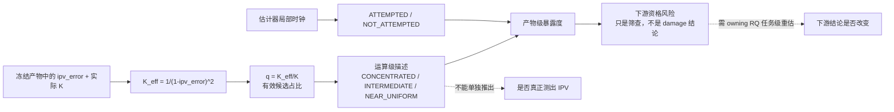

# RQ015A v1 独立复审 — Reviewer 3（跨学科可读性、可复现执行与治理）

状态：`COMPLETE / BLOCKED / REQUEST_CHANGES`  
`formal_g1_eligible=false`｜`execution_authorized=false`｜未启动 RQ015A 计算

## 1. 复审设置与独立性

- 冻结对象：`reports/plans/RQ015A_plan_v1_attempt_status_and_weight_concentration_audit_20260726.md`
- 对象 SHA-256：`3c77f9713153a22772d92adfa7841f48a919ba10782b15baea3ecdc3e6367b04`
- 校验清单：`reports/plans/RQ015A_plan_v1_checksums_20260726.sha256`
- 校验清单 SHA-256：`5c069d0fc1fd4547e03dac4d17e7ae16b11f240d4efe3e42f61a6c9ce841b74e`
- 现场校验：清单内 `6/6 OK`。
- 复审角色：Reviewer 3；主轴为跨学科可读性、可复现执行、授权与验收治理，同时覆盖 Nature-style 科学与技术完整性。
- 独立性声明：本路未读取、未与其他 v1 Reviewer 交流，也未使用其结论。仅查阅冻结 v1 计划、v0 统一综合、封存暴露登记、RQ007 绑定契约/拆分/摘要规则及计划所指的一手 schema/manifest。
- 本路只产出本复审报告；未修改计划、代码、数据、决策或状态文件。

## 2. 总体结论

| 判定 | 数量 / 状态 |
|---|---:|
| Verdict | **`BLOCKED / REQUEST_CHANGES`** |
| Blocker | **5** |
| Major | **5** |
| Minor | **2** |
| Formal G1 | **不具备资格** |
| 执行授权 | **`false`** |

v1 完成了一次决定性的科学纠偏：它不再把候选权重集中度冒充为 IPV 的
estimability，也不再从 prevalence 直接宣布下游“受损”。这一构念和主张边界已经进入
可辩护范围。

但它仍是一份**纠正后的研究意图**，还不是一份可由不同实现者独立复现、可由机器验收、
可被一次性授权的执行合同。当前文本把阈值导出规则、输入 inventory、ledger schema、外部
产物的 split 适用域、case/episode 聚合、C0 裁决 rubric 和验收程序留到“Phase A 前再冻结”。
这等于把研究者自由度与关键执行选择移到复审之后，因此不能进入 Formal G1。

## 3. 机制与证据边界图

上图中实线部分是 v1 可合理追求的证据链；两条虚线是必须保留的推断断点。这与 RQ007
`binding_execution_contract.md:53-61,71-81` 中“concentration-only 不得称为 estimability”的绑定规则一致。
图中用 `q` 而不是 v1 的 `c`，是为避免与 RQ007 已冻结的另一个 `c_i(t)` 混淆；这一点本身就是
当前计划的可读性和实现风险（见 B4）。

## 4. 主要优点

1. **构念修正到位。** 计划 `:14-29,31-40` 将中心问题改为“是否尝试估计 + 权重集中程度”，
   并明确不估计真值正确性。这直接关闭了 v0 最严重的构念越界。
2. **分档互斥性已修复。** `:42-69` 从 `K_eff` 绝对阈值改为 `K_eff/K`，消除了 v0 在
   `K<=4` 时两档重叠的错误，也给出了 K=5/7/9 的精确 error 转换边界。
3. **封存暴露没有被隐藏。** `:77-88,107-125` 明确降级了受 sealed 聚合分布影响的旧阈值；
   知识层登记 `sealed_exposure_disclosure_20260726.md:62-84` 也已记录 PI 判读 A 和附加条件。
4. **下游主张明显收窄。** `:157-170` 只允许报告 exposure 与 qualification risk，把真正的
   damage/validity 重估留给 owning RQ。
5. **已识别三个关键跨产物陷阱。** `:90-105` 明示 M3 alpha 三倍计数、OnSite 全局帧号不等于
   estimator-local 时钟、WOD 部分 error 缺失；这些是后续输入合同必须保留的正确边界。

## 5. Blockers（必须全部关闭）

### B1. 阈值“先冻结再计算”仅是流程口号，没有可复现的导出规则

**证据。** 计划 `:83-88` 要求从 dev+guard 重新导出 `c_lo/c_hi`，并说规则将在计算前冻结；
但当前文本和六项 checksum manifest 中均无具体算法。未规定是分位数、混合分布谷值、
固定有效候选数、全局还是分层阈值，也没有设定 tie-break、四舍五入、minimum support、
missing/unknown 排除、dev 与 guard 各自的角色。

**为何是 blocker。** 如果实现者先看 dev+guard 分布再写规则，则研究者自由度仍在复审之后；
对同一数据可产生多组“合理”阈值。尤其是同时用 dev+guard 选值，会使 guard 不再是独立检查层；
如 PI 决定将两者合并为纯描述 policy-fit 集，也必须显式降级确认性语言。

**关闭条件。** 在任何 measurement-field 扫描前，冻结并纳入 manifest 的 threshold-spec，至少包含：
选值目标、精确公式/分位、拟合集和验证集角色、去重后单位、全局/分层决策、最小样本、
K 范围、missing 规则、tie-break/精度、敏感性分析及不得使用的下游结果。

### B2. authoritative input inventory、D0 时钟和 ledger schema 仍是待办项

**证据。** 计划 `:94-105` 中 OnSite 的计数单位与局部序号待确认，WOD 的判据与主键仍写
“逐产物确认/冻结”；§§3.1 只列出将来 schema 应包含的概念，未给出实际字段、类型、enum、
唯一键和守恒断言。manifest `:1-6` 也没有 inventory 或 schema 文件。现场一手证据进一步说明
“行”不可直接当测量单位：RQ009 `prediction_manifest.json:136-145` 的 M3 test 为 1,270,566 anchors
对 3,811,698 rows；OnSite 实物一行同时容纳 `ego/counterpart x hw4/hw10` 四个 measurement roles。

**为何是 blocker。** 当前表格既不能确定输入 universe，也不能唯一确定每产物的分母。不同实现者
会对 M3 是否 join source measurement、OnSite 的四个 role 如何展开、WOD 何时为 unknown、L2/L3 何时转态
做出不同选择，导致结果不可比也不可验收。

**关闭条件。** 冻结 machine-readable inventory 和 versioned long ledger schema：每个 artifact 必须有
path/hash/producer/config/schema/row unit/measurement role/join key/K-grid/min-observation/split scope/expected rows/
local availability；唯一键至少覆盖 artifact、case、sequence/anchor、perspective、role、configuration、
window 和 estimator version。duplicate、unmapped、未知 K、无法恢复 D0 与 row-conservation mismatch 均应 fail closed。

### B3. RQ007 split 没有绑定，外部产物与“只用 dev+guard”的范围不相容

**证据。** 计划 `:84-88,122-125` 要求阈值和最终画像只用 RQ007 dev+guard，但 `:90-100`
又把 RQ009、OnSite 和 WOD 列入跨产物审计。它没有说明外部产物是否仅作 out-of-domain 补充、
是否应标 `RQ007_SPLIT_NOT_APPLICABLE`，也没有给出与 RQ007 case assignment 的 join/filter 规则。已有的
`case_split_assignment.csv` SHA-256 为
`90d8bb91e68f9b5e0596cf1ae915eb22b01a5c4ccffbad00c0b446efa46d537d`，`split_freeze.json` SHA-256 为
`99d81147c761981c87bb6a052044a92db35a76003033d2ff46cd462a79f88570`，但两者都不在 v1 manifest 中。

**为何是 blocker。** “sealed 不进入结论”必须是可执行的行级不变式，不能仅是报告声明。若不先按
case ID allowlist 过滤再读 measurement fields，还会重复封存暴露的治理风险。而外部数据不能被伪装为
RQ007 join failure 或 dev/guard 样本。

**关闭条件。** 将 assignment/split-freeze 的相对路径和 SHA 纳入 manifest，冻结“先 ID 过滤、后读测量列”的
处理顺序，给出 zero-leakage validator。对每个外部 artifact 强制填写
`split_scope = RQ007_DEV | RQ007_GUARD | RQ007_HELD_OUT_EXCLUDED | RQ007_SPLIT_NOT_APPLICABLE`，并明确哪些产物进入
threshold fit、primary portrait、external descriptive portrait 或只进 C0 inventory。

### B4. 分析 SAP、episode 摘要与 C0 rubric 不足以唯一生成结果

**证据。**

- `:138-143` 只列 case 需报告的统计量，没有冻结 perspective/configuration/window 分母、最小支持、
  zero-denominator、missingness、case-clustered uncertainty 和比较的 primary/sensitivity 层级。
- `:145-149` 列出探索性 predictors，但未定义响应量、函数形式、特征时间有效性、共线性、分层/聚类、
  不确定性或多重比较。
- `:151-155` 称 episode 摘要“沿用并扩展 RQ007”，却没有复现或引用具体公式。RQ007
  `summary_sensitivity_method.md:21-31` 的已冻结权重为
  `max((1-1/sqrt(7))-c_i(t),0)`，其 `c_i(t)` 是 `ipv_error=1-sqrt(sum(w^2))`；v1 却重新定义
  `c=K_eff/K`。两者同名但不同尺度，直接替换会产生不同权重，也没有规定“无 CONCENTRATED 帧”
  时摘要是 `NA`、`unknown` 还是回退到全帧。
- `:162-170` 给出 C0 需考虑的因素和三档文字结论，但没有可决定重现的 rubric，也没有
  `UNKNOWN_REQUIRES_OWNER_REVIEW`；WOD 明知有 unknown，不能被吸收进“不适用”。

**为何是 blocker。** 这些不是报告排版细节，而是直接改变数字、分母、不确定性和下游行动分类的
分析规则。当前文本无法让两位实现者得到同一份 portrait 和 C0 matrix。

**关闭条件。** 冻结 SAP 和 machine-readable C0 rubric：明确三层分析单位（measurement row /
case-perspective-configuration / case）、所有分母、透视角和配置聚合、minimum support、NA/unknown、
case-clustered interval、primary/sensitivity 对比、探索模型与否证检查。episode 中为新规范量换名（如 `q`），
显式绑定 RQ007 原式、新式和零支持处置；C0 每一类必须由确定性条件产生。

### B5. 没有可授权 run spec 和 machine-readable acceptance validator

**证据。** 计划 `:172-185` 是自然语言交付和验收清单；`:200-203` 只说“本地 CPU 分钟级”
和“复审无 blocker 后进 G1”。当前没有 operation ID、immutable run spec、exact command、environment lock、
input allowlist/hash、output root、validate-only、no-overwrite、single-use authorization receipt，也没有一个把行守恒、
键唯一性、split leakage、终态穷尽、可视化分母与主张词汇转成 PASS/FAIL 的程序。

**为何是 blocker。** `execution_authorized=false` 是正确的当前状态，但计划没有定义如何从该状态变成
一次有界授权。即使人工判断代码“大概对”，也不能证明某次运行只读冻结输入、没有覆盖产物、
没有泄漏 sealed 且每个验收条件都通过。

**关闭条件。** 冻结 run-spec + validator + scoped decision 三件套；validator 先支持 `--validate-only`，并只对
manifest allowlist 的输入和新 output root 工作。授权 receipt 必须绑定 plan/SAP/inventory/schema/code/environment/
command/output-root 的 SHA，且不得暗含 held-out 解封、RQ015B 重算或下游 decision 改写权。

## 6. Major concerns

### M1. 数学取值范围与指标名称仍会误导实现和跨学科读者

计划 `:50-64` 写 `K_eff in (0,K]`、`c in (0,1]`。对 K 个已归一且非负的权重，正确范围是
`sum(w_i^2) in [1/K,1]`、`K_eff in [1,K]`、`K_eff/K in [1/K,1]`。还需对非有限值、越界
`ipv_error`、非整数/`K<1`、浮点边界和容差给出 fail-closed 规则。

此外，`K_eff/K` 越大越接近均匀，称为“归一化集中度”在直觉上是反向的。建议改名为
`effective_candidate_fraction` / `uniformity_fraction` 并用 `q`，或改用“1-q”作真正的集中度；
无论选哪一种，都要与 RQ007 的 `c_i(t)=ipv_error` 保持不同名。

### M2. 封存暴露登记对“未读取逐行测量值”的描述在技术上不精确

`sealed_exposure_disclosure_20260726.md:11-22` 记录了对含 sealed 的整表多轮扫描，并基于 `ipv`、
`ipv_error` 统计总体、分层和 case 分布；这一计算必然会解析逐行字段。可辩护的精确说法是：
“程序扫描并聚合了逐行字段，但未显示、导出、落盘或人工检视任何 held-out 单行值，也未用其做效应估计、
拟合或检验。” 计划 `:115-116`、登记 `:21-22,66-67` 及所有索引应同步修正。这不自动推翻
PI 判读 A，但是完整审计轨迹的必要精度。

### M3. RQ015A -> RQ015B 没有 append-only 富化接口，且 B 的一处措辞与自身禁令冲突

计划 `:131-136` 将 L3 交给 RQ015B，但没有绑定交付键、schema version、原行不可覆盖、重算 provenance、
状态转移和重复/冲突处置。RQ015B `:17-19` 又说集中度因素为“可修 vs 固有”提供先验，
而其自身 `:129-130` 禁止把当前网格/模型下平坦称为“固有不可辨识”。应将措辞统一为
“数值缺陷 vs 当前网格/模型下平坦 vs 模型失配”，并使 B 只能在保留 A 原始键的新版 ledger 上附加字段。

### M4. 没有主张对应的图文和数据可视化合同

v1 `:172-181` 列出了 portrait、因素分析和风险矩阵，但没有说明哪幅图证明哪个结论、每格的
n/分母、不确定性、unknown/pending 怎样可视化，也没有防止只用单个总体百分比掩盖产物差异的验收条件。
为达到跨学科可读性和项目的 publication-grade 要求，至少应预冻结：

1. attempt -> concentration proxy -> exposure -> owner-level reassessment 的机制/证据边界图；
2. `source x feasibility layer` 的 count/% 堆叠图，显示 unknown 和 pending_RQ015B；
3. 按 source/config/K 分面的连续 `q=K_eff/K` ECDF/密度图，画出 policy cutoff 及 sensitivity；
4. case-perspective-configuration 层的 concentrated/near-uniform share 全分布，附 case-clustered interval；
5. `source x geometry x window` 热图，每格直接标 n、分母、比例与区间；
6. 六个下游 RQ 的 evidence-to-decision matrix，分开 exposure、estimand change、selection risk 和 owner action。

每个中心结论都应有正面证据、边界例、unknown/missing 反例和敏感性视图，并同时输出阅读版 PNG
与可编辑 PDF/SVG。

### M5. 当前状态索引不一致，无法形成唯一的现行治理入口

- `START_HERE.md:15-38` 已描述 v1 与 PI 附加条件，但 `:58-59` 又笼统写“RQ015A 已复审并
  BLOCKED”并指向旧 `RQ015AB_split_checksums`，没有明示那是 v0 结论。
- `STUDIES.md:50` 说封存暴露“待 PI/RQ007 裁定”，但 disclosure `:62-84` 显示裁定已作出。
- 知识层 `reports/knowledge/RQ015A_ipv_estimability_labelling/README.md:3-7` 仍把 v0 计划和 v0 BLOCKED 状态
  当作唯一现行入口。
- 执行层 `reports/studies/RQ015A_ipv_estimability_labelling/README.md:1-3` 也只记 v0，未标明 v1 正处于重启复审。

在进入任何 G1 裁定前，这些入口必须原子化更新到同一 plan SHA、manifest SHA、review 状态和
`execution_authorized=false`，同时保留 v0 为明确的历史记录。

## 7. Minor concerns

### m1. “全文无 estimability”不是可执行的语义验收条件

计划 `:27-29,183-185` 自身就必须在历史纠偏、限制和与 RQ007 的边界中使用 estimability 一词。应将
验收范围改为：标签、主张、图题、表头和结果叙述不得把 RQ015A 状态命名/解释为 estimability；
允许在否定、历史和 scope-boundary 语境中出现，并用结构化 claim-lint 检查，而不是简单字符串搜索。

### m2. “本地 CPU 分钟级”没有基准或资源上界支持

计划 `:200-202` 的资源判断可能最终成立，但当前涉及百万级长表、parquet/csv join、多产物
守恒和 case-clustered uncertainty，没有 dry-run 基准、内存上限和预计输出大小。建议以可接受的抽样
validate-only benchmark 估算 wall time/RAM/disk，并在 run spec 中冻结上界；无需因此默认转 HPC。

## 8. Nature-style 审稿轴判定

| 审稿轴 | 判定 | 理由 |
|---|---|---|
| Originality | **尚不可判定** | 计划没有相对既有 estimator reliability / abstention / effective-sample-size 文献的定位；本轮不因此否定内部审计价值。 |
| Significance | **内部价值高，对外主张未建立** | 可防止“默认 0”或近均匀权重在下游被当成正常测量；但 A 不能识别成因也不重估下游效应。 |
| Scientific soundness | **方向可辩护，方法尚不完整** | 构念与主张边界已修正；阈值、SAP、统计单位和 missingness 仍留有决定结果的自由度。 |
| Statistical adequacy | **不足** | 没有冻结 case-clustered uncertainty、分母、分层、minimum support、探索模型或敏感性决策。 |
| Reproducibility | **不通过** | 无 authoritative inventory/ledger/SAP/run spec/validator/receipt；manifest 只保护了计划及部分旁路文件。 |
| Interdisciplinary readability | **较 v0 显著改善，仍需大修** | 命名已去除最危险的 estimability 等号，但 `c` 同名异义、反直觉的“集中度”和缺失图文证据套件仍阻碍非本项目读者。 |
| Governance / authorization | **不通过** | 封存裁定已登记，但 split/filter、当前索引、一次授权和验收链未闭合。 |

## 9. 对潜在读者的价值

完成修订后，该 RQ 对以下读者具有明确价值：自动驾驶交互建模研究者、将社会行为隐变量用于
预测/验证的方法学者、估计器可靠性与 abstention 工程人员，以及需要区分“数值被产生”与
“数值有判别信息”的研究治理人员。其可普适的方法贡献不是某个百分比，而是一条可复用的
`attempt status -> concentration proxy -> feasibility -> downstream owner action` 审计链。要形成这一贡献，
必须先关闭本报告的可执行性 blockers。

## 10. 精确关闭清单

| Gate | 必须新增/修正的冻结件 | 最小机器验收 |
|---|---|---|
| G1 阈值 | `threshold_spec` + SHA | 同一 fixture 重复运行导出完全相同；禁用下游 outcome |
| G2 输入 | `artifact_inventory` + `concentration_ledger.schema` + SHAs | schema/type/enum 通过；键唯一；每 artifact 行守恒；duplicate/unmapped fail closed |
| G3 split | RQ007 assignment/split-freeze 绑定 + split-scope crosswalk | 先 filter ID 后读 measurement；sealed conclusion rows=0；external 不得假冒 join failure |
| G4 SAP | 分母/角色/配置/uncertainty/episode/C0 rubric | 金标 fixture 结果唯一；zero-support -> 显式状态；C0 unknown 不可被吸收 |
| G5 执行 | immutable run spec + validate-only + validator + scoped receipt | 输入 SHA 不符、越界路径、覆盖企图、泄漏或验收失败均中止 |
| G6 治理 | START_HERE/STUDIES/两层 README 同步 | 所有入口指向同一 plan/manifest/review 状态，v0 显式标历史 |

## 11. 推荐结论与风险边界

**推荐：`BLOCKED / REQUEST_CHANGES`。** 这不是对 RQ015A 研究问题的否定，而是对当前执行契约未闭合的
判定。修订应保留 v1 的构念收窄和主张边界，不应退回 v0 的 estimability 标签。

在下一版通过独立复审并完成 scoped authorization 之前：

- `formal_g1_eligible=false`；
- `execution_authorized=false`；
- 不得扫描 RQ007 held-out/sealed 的 measurement fields；
- 不得用当前占位阈值生成结论 portrait；
- 不得构建最终 ledger、启动 L3 重算、修改任何下游 `decision.md` 或重开 owning RQ；
- 不得从 concentration 单独声称 IPV “测出/未测出”、正确/错误，或下游已经受损。

