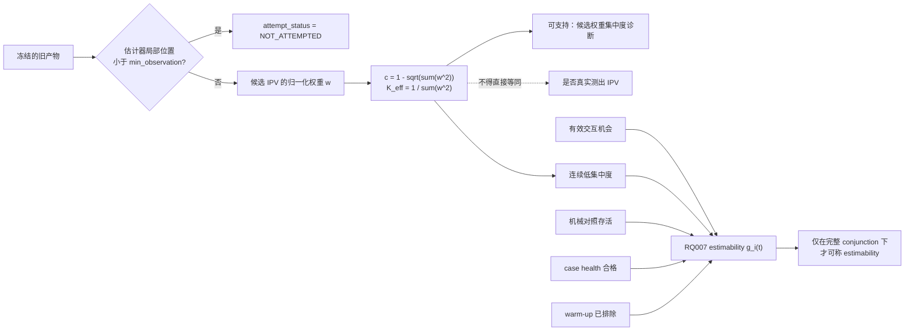

# RQ015A v0 三路独立复审综合

状态：`COMPLETE / BLOCKED / REQUEST_CHANGES`  
`formal_g1_eligible=false`｜`execution_authorized=false`｜未启动 RQ015A 计算

## 1. 复审对象与程序

- 冻结计划：`reports/plans/RQ015A_plan_v0_ipv_estimability_labelling_20260726.md`
- 计划 SHA-256：`cd352390d816c12c77942211ad73479a5d3b71c43c8c801150ab3e25cfa9fea8`
- 基线 manifest：`reports/plans/RQ015AB_split_checksums_20260726.sha256`，现场复核 `5/5 OK`
- 首轮由三路 Reviewer 在同一冻结字节上互不通信、互不读取对方报告地完成。
- 首轮冻结后，三路又收到完全相同的一手证据质询；每路只回看自己的报告并追加判断，
  原始 verdict/counts 保留不改。这一阶段用于检验结论面对同一反证时是否稳定，不替代首轮独立性。
- 两路只读事实核查另行验证了 RQ007 split/契约和各产物 schema；它们不充当 Reviewer，
  也未写入正式 review 文件。

| 路线 | 首轮结论 | 统一质询后结论 | 最终报告 SHA-256 |
|---|---|---|---|
| Reviewer 1 — 技术正确性 | `BLOCKED`；4 blocker / 4 major / 1 minor | `BLOCKED`；5 blocker / 4 major / 1 minor | `9180d4371a7fd2362ded240613b20eadd163831ba20bba329c335598095c0257` |
| Reviewer 2 — 科学意义与主张边界 | `BLOCKED`；2 blocker / 3 major / 4 minor | `BLOCKED`；4 blocker / 3 major / 4 minor | `02d53aa421a092f522f39b411f564c5a40c0d986a31b81b9da9de235fe061869` |
| Reviewer 3 — 可读性、执行与治理 | `BLOCKED`；4 blocker / 5 major / 2 minor | `BLOCKED`；6 blocker / 5 major / 2 minor | `fb65d7906af7fa78a77a22790e8ddadb2d20f2846094e61541f85c1375133e79` |

正式报告：

- `reviewer1_technical_v0_20260726.md`
- `reviewer2_significance_v0_20260726.md`
- `reviewer3_readability_execution_v0_20260726.md`

## 2. 综合结论

三路最终结论一致：**RQ015A 的拆分方向值得保留，但 v0 不能进入 Formal G1。**

当前最核心的问题不是阈值略粗，而是研究对象被替换了：计划能从旧产物直接恢复的是
“是否曾尝试估计”和“候选权重集中到什么程度”；它却把后者直接命名为
`ESTIMABLE / NOT_ESTIMABLE`，并用来回答“到底有没有测出 IPV”。RQ007 的绑定契约明确禁止
这种等同。即使把数据工程问题全部修好，当前标签仍不能承载该中心主张。

此外，计划已使用含 RQ007 held-out/sealed 的全语料聚合画像，再声称 sealed 从未参与阈值，
在历史上不可同时成立；跨产物的行单位、D0 时钟、字段角色、去重、case 聚合和本地验收链
也尚未冻结。按现文执行，不同实现者会得到不同分母和标签。

## 3. 机制判断图：当前数据究竟能证明哪一层

RQ007 `binding_execution_contract.md:53-61,71-81` 将当前 IPV、集中度指数、交互机会、
estimability 和行为动力学列为五个不得混淆的概念，并明确规定 concentration-only 输出只能作为
较弱诊断，不能命名或解释为 estimability。RQ015A v0 `:18-21,55-69` 与这一冻结定义正面冲突。

## 4. Reviewer 1：技术正确性

Reviewer 1 支持把回溯审计与估计器修复拆开，但判定中心交付物还不能唯一实现：

1. OnSite 输出保留原生 `frame_index`，估计器 warm-up 却发生在一次调用内的局部序号；
   `frame_index < 4` 会把原生帧号从 101 开始的前四个占位行误判成已尝试估计。
2. 现有全量扫描已读取 RQ007 held-out 的聚合端点，不能再称其 untouched。
3. `estimability_ledger` 没有 observation unit、主键、字段、去重和守恒不变式；
   M3 的 80/90/95 三个 nominal 行会把同一 anchor 三计。
4. “case 至少 1/5 个值”和 RQ007 加权没有冻结 perspective、configuration、分母、
   零支持处置或 variable-K 公式。
5. 统一质询后新增中心 blocker：K_eff-only 状态违反 RQ007 的构念命名禁令。

## 5. Reviewer 2：科学意义与主张边界

Reviewer 2 认为该研究作为 measurement audit 有较高内部价值，但当前不能声称已经判断测量成功：

1. 集中权重可能“很自信但错”，近均匀权重也可能来自下溢、当前网格/模型下平坦或模型失配；
   A 又明确不能拆分 D1/D2/D3，因此只能报告 concentration proxy。
2. 未做下游任务的重估，就预先称帧/锚点研究“直接受损”、case 研究“受损较轻”，
   把 prevalence 当成 damage。C0 最多能给出 exposure/qualification risk。
3. `K_eff<=4` 与 `K_eff>=0.93K` 是新的 PI 操作性分箱，不是 RQ007 已验证的测量成功边界；
   RQ007 实际冻结的是另一套 `tau + 连续帧 + conjunction` 规则。
4. “距离不是主要因素”和“可修 vs 固有限制”均超出当前探索设计；RQ007 C1 还表明
   其 interaction-conditioned gap 的大部分与接近程度相容。
5. 统一质询后，sealed-informed cutoff 与 OnSite D0 分别升级/新增为 blocker，
   M3 alpha 展开新增为分析单位 major。

## 6. Reviewer 3：跨学科可读性、执行与治理

Reviewer 3 判定当前文本仍是研究意图，而非可授权、可机器验收的执行合同：

1. 没有逐产物 authoritative inventory；“全部主要产物都有 `ipv_error`”与 L3/L4 及实物 schema 冲突。
2. 没有版本化 long-form ledger、唯一键、measurement-role crosswalk 和逐产物行守恒。
3. 已存在的 RQ007 split 未被路径与 SHA 绑定；外部数据集也未区分
   `RQ007_SPLIT_NOT_APPLICABLE` 与真正 join failure。
4. 没有 operation ID、exact command、环境、output root、validate-only、一次性授权 receipt 和
   machine-readable acceptance validator。
5. 预测子、episode summary、C0 rubric 及 A→B append-only enrichment 均未闭合。
6. 统一质询后，构念替换与 sealed-informed cutoff provenance 新增为两个 blocker。

## 7. 交叉复审归并后的阻断项

以下是对三路重叠 findings 的归并，不把同一缺陷机械重复计数。

| Gate | 归并问题 | 直接证据 | 关闭条件 |
|---|---|---|---|
| G1 构念 | K_eff-only 被命名为 estimability/“测出 IPV” | RQ007 contract `:53-61,71-81`; plan `:18-21,55-69` | 推荐改成“估计尝试 + 候选权重集中度审计”，使用 `CONCENTRATED / INTERMEDIATE / NEAR_UNIFORM`；若坚持 estimability，必须重建完整 `g_i(t)` conjunction |
| G2 sealed 治理 | 已查看含 sealed 的聚合分布，却要求 sealed 从未参与阈值 | plan `:42-64,74-78,140`; RQ007 split contract `:99-114` | 记录历史 exposure，由 PI/RQ007 治理层裁定；无 pre-scan authority 时将分箱降级为 post-hoc policy，取消 untouched/confirmatory 语言；停止进一步解析 held-out 测量列 |
| G3 数据与 ledger | 输入 universe、字段角色、长表单位、键与守恒未冻结 | plan `:25,80-90,133`; RQ009/OnSite/WOD schema | 冻结 machine-readable inventory 和 versioned long ledger；把 attempt、concentration、feasibility、split 设为正交字段；duplicate/unmapped/conservation mismatch fail closed |
| G4 D0 时钟 | 全局 `frame_index<4` 不能跨产物表示 estimator warm-up | plan `:36-38,58-65`; OnSite producer/local sequence | 以 `estimator_sequence_id + local_sequence_position + producer min_observation` 判 D0；不可恢复时为 UNKNOWN，并以 OnSite fixture 验证 |
| G5 单位与数学 | agent-frame/case-agent/case 混用；K≤4 标签重叠；0.61 不是 0.93×7 的精确边界 | plan `:58-65,92-105` | 冻结三层单位、分母和 perspective 规则；限制 K 域或定 precedence；K=7 精确 error 边界为 `0.608069099165`，不得用 0.61 快捷实现 |
| G6 主张边界 | prevalence 被提前解释为 downstream damage；hard-filtered summary 被误称为沿用 RQ007 | plan `:94-105,115-129`; RQ007 summary method `:15-35` | 改为 exposure/qualification risk；冻结新 summary 公式与敏感性目的；具体 damage/validity 留给 owning RQ 的任务级重估 |
| G7 可执行性 | 统计 SAP、C0 rubric、operation 与验收机器门缺失 | plan `:107-142,157-160` | 冻结 dev/guard 角色、case-aware uncertainty、missingness、decision rubric、run spec、validator 与一次性授权 receipt |

## 8. 已核实的跨产物事实

计划 `:25` 的“全部主要产物都已有 `ipv_error`”不成立。更准确的三类是：

| 类别 | 已核实对象 | RQ015A 可做什么 |
|---|---|---|
| error 直接存在 | InterHub sigma01/RQ009 target 与 matrix、RQ012B OnSite、RQ010B full479 audited | 在 schema、D0、K/grid 与 split 契约闭合后直接读取 |
| error 可无重算 join | RQ009 M3 predictions 可按 anchor key 连接 matrix 的 `target_ipv_error_future` | 每个 anchor 只打一次标签；`alpha` 是区间层，不是新测量 |
| IPV 存在但 error 已丢弃 | RQ010B final/10Hz、RQ014 `g2r_anchor_scores` | 当前 A 禁止 replay，故只能标 `error_unknown/pending`，不得伪装为 L1 |

三个可证实的计数陷阱：

- InterHub 一个物理 frame row 含两个 agent-perspective 测量；物理行数不是 IPV measurement 数。
- M3 prediction 每个 anchor 有 80/90/95 三个 alpha 行；按物理行画像会三倍计数。
- OnSite 一行可同时含 `ego/counterpart × hw4/hw10` 四套测量，且 native frame index 不是 estimator-local 时钟。

此外，v0 的 41.2794% 近零和 24.1688% `error<=0.50` 基线应明确限定到冻结的
RQ009 hw4 配置，不能写成所有估计器配置/所有产物共同的“全语料事实”。

## 9. 建议的新版本最小关闭清单

1. **构念二选一。** 推荐窄化为 concentration audit；若保留 estimability，完整复用 RQ007 conjunction。
2. **重写名称与主张。** `NOT_ATTEMPTED` 是 attempt status；其余只描述权重集中度，
   不说“测出/没测出”“成功/失败”。
3. **披露 sealed 历史。** 钉死现有 assignment SHA
   `90d8bb91e68f9b5e0596cf1ae915eb22b01a5c4ccffbad00c0b446efa46d537d`；
   先按 ID allowlist 过滤，再解析 measurement fields；对历史 aggregate exposure 作 PI 裁定。
4. **冻结输入清单。** 每个 artifact 给 path/hash/producer/config/schema/row unit/field role/key/K/grid/
   min-observation/split scope/expected rows/local availability。
5. **冻结 long ledger。** 唯一键至少覆盖 artifact、case、sequence/anchor、perspective、
   measurement role、configuration/window 和 estimator version；给出 row-conservation 门。
6. **修正 D0。** 改用 estimator-local position，增加 unknown/invalid 分支与 source-specific fixture。
7. **修正数学合同。** 保留 continuous K_eff 为主；操作性 bins 明示为 PI policy，报告 cutoff sensitivity；
   关闭 K≤4 重叠、浮点域和 exact-boundary 问题。
8. **冻结统计合同。** 以 case-perspective-configuration 为 episode 基础；给出分母、minimum support、
   zero denominator、K-aware 或 K=7-only weighting、case-clustered uncertainty、dev/guard 角色和 missingness。
9. **冻结 C0 rubric。** 输出 `potentially affected / redesign required / not applicable /
   unknown_requires_owner_review` 的确定性规则，不替 owning RQ 宣布 damage 或修改 decision。
10. **冻结本地执行与验收。** operation ID、exact command、环境、只读输入 hash、output root、
    validate-only、不可覆盖、single-use receipt 和 machine-readable PASS/FAIL validator。

## 10. 建议的图文交付合同

下一版不应只给若干百分比。为使“0、未尝试、权重近均匀、case 仍有部分有效片段”不再混淆，
正式报告至少应包含：

1. 本综合 §3 的机制图升级版，明确 latent truth 与 concentration proxy 之间没有直接等号；
2. `source × feasibility layer` 的 count/% 堆叠图，同时显示 unknown/pending；
3. 按配置分面的 continuous K_eff ECDF/密度图，画出 policy cutoff，并标 numerator/denominator；
4. case-perspective 级 concentrated-frame share 的完整分布，而不是只给均值或“至少 1/5 个”；
5. `source × geometry × window` 热图，每格显示 n、比例与 case-clustered interval；
6. 六个下游 RQ 的 evidence-to-decision matrix，区分 exposure、estimand change、selection risk 和 owner action。

在计划复审通过前，不生成上述最终画像；这里只冻结应如何解释和验收它们。

## 11. Risk / unsupported claims

- 不能从 K_eff 单独证明“这一行测出/没测出 IPV”。
- 不能从旧产物区分 D1 下溢、D2 当前网格/模型下平坦与 D3 模型失配。
- 不能把新的 PI 分箱说成 RQ007 已验证的 estimability boundary。
- 不能把 RQ009 hw4 的比例泛化到所有历史产物。
- 不能把帧级 concentration prevalence 直接解释为下游 damage，或声称 case 级一定受损较轻。
- 不能由边际距离分箱推出 proximity 不是主要解释因素，更不能推出“固有识别极限”。
- 不能把已看过 aggregate endpoint 的 RQ007 held-out 继续无条件称为 untouched。

## 12. 最终状态

`BLOCKED / REQUEST_CHANGES`

- `formal_g1_eligible=false`
- `execution_authorized=false`
- 不创建 `decision.md`
- 不启动 RQ015A 最终画像、ledger 构建或任何 held-out IPV/error 解析
- 下一步仅允许起草新的 checksum-frozen v0.1/amendment，关闭上述 gates 后重新启动独立复审

