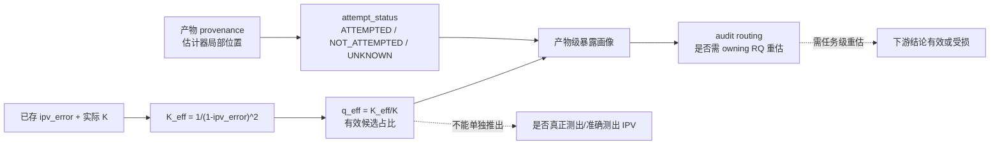

# RQ015A v1 三路独立复审综合

状态：`COMPLETE / BLOCKED / REQUEST_CHANGES`  
`formal_g1_eligible=false`｜`execution_authorized=false`｜未启动 RQ015A 计算

## 1. 复审对象与程序

- 冻结计划：`reports/plans/RQ015A_plan_v1_attempt_status_and_weight_concentration_audit_20260726.md`
- 计划 SHA-256：`3c77f9713153a22772d92adfa7841f48a919ba10782b15baea3ecdc3e6367b04`
- 基线 manifest：`reports/plans/RQ015A_plan_v1_checksums_20260726.sha256`，现场复核 `6/6 OK`
- 三路 Reviewer 对同一冻结字节独立完成报告；任一路均未读取其他 v1 Reviewer 输出，
  未与其他复审路线交换判断。
- 两路额外只读事实核查用于验证 RQ007 契约/split 与跨产物 schema；它们不充当 Reviewer，
  也未读取 v1 Reviewer 报告。
- 本轮为计划复审：未改 v1 计划、代码、数据或已接受 `decision.md`；未解封 held-out，
  未导出阈值，未构建最终 ledger/画像，未执行 HPC 作业。

| 路线 | 主审轴 | 结论 | Findings | 报告 SHA-256 |
|---|---|---|---:|---|
| Reviewer 1 | 技术正确性 | `BLOCKED` | 4 blocker / 4 major / 2 minor | `73b6954826863bd675101666ad8a1b53e94f24e723c7ac659679355911d4aebb` |
| Reviewer 2 | 科学意义与主张边界 | `BLOCKED` | 2 blocker / 4 major / 3 minor | `b9fff55df5a3961d143e39dec6f366a69c653d4319f669b786c14640eb292a68` |
| Reviewer 3 | 跨学科可读性、可复现执行与治理 | `BLOCKED` | 5 blocker / 5 major / 2 minor | `4155394252dca6051bfd0380f9eecc22904a51beef302c29f3e12df781169acd` |

正式报告：

- `reviewer1_technical_v1_20260726.md`
- `reviewer2_significance_v1_20260726.md`
- `reviewer3_readability_execution_v1_20260726.md`

## 2. 综合结论

三路结论一致：**v1 的构念收窄成立，但当前文本仍不能进入 Formal G1。**

v1 已实质修复 v0 的中心问题：它不再把 `K_eff` 单指标解释为 IPV estimability，
不再使用 `ESTIMABLE / NOT_ESTIMABLE` 回答“是否测出 IPV”，而是明确限定为
**estimator attempt provenance + candidate-weight effective support/concentration**。该修正应保留，
不应在下一版退回 v0 的命名或把工作重新扩张为完整 RQ007 conjunction。

当前阻断已转移到**决定数字的规则仍未在复审前冻结**：阈值将如何“重导出”、
哪些产物/测量角色进入分母、OnSite/WOD 的局部时钟与 unknown 怎样生成、
M3 怎样 join/deduplicate、case/episode 怎样聚合、C0 怎样从证据确定产生行动类别，
以及某次运行如何被对象化授权和机器验收。如按现文直接执行，两位实现者可在
不违反文字的前提下得到不同阈值、分母、标签和下游路由判定。

## 3. 本 RQ 的机制与证据断点

实线是 RQ015A 在契约闭合后可支持的证据链；虚线是不得跨越的推断断点。
RQ007 `binding_execution_contract.md:53-81` 已冻结 current IPV、concentration index、
interaction opportunity、estimability 与 dynamics 五个不得混淆的概念，并规定 concentration-only
输出不得命名或解释为 estimability。v1 `:14-40,71-75,187-192` 已符合这一边界。

为避免与 RQ007 已用于 `ipv_error` 的 `c_i(t)` 冲突，综合报告用 `q_eff`
指代 `K_eff/K`。该量越大表示有效候选越多、越接近均匀；更准确的名称是
`effective_candidate_fraction`，而非直觉上“越大越集中”的得分。

## 4. v0 问题在 v1 中的关闭状态

| v0 问题 | v1 状态 | 综合判定 |
|---|---|---|
| `K_eff-only = estimability` 的构念替换 | **CLOSED** | 标题、RQ、标签、限制和下游措辞已实质收窄；下一版不应重开。 |
| 小 K 时两档重叠；用 `0.61` 近似代替精确边界 | **CORE CLOSED / residual open** | 占位阈值下三档互斥，K=5/7/9 转换正确；但重导出后的 `0<c_lo<c_hi<=1`、理论域、K=1 和 invalid 分支未冻结。 |
| sealed 历史暴露未登记/未裁定 | **PI DECISION RECORDED / wording residual** | PI 判读 A 及附加条件已登记；但 waiver 不能把已观察的聚合信息变回科学上 untouched。 |
| M3 alpha 三倍计数 | **PARTIAL** | 已说明按 anchor 去重；但 predictions 无 error，缺 `source_dataset` 的 matrix join、measurement role 和 1:1 cardinality 契约。 |
| OnSite D0 使用全局 `frame_index<4` | **PARTIAL** | 已承认必须用 estimator-local position；但局部序列的过滤、排序、断帧和重启规则仍是未冻结待办项。 |
| prevalence 被直接解释为 downstream damage | **CORE CLOSED / rubric open** | 已改成 exposure/qualification routing；但 `低资格风险` 仍超出本 RQ 能证明的边界，且无确定性/unknown rubric。 |
| ledger、case/K-aware 聚合、SAP、operation/validator | **OPEN** | 文本仍是“Phase A 前再冻结”的承诺，而非本次可复审的执行契约。 |

## 5. 交叉归并后的 Formal-G1 gates

下表归并三路重叠 findings，不把同一缺陷机械重复计数。

| Gate | 状态 | 当前缺口 | 可验收关闭条件 |
|---|---|---|---|
| G1 构念与主张边界 | **CLOSED** | 仅存符号/名称可读性风险 | 保留 attempt + concentration audit；把 `K_eff/K` 改名 `q_eff`/`effective_candidate_fraction`；禁止将其解释为测量成功、准确度或 RQ007 estimability。 |
| G2 阈值科学契约 | **BLOCKED** | 没有选值目标、精确算法、权威输入/role、权重、dev/guard 分工、稳定性或 fail/withhold 规则 | 冻结 `cutoff_derivation_contract`；continuous `q_eff` 为 primary、bins 为 secondary policy summary；development 选择、locked guard 验证，或明确声明 dev+guard pooled 无独立 guard 验证；预注册 sensitivity 与 bins-withheld 失败路径。 |
| G3 input/split/D0/ledger | **BLOCKED** | 无 authoritative inventory、split SHA 绑定、long schema、measurement-role crosswalk、M3 join cardinality、OnSite/WOD 时钟与 normalized-measurement 守恒 | 冻结 machine-readable inventory + schema + crosswalk + fixtures；先用 case ID allowlist 过滤，后读 measurement fields；`held_out conclusion/parsed rows=0`；duplicate/unmapped/K unknown/守恒不符 fail closed。 |
| G4 分析单位、SAP 与 summary | **BLOCKED** | case/perspective/configuration/window 混合；分母、minimum support、zero support、unknown、聚类不确定性、episode 权重函数未冻结 | 冻结 measurement→case-perspective-configuration→case 三层单位和精确公式；新 summary 只称 definition sensitivity，不宣称哪一种更准；fixture 结果唯一。 |
| G5 C0 audit routing | **BLOCKED** | `低资格风险` 没有任务级证据，三档结论没有必要/充分条件，也没有 unknown 终态 | 改为确定性路由：`NOT_APPLICABLE` / `NO_AUDIT_TRIGGER_DETECTED` / `OWNER_REANALYSIS_REQUIRED` / `INDETERMINATE_UNKNOWN_PROVENANCE`；冻结分母、优先级、reason code 和 owner action；不自动改 owning RQ decision。 |
| G6 sealed 与状态治理 | **PARTIAL / BLOCKING EXECUTION** | PI waiver 已有，但“程序未读逐行值”与扫描实现不精确；RQ007 权威入口仍称 untouched；外部产物不属于 RQ007 split | 保留 PI 治理裁定，但精确记录为“程序解析并聚合了逐行字段，未显示/导出/人工检视 held-out 单行值”；RQ007 权威入口加 append-only pointer；外部产物显式 `RQ007_SPLIT_NOT_APPLICABLE`。 |
| G7 run/authorization/validator | **BLOCKED** | 无 operation ID、immutable run spec、exact command/env/input hashes/output root、validate-only、no-overwrite、single-use receipt 和 machine PASS/FAIL | 冻结 run-spec + validator + scoped receipt；绑定 plan/SAP/inventory/schema/code/env/command/output-root SHA；输入哈希不符、越界、覆盖、split leakage 或守恒失败均中止。 |

## 6. 已核实且会改变分母/标签的产物事实

这些事实来自与 Reviewer 独立的只读核查，用于判断“未冻结”是否会真实改变结果。

### 6.1 RQ007 split 与 InterHub 单位

- `case_split_assignment.csv` 的真实标签是 `development / guard / held_out`，数量为
  `19,258 / 7,628 / 11,342`；代码不得以 `split != "sealed"` 排除 held-out。
- RQ009 另有 `train / guard_tune / calibration / test` 分割，不得把 `guard_tune`
  当成 RQ007 `guard`；两个 split 系统须按 `case_id = case_key` 连接。
- sigma01 在 RQ007 development+guard 中，D0 后是 `2,490,992` 个宽表 frame rows，
  展开为 `4,981,984` agent-values。原表无真实 `agent_slot` 列，必须先冻结
  `ipv_key_agent_1/2` 如何展开为两个 measurement roles。

### 6.2 RQ009 / M3

- M3 calibration+test 共 `2,536,848` anchors / `7,610,544` alpha rows；再限定 RQ007
  development+guard 后为 `1,778,594` anchors / `10,580` cases。
- prediction 表本身没有 `ipv_error`；必须以
  `(case_key, anchor_frame_index, perspective, source_dataset)` 连接 feature matrix 的
  `target_ipv_error_future`。计划键遗漏 `source_dataset`。
- 现有 RQ009 的 current/counterpart/target roles 均已越过 D0，但它们分别取自 anchor `t*`
  与 target end `t*+6`；“继承来源行”不足以冻结 role 身份。
- RQ009 current/target/M3 是 sigma01/hw4 的复制或 join。若在阈值导出中把多个产物
  直接 pooling，会对同一原始 IPV/error observation 重复加权。

### 6.3 OnSite

- dense timeseries 有 `70,317` physical rows / `267` cases。真实 D0 是每 case 保留序列的
  局部位置 0–3，共 `1,068` physical rows；全局 `frame_index<4` 只命中 `53` 行。
- `254/267` cases 首帧非 0，`36` cases 的 `frame_index` 不连续。可恢复规则是在冻结
  filtering 后按 `(timestamp_ms, frame_index)` 排序并使用局部 `row_number-1`，
  不是 `frame_index-min(frame_index)`。
- anchor table 中有 `252` 个 current-role anchors 落在局部 position 3，error=1；若套全局帧规则，
  它们会被错标为 `ATTEMPTED`。target role 的最小局部位置为 9，无 D0。
- 一个 dense row 同时包含 `ego/counterpart x hw4/hw10` 四个通道；未冻结 role 时，
  D0 分母可以是 `1,068 / 2,136 / 4,272`。

### 6.4 WOD

- RQ010B full479 audited 表的 `906 = 302 x 3` 行直接保存了 error；但 Phase1/Phase1b/
  10Hz/SchemeB 产物丢弃 error，可由 replay 恢复但 RQ015A 现范围禁止 replay。它们不应被
  笼统归为“无法恢复”。
- RQ014 `g2r_anchor_scores` 有 `37,242` 个唯一 candidate-tau rows 但无 error。
  其中 `18,516` solver-budget + `3,060` undefined-heading rows 是 scene-wide fail-closed 终态；
  现存产物无法为这 `21,576` 行恢复逐行 `ATTEMPTED/NOT_ATTEMPTED`，应进入
  `attempt_status=UNKNOWN`，不得由终态粗暴推断。

## 7. 三路共识与互补判断

1. **共识最强的 blocker 是阈值契约。** 三路都独立指出：“以后先冻结一条规则并登记 SHA”
   不等于现在已经有科学规则。数据分布不会自动给出两个唯一的语义分界点。
2. **Reviewer 1 与 Reviewer 3 的执行契约缺口得到一手数据验证。** OnSite 的 `1,068 vs 53`、
   M3 的三 alpha rows 与缺 `source_dataset` join key、RQ014 的 scene-wide terminal propagation 表明，
   这些不是文档美化，而是会直接改变分母和标签的中心规则。
3. **Reviewer 2 独立强化了科学主张边界。** continuous `q_eff` 应是主结果，三档只能是操作性汇总；
   不做 owning-RQ 重估就不能证明“低资格风险”；guard 若参与选阈值，就不再是独立验证。
4. **sealed waiver 是治理决定，不是科学上“未观察”的事实。** 本轮不推翻 PI 判读 A，
   但未来必须以 disclosed waiver 而非 pristine untouched 语言继续 RQ007 路径。
5. **“proximity 不是主要因素”与“加权后摘要更好”都不受现计划支持。** 前者用 3.8%
   边际占比推断机制，且与 RQ007 C1 的不同 estimand 存在冲突；后者只能被定义为
   summary-definition sensitivity，不能当作正确性验证。

三路已经在无互读的前提下对决定性问题高度收敛，本轮无需再进行后置统一反证追问。

## 8. 新版计划的最小关闭包

下一版不应只再增加“将于 Phase A 前冻结”的文字，而应把下列对象直接放入新 checksum
manifest 并接受新一轮独立复审：

1. `artifact_inventory`：path/hash/producer/version/configuration/measurement roles/K/grid/
   min-observation/split scope/expected rows/local availability；
2. `concentration_ledger.schema`：long-form 唯一键、字段类型/enum、role crosswalk、direct/join/
   replay/unknown 可行性状态和 normalized-measurement 守恒 validator；
3. `cutoff_derivation_contract`：科学目标、权威输入、去重策略、exact algorithm、权重、
   development/guard 角色、异质性、敏感性与 fail/withhold 规则；
4. RQ007 assignment/split-freeze 的 path+SHA、case-ID-first allowlist 和 zero-leakage validator；
5. OnSite retained-sequence、M3 join/dedup、WOD unknown 的逐产物契约与金标 fixtures；
6. case/episode summary spec、因素分析 SAP 和 deterministic C0 routing rubric；
7. immutable operation spec：operation ID、exact command/environment、read-only input hashes、
   output root、validate-only、no-overwrite、single-use authorization receipt 与 machine PASS/FAIL validator；
8. RQ007 权威入口的 append-only disclosure/waiver pointer，以及暴露事实的精确措辞；
9. 主张索引化图文套件：mechanism boundary、source x feasibility count/%、连续 `q_eff`
   分布与 cutoff sensitivity、case-level 完整分布、带 n/分母/聚类区间的分层热图和
   evidence-to-owner-action matrix；PNG + PDF/SVG 同时导出。

## 9. Risk / unsupported claims

- 不能由 `ATTEMPTED` 或 `K_eff/K` 单独证明 IPV 已被正确测量、未被测出，或 RQ007 estimability。
- 不能由近均匀权重区分 numerical underflow、当前 grid/model 下平坦、model misfit 或 solver/input failure；该机制分拆属 RQ015B。
- 不能把尚无选值目标和算法的 `c_lo/c_hi` 称为 dev/guard-derived scientific boundaries。
- 不能声称 guard 既参与 cutoff 选择，又对其做独立验证。
- 不能由 K 归一化自动推出不同 grid、estimator configuration、source 与采样率之间具有物理可比性。
- 不能把 RQ009 hw4 的比例泛化为 sigma01 hw10、OnSite 或 WOD 的共同画像。
- 不能以 `<5 m` 帧仅占 3.8% 推出 proximity 不是主要解释因素；也不能把不同 estimand 下的该统计当成对 RQ007 C1 的否定。
- 不能把 hard-filtered 或 concentration-weighted episode summary 解释为更准确；它们只能证明定义敏感性。
- 不能以 exposure prevalence 证明下游“低资格风险”、validity、damage 或 safety；该判定属 owning RQ 任务级重估。
- PI waiver 可作为治理裁定继续使用，但不能证明先前的 aggregate sealed exposure 在科学上等于没有信息暴露。

## 10. 最终裁决与当前边界

**`BLOCKED / REQUEST_CHANGES`**

- `formal_g1_eligible=false`
- `execution_authorized=false`
- 不创建 `decision.md`
- 不导出 `c_lo/c_hi`，不用占位阈值生成结论画像
- 不构建最终 ledger，不进入 RQ015B replay/富化，不产生 C0 下游资格分类
- 不解析任何新的 RQ007 held-out IPV/error 值，不修改任何已接受的下游 `decision.md`
- 下一步只允许起草新的 checksum-frozen 修订版及上述关闭包，然后重启新一轮独立复审

