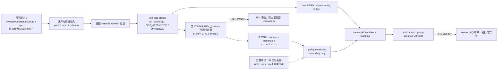

# RQ015A v2 三路独立复审综合

状态：`COMPLETE / BLOCKED / REQUEST_CHANGES`  
`formal_g1_eligible=false`｜`execution_authorized=false`｜未启动 RQ015A 计算

## 1. 复审对象与程序

- 冻结计划：`reports/plans/RQ015A_plan_v2_concentration_audit_20260726.md`
- 计划 SHA-256：`9186c95eb6d84ee56626f6e96cb75d2f0422297446824ea20848e34258ab9a67`
- 基线 manifest：`reports/plans/RQ015A_plan_v2_checksums_20260726.sha256`
- manifest SHA-256：`c63f7564269fb98ccca776e5cb52bdbfdc9760b7d06a948b1440164b3917b96e`
- 现场完整性复核：manifest 内 `6/6 OK`。
- 三路 Reviewer 对同一冻结字节独立完成报告；任一路均未读取另外两路 v2 输出，
  未读取本综合，也未交换判断。
- 两路额外只读事实核查分别核验治理/契约与逐产物数据事实；它们不充当 Reviewer，
  也未读取三路 v2 报告。
- 本轮只复审计划：未修改 v2 计划、代码、数据、任何已接受 `decision.md`；未运行
  RQ015A、未解析新的 held-out measurement fields、未 replay、未连接或提交 HPC。

| 路线 | 主审轴 | 结论 | Findings | 报告 SHA-256 |
|---|---|---|---:|---|
| Reviewer 1 | 技术正确性与唯一可执行性 | `BLOCKED` | 5 blocker / 3 major / 2 minor | `6d8b3dccb54915b74acb70c2f36ac3f1477a14faaf5d600031c52e2cc52c60f8` |
| Reviewer 2 | 科学意义与主张边界 | `BLOCKED` | 2 blocker / 4 major / 2 minor | `cd8b3954bc241940f752fcf7ce5e62e5ae450be4e966d4c032652c08d8e9010f` |
| Reviewer 3 | 可读性、可复现执行与治理 | `BLOCKED` | 6 blocker / 4 major / 2 minor | `442a48a860641de78b52bc1c21cecf82ca18467366b18f7b201f3eeb72a0ff64` |

正式报告：

- `reviewer1_technical_v2_20260726.md`
- `reviewer2_significance_v2_20260726.md`
- `reviewer3_readability_execution_v2_20260726.md`

## 2. 综合结论

三路一致认为：**v2 的科学方向应保留，但其 Formal-G1 closure package 尚未建立。**

v2 最重要的进步是把连续 `q_eff=K_eff/K` 分布设为主产物，并明确三档不是数据中
发现的自然边界。这正确回应了 v1 的阈值问题，也保持了已经接受的构念边界：RQ015A
只能审计 estimator attempt provenance 与候选权重的 effective support，不回答 IPV 是否
正确、是否“测出”，也不替代 RQ007 的完整 estimability 合取。

阻断不在 continuous-primary 思路本身，而在**决定数字和行动的对象仍未冻结**。v2 的
`6/6 OK` 只证明列出的六个文件没有漂移；这六项没有包含 split assignment、逐产物输入、
inventory、ledger schema/crosswalk、fixtures、SAP、C0 rubric、RQ015A executor、environment、
immutable run spec 或 validator。因此“计划里列出将来要绑定什么”不等于这些对象已经存在、
已经过审或已经可授权执行。

同时，冻结文字存在三个中心矛盾：

1. PI disclosure 仍无条件要求 `4/7` 与 `0.93` 在 dev+guard 重导，v2 却直接复用并称无需重导；
2. plan 声称 policy bins 不得参与下游判定，但 episode 与 C0 分别直接使用 `q_lo/q_hi`；
3. `input_rows = Σ terminal_rows` 无法同时覆盖宽表 1→2/1→4 展开与 M3 3→1 去重。

因此 v2 不能进入 Formal G1，更不能获得执行授权。

## 3. 机制图：v2 的正确证据链与当前断点



实线是 closure package 建立后可支持的证据链；虚线是不得跨越的主张边界。v2 已把
构念链的方向写对，但 A、E、G、H、I 的机器对象、公式和治理授权尚未闭合。

## 4. v2 相对 v1 的实质进展

| 项目 | v2 判定 | 说明 |
|---|---|---|
| continuous `q_eff` 为主产物 | **ACCEPTED** | 数据分布不必产生两个语义阈值；应保留为下一版中心设计。 |
| attempt/concentration 与 accuracy/estimability 分离 | **CLOSED** | 不重开 v0 的构念越界问题。 |
| 真实 split 标签与 case-ID-first allowlist | **PROSE CLOSED / BINDING OPEN** | `development/guard/held_out` 与白名单规则正确，但 assignment/split-freeze SHA 未纳入 v2 manifest。 |
| 禁止跨产物 pooling | **PRINCIPLE CLOSED / SAP OPEN** | 原则正确；L2/L3 keys 又丢掉 artifact/role，可能在聚合时重新 pooling。 |
| M3、OnSite、WOD、RQ014 的特殊事实 | **FACTS IMPROVED / CONTRACT OPEN** | 关键事实已进入文字，但 exact input path/hash/type/role/cardinality/fixtures 未冻结。 |
| 四个 C0 名称与 bounded wording | **LANGUAGE IMPROVED / LOGIC OPEN** | 删除“低资格风险”正确，但路由条件、分母、映射和 policy sensitivity 仍不唯一。 |
| held-out 暴露措辞 | **CORE CLOSED / GOVERNANCE RESIDUAL** | “程序解析并聚合，但未显示/导出/人工检视单行值”准确；RQ007 decision pointer 仍冲突。 |
| run-contract 意图 | **REQUIREMENTS LISTED / OBJECT OPEN** | operation ID、validate-only/no-overwrite 思路正确，但尚无 actual spec/command/env/validator/receipt。 |

## 5. Formal-G1 gates

| Gate | 状态 | 当前缺口 | 可验收关闭条件 |
|---|---|---|---|
| G1 构念与主张边界 | **CLOSED** | 仅存命名可读性风险 | 保留 attempt + continuous effective-candidate-support audit；输出不得解释为 accuracy、measurement success 或完整 estimability。 |
| G2 continuous/policy contract | **PARTIAL / BLOCKING** | primary 方向正确；PI 强制重导条件未被正式撤销，旧 `q_lo/q_hi` 仍进入 episode/C0；三档边界和 exact instability 函数不完整 | checksum-bind PI addendum：重导或正式 supersede 二选一；政策阈值、敏感性、route-withheld cascade 全部写死。 |
| G3 input/split/D0/ledger | **OPEN / BLOCKING** | 无绑定的 inventory/schema/crosswalk/fixtures；逐产物 key/role/path/hash 未冻结；守恒式错误 | 机器可读对象全部进入新 manifest；逐产物冻结 raw→expanded→dedup/join→terminal 多阶段守恒和金标 fixtures。 |
| G4 units/SAP/episode/factors | **PARTIAL / BLOCKING** | L2/L3 keys 会丢 artifact/role；无 exact aggregation、equal-weighting、zero-weight、time weighting、因素 SAP 和公式 fixtures | checksum-bind SAP；每层冻结 estimand、分母、聚合顺序、support/unknown/CI；因素分析删除或完整预注册。 |
| G5 C0 routing | **OPEN / BLOCKING** | `q_hi` 与 bins-downstream 禁令矛盾；分子可双计；条件重叠；1:1 mapping 不适用于聚合型 RQ；无 policy-sensitive terminal | applicability-first ordered algorithm、mutually exclusive state union、逐-RQ mapping/cardinality、zero denominator、阈值敏感性与 route-withheld fixtures。 |
| G6 held-out/governance | **PARTIAL / BLOCKING** | README pointer 已有，但 frozen decision 仍写 sealed/untouched；“必须改 decision”又与“不得改 decision”冲突；leakage counter 名称含混 | PI 授权窄化的 append-only decision pointer，或 checksum-bound 权威 addendum/overlay；拆分 ID-only 与 measurement-field counters。 |
| G7 run/authorization/validator | **OPEN / BLOCKING** | 只有字段清单，无 actual run spec、entrypoint、env、command、output root、validator、receipt schema 或 scoped authorization | 先创建并 checksum-bind完整执行包，再独立复审；validate-only PASS 后，才对精确 run-spec SHA 签发 single-use compute receipt。 |

没有任何证据支持 v2 所称“G2-G7 已逐条关闭”。准确状态是：**G1 closed；G2/G4/G6
partial but blocking；G3/G5/G7 open and blocking。**

## 6. 决定性技术问题

### 6.1 PI 条件与 policy reuse 冲突

`sealed_exposure_disclosure_20260726.md:71-84` 仍规定：

- 两个阈值必须从 dev+guard 重导；
- `4/7` 与 `0.93` 是 `PROVISIONAL_PENDING_DEVGUARD_REDERIVATION`；
- 重导前不得用它们产出结论画像。

v2 `:23,43-48,111-125` 却复用同两值生成 policy bins、hard-filtered episode summary 与
C0 owner action。把数值改称 policy 并不会自动撤销既有 PI 命令。下一版必须有一个
checksum-bound append-only PI addendum，明确二选一：

1. 遵守原命令，冻结并执行 dev+guard 重导合同；或
2. 正式 supersede 原命令，说明历史数值只可在哪些 administrative display/action 中使用，
   并对 sensitivity、withheld 与 owner action 给出替代治理条件。

若选择第 2 路，最干净的实现是让旧 bins 真正保持 secondary display，不再自动驱动
episode/C0；否则所有 `q_lo/q_hi/5%/20%` 都必须被明示为同一版本化 policy，并接受路由级
敏感性与 withhold。

### 6.2 `q_eff` 的数学域与计算顺序

对 `K>=1` 个非负、归一化权重：

```text
1/K <= sum(w_i^2) <= 1
1 <= K_eff <= K
1/K <= q_eff <= 1
```

因此 v2 的 `(0,K]` 与 `(0,1]` 不精确。`q_eff` 越大代表权重越接近均匀、effective
support 越大；“normalized concentration”容易让读者误以为数值越大越集中。建议字段名采用
`effective_candidate_fraction` 或在所有图中明确方向。

必须冻结计算顺序：

```text
attempt routing
-> K/grid/error finite-domain validation
-> only ATTEMPTED+valid rows derive q_eff
-> continuous summaries
-> optional policy summaries
```

否则 D0 的 `error=1` sentinel 会使公式除零。还需定义 K 为正整数、K=1 singleton、
candidate duplication、浮点容差、rounding/clipping 与 invalid reason codes。

### 6.3 ledger 需要多阶段守恒，而不是一个 raw-row 等式

只读事实核查确认：

- sigma01 dev+guard：`2,598,536` physical rows × 2 roles = `5,197,072` L1 measurements，
  应守恒为 `4,981,984 ATTEMPTED + 215,088 NOT_ATTEMPTED`；
- M3：`7,610,544` alpha rows → `2,536,848` deduplicated anchors →
  `1,778,594` dev/guard anchors → 同数 1:1 joined terminals；
- OnSite dense：70,317 physical rows，每行到底展开 1/2/4 roles 尚未冻结，D0 physical rows
  为 1,068，但 normalized-measurement D0 可为 1,068/2,136/4,272；
- WOD full479 与 SchemeB 的 role/field 选择未冻结，不能先声称守恒。

逐产物至少应同时记录：raw physical rows、expanded role cells、intentional duplicate rows、
deduplicated measurements、filtered rows、join successes/failures、expected unknown terminals、
unexpected rejects 与 final terminal rows。`input_rows = Σ terminal_rows` 只可在单位相同的阶段使用。

L1 key 还需显式包含 `configuration_id` 与 `measurement_time_role`；`product_row_key` 必须逐产物
列出真实字段，不得留作一个抽象字符串。

### 6.4 L1-L3 与 episode SAP 未形成唯一 estimand

v2 的 L2 key 丢掉 `artifact_id` 和 measurement-time role，L3 只剩非全局唯一的 `case_id`。
按字面 group-by 会把计划禁止 pooling 的复制/join 产物、current/target、不同窗口重新合并。

下一版须写出唯一的 L1→L2→L3 函数：artifact namespace 是否始终保留、perspective/configuration
按何顺序聚合、measurement 等权还是 L2 等权、long episode 是否获得更大权重、unknown 是否进入
分母。bootstrap 的 `B=2000, seed=20260726` 只能复现采样序列，不能替代 estimand 定义。

episode 两个定义还缺：eligible states、unfiltered attempted reference、时间/帧权重、零入选帧、
`sum(1-q_eff)=0`、unknown、minimum support、perspective/configuration 和 `q_lo` 敏感性。因素分析
若保留，必须预注册 response、covariates、unit、model/contrast、source/config strata、missingness、
multiplicity、case-aware CI 和非因果措辞；否则应从 Formal-G1 scope 删除。

### 6.5 C0 不是互斥穷尽的确定性算法

当前条件会重叠：D0 通常同时是 `NOT_ATTEMPTED` 与 q unavailable；RQ014 的 attempt unknown、
q unknown 与 provenance unknown 也可能重合。直接把三个比例相加会双计。`unknown>=20%` 又必然
同时满足“combined exposure>=5%”。优先级能选出一个标签，但原始条件并非互斥。

建议冻结以下 ordered algorithm：

1. 先判 `uses_ipv`；否即 `NOT_APPLICABLE`；
2. 对适用 RQ 判 mapping/provenance 是否足以覆盖其真实 analysis unit；不足即 `INDETERMINATE`；
3. 在一个互斥 terminal-state partition 上定义暴露分子的集合并集，不做比例相加；
4. 记录 canonical numerator、denominator、zero-denominator、mapping cardinality 与 coverage；
5. 若 policy threshold 改变 action，输出 `ROUTE_WITHHELD_POLICY_SENSITIVE`，不得给出看似确定的
   `NO_AUDIT_TRIGGER_DETECTED` 或 `OWNER_REANALYSIS_REQUIRED`。

“analysis row 与 ledger 1:1”不是通用要求；case/episode RQ 可以合法地一行映射多个 L1 measurement，
所需的是逐 owning-estimand 冻结的 cardinality 与 coverage。

### 6.6 held-out counters 与 RQ007 pointer

case-ID-first 过滤必须解析 ID 才能识别 held-out，因此单个 `held_out parsed rows=0` 既可能错误
拒绝合法实现，也可能掩盖 measurement-field 泄漏。至少拆为：

- `held_out_id_only_rows_seen`：允许且应与 assignment 对账；
- `held_out_measurement_fields_parsed_rows = 0`；
- `held_out_normalized_measurements = 0`；
- `held_out_conclusion_rows = 0`。

RQ007 README 已有 append-only pointer，但 frozen `decision.md:3,24,30` 仍写 sealed/untouched；
v2 又同时要求给 decision 加 pointer并禁止修改任何 decision。须由 PI 选择一个唯一治理实现：
授权仅追加不改 claim ledger 的 pointer，或创建 manifest-bound 权威 addendum/overlay 并明确它在 exposure
措辞上覆盖旧 decision。

## 7. 逐产物 binding 状态

| Product | 已确认事实 | v2 closure 状态 |
|---|---|---|
| sigma01 | 存在两个竞争性 wide CSV；需要两 measurement roles | **OPEN**：`sigma01 hw4 original` 不是唯一 path；无 hash、row key、role crosswalk。 |
| RQ009 M3 | 正确 join key 含 `(case_key, anchor_frame_index, perspective, source_dataset)` | **PARTIAL**：无绑定 paths/hashes/types；alpha-collapse、target source-frame mapping 未冻结。 |
| OnSite dense | 70,317 physical rows；正确 D0 为局部 0–3 共 1,068 | **OPEN**：role×1/2/4 未选；filter/group/tie/restart 与 crosswalk 未冻结。 |
| OnSite anchors | current/target roles 的时间位置不同 | **OPEN**：counterpart current、M4 current-self、future-target 选择未冻结。 |
| WOD full479 | 906=302×3 rows 且保留 error | **OPEN**：无绑定 path/hash；`ego_ipv_error` 与 `ego_ipv_driven_error` 未选。 |
| WOD replay products | Phase1/1b/10Hz/SchemeB 可 replay，但 A 禁止 replay | **OPEN**：无完整枚举、path/hash、wide-to-long crosswalk。 |
| RQ014 | 37,242 rows 全部 q unavailable；21,576 的 attempt 也 unknown | **OPEN**：无 path/hash/key/reason-code mapping；不得把 21,576 当作全产品唯一 unknown 数。 |

已存在的 RQ007 split assignment SHA 为
`90d8bb91e68f9b5e0596cf1ae915eb22b01a5c4ccffbad00c0b446efa46d537d`，数量
`19,258 / 7,628 / 11,342`，但它没有进入 v2 manifest。故 split 规则目前是 prose-correct，
不是 immutable-input closed。

## 8. 三路共识与互补判断

1. **三路都接受 continuous-primary。** 下一版不应退回分档主产物，也不应重开 v0 的
   concentration-only=estimability 构念。
2. **三路都独立识别 PI condition 冲突。** 这是 authority-chain blocker，不是“policy 还是
   science”措辞争议。
3. **Reviewer 1/3 的执行 blocker 获数据事实核查支持。** 1→2、1→4、3→1 转换、两个 competing
   sigma inputs 与 OnSite/WOD role 未决，会实际改变分母，而非仅影响文档美观。
4. **Reviewer 2 强化主张边界。** C0 的 `5%/20%` 和 `q_hi` 只是行政政策，不能获得科学
   qualification、damage、validity 或 safety 的含义。
5. **三路都认为 actual closure objects 不存在。** 新 manifest 必须冻结决定数字的对象，不能只
   冻结描述未来对象的计划。
6. **图文合同仍需补齐。** 50-bin histogram 不足以解释 attempt、q availability、recoverability、
   unknown 与 owner action 的机制和分母。

三路已在无互读的前提下对决定性问题高度收敛，不需要后置统一反证追问。

## 9. 下一版最小可复审 closure package

下一版应把以下**实际文件**全部纳入一个新 checksum manifest，而不是再次写成未来交付物：

1. PI/RQ007 append-only addendum：阈值重导或 supersession 的唯一授权规则；
2. `artifact_inventory`：逐产物 path/hash/producer/version/type/key/config/K/grid/window/rate/
   split scope/D0/expected raw rows/expected normalized measurements/local availability；
3. RQ007 assignment + split-freeze path/SHA，以及 case-ID-first leakage validator；
4. `concentration_ledger.schema` + measurement-role/time-role/configuration crosswalk + 正交 enums：
   attempt status、q availability、recovery status、mapping status；
5. 逐产物 raw→expanded→dedup/join→terminal 守恒合同和金标 fixtures；
6. SAP：L1/L2/L3 exact estimands、aggregation/weighting、support/unknown/zero denominator、quantile/
   histogram edge semantics、case-cluster CI、episode formulas；因素分析完整预注册或删除；
7. machine-readable C0 rubric + owning-RQ link crosswalk + applicability/mapping/overlap/boundary/
   policy-sensitivity fixtures；
8. RQ007 exposure addendum/pointer 的唯一权威实现与分层 held-out counters；
9. RQ015A executor、environment manifest、immutable run spec、validate-only/full exact command、
   output root、no-overwrite validator、receipt schema/template；
10. claim-indexed 图文合同：
    - attempt → `q_eff` → exposure → owner action 机制/推断断点图；
    - source×terminal-state count/%；
    - product/config/K 分面 ECDF/密度/分位数与 policy sensitivity；
    - L2/L3 完整分布与 support/unknown/CI；
    - source×geometry×window 热图，每格 n、分母、tail metric、CI；
    - evidence-to-owner-action matrix；
    - 每图 panel-level source table、PNG + PDF/SVG 和 figure manifest。

该完整包须重新经过独立复审。复审无 blocker 只表示可进入 Formal G1；它本身不等于 compute
authorization。随后仍需对精确 run-spec SHA 签发 scoped single-use receipt。

## 10. Risk / unsupported claims

- 不能由 `ATTEMPTED`、`ipv_error`、`K_eff` 或 `q_eff` 单独证明 IPV 已正确测量、未被测出，
  或满足 RQ007 estimability conjunction。
- 不能因 continuous-primary 合理，就推断旧 `4/7/0.93` 已自动满足或撤销 PI 的重导条件。
- 不能声称 policy bins 不参与下游，同时让 `q_lo/q_hi` 决定 episode/C0。
- 不能用 `10 pp` 的 bin-share 稳定性保证 `5%` C0 action 稳定；两者不是同一判据。
- 不能把 physical-row count、expanded measurement count 与 deduplicated anchor count 当作同一分母。
- 不能把 attempt unknown、q unavailable、replay-out-of-scope、mapping unknown 与 schema defect 合并成
  一个可直接相加的 `unknown`。
- 不能由无量纲 `q_eff` 自动推出不同 K、grid、sigma、window、rate、model 或 source 具有相同物理含义。
- 不能把 exploratory factor/proximity 关联解释为机制、因果、修复可能性，或对 RQ007 C1 的确认/否定。
- 不能把 `q_lo` hard-filter 或 `1-q_eff` weighting 解释为更准确或更优的 episode IPV。
- 不能以 C0 policy prevalence 证明 owning RQ 低风险、有效、失效、受损或安全。
- 不能用 `6/6 OK` 声称 G2-G7 已闭合；缺失的 closure objects 根本不在该 manifest 中。
- 不能把本复审、Formal G1 或 validate-only PASS 当作 compute authorization。

## 11. 最终裁决与当前边界

**`BLOCKED / REQUEST_CHANGES`**

- `formal_g1_eligible=false`
- `execution_authorized=false`
- 不创建 RQ015A `decision.md`
- 不生成最终 ledger、连续画像、policy bins、episode summary 或 C0 routing
- 不解析新的 RQ007 held-out measurement fields
- 不 replay WOD/RQ014，不修改任何 accepted claim/decision，不提交 HPC
- 下一步只允许起草新的 checksum-frozen closure package，并重启独立复审

本裁决**接受并保留** v2 的 continuous-primary、construct narrowing、no-pooling、explicit unknown
和 bounded owner-routing 方向；拒绝的是“G2-G7 已被当前六文件 manifest 实质关闭”的完成性主张。
