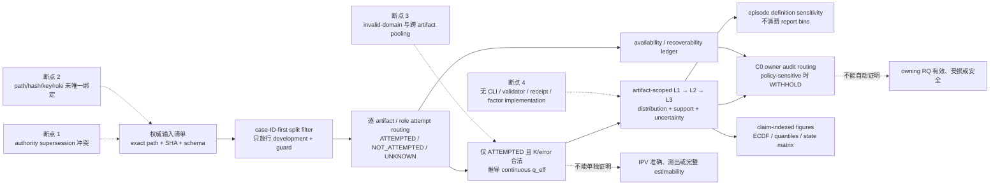

# RQ015A v3 三路独立复审综合

状态：`COMPLETE / BLOCKED / REQUEST_CHANGES`  
`formal_g1_eligible=false`｜`execution_authorized=false`｜未启动 RQ015A 计算

## 1. 复审对象、隔离与完整性

- 冻结计划：`reports/plans/RQ015A_plan_v3_concentration_audit_20260726.md`
- 计划 SHA-256：`75912bc1433a5efb5b0520af492e27579e9a1f6652074d3f37eb3a77befff264`
- 基线 manifest：`reports/plans/RQ015A_plan_v3_checksums_20260726.sha256`
- manifest SHA-256：`be1c66eb881079b96038d08eccd6c4e83fa6b4e54a0b76de92ebb52d9145a276`
- 现场完整性复核：manifest 内 `6/6 OK`。
- 三路 Reviewer 以同一冻结事实基线、不同侧重点独立复审；最终纳入的 Reviewer 3 是在发现
  一次并发文件覆盖及信息回流后重新启动的 clean-room 替代审查者。被污染的旧 Reviewer 3
  输出已被替换，不进入本综合或复审 manifest。
- 本轮只做复审和 synthetic contract probes：未修改 v3 plan/schema/run spec/code/tests/data，
  未读取新的 held-out measurement 值，未执行 RQ015A、未 replay、未连接或提交 HPC，未修改
  accepted `decision.md`。

| 路线 | 主审轴 | 结论 | Findings | 报告 SHA-256 |
|---|---|---|---:|---|
| Reviewer 1 | 技术正确性与唯一可执行性 | `BLOCKED` | 4 blocker / 3 major / 1 minor | `72c32d7a62b126de9fbfa95c011a2f1df88fc69130bad67328699d2378ee6c41` |
| Reviewer 2 | 科学意义与主张边界 | `BLOCKED` | 2 blocker / 3 major / 2 minor | `b37bc6c71f613be188b4967a04b32e7931cf145f49a2a9e7162fd360b351bb9a` |
| Reviewer 3 | 可读性、执行与治理 | `REQUEST_CHANGES`（blocking） | 2 blocker / 3 major / 0 minor | `eeff97d179877282e9c272cee349389aa4113673964db74c494946da111ab23b` |

正式报告：

- `reviewer1_technical_v3_20260726.md`
- `reviewer2_significance_v3_20260726.md`
- `reviewer3_readability_execution_v3_20260726.md`

## 2. 综合裁决

三路结论一致：**v3 是实质改进，但不是 Formal-G1 closure package。**

应当保留的科学方向已经稳定：连续 `q_eff=K_eff/K` 是主产物；report bins 仅作描述；
attempt provenance、q availability、accuracy 与完整 RQ007 estimability 必须分开；unknown 不能当作
数值 0。v3 还首次提供了真实 schema、helper implementation、fixtures 和 run-spec 文件，并把
bins 从 episode/C0 的函数参数中移除。这些不是文字润色，而是有效进展。

但“文件存在”不等于“对象唯一、实现完整、可以授权执行”。当前冻结包仍有四类决定性断点：

1. **权威链冲突**：manifest-bound disclosure 与 RQ007 README 仍要求 dev+guard 重导
   `4/7`、`0.93`，v3 plan 单方面写“正式解除”，没有同层级 append-only supersession；
2. **执行链缺失**：run spec 没有 command/entrypoint，引用的 authorization object 不存在，
   split 是符号串，ledger builder、validator、receipt writer 和完整统计流程也不存在；
3. **数据合同与真实产物不一致**：逐产物 exact path/hash/source columns 未冻结；OnSite、M3、
   WOD、RQ014 的 key/role/cardinality 中存在实际会改变行数或 join 的错误；
4. **代码可通过 fixtures 但仍 fail-open**：invalid `ipv_error` 会被计算为有效 `q_eff`，
   L2/L3 能跨 artifact pooling，无 q 证据的 C0 仍返回 `NO_AUDIT_TRIGGER_DETECTED`。

因此当前准确状态仍为：`BLOCKED / REQUEST_CHANGES`、`formal_g1_eligible=false`、
`execution_authorized=false`。

## 3. 机制图：v3 已建立的骨架与仍然断裂的位置



v3 已把 C→D 的核心概念和部分 D→E helper 写成代码；A、完整的 B→C、artifact-scoped E、
H 的 policy-withheld 状态以及 I 仍未闭合。虚线右侧是任何版本都不得越过的主张边界。

## 4. 相对 v2 已真正关闭的内容

| 项目 | v3 判定 | 复审解释 |
|---|---|---|
| continuous `q_eff` 主产物 | **ACCEPTED / RETAIN** | 不再要求数据“发现”两个科学阈值；不得退回 bands-primary。 |
| bins 不进入 episode/C0 函数 | **MECHANICALLY CLOSED** | 当前 helper 的 episode 与 C0 参数不含 report-bin cutoffs，fixture 也核了这一点。 |
| 守恒改为三条恒等式 | **CONCEPT CLOSED / ARTIFACT COUNTS OPEN** | expansion/collapse/terminal/recoverability 的单位分开是正确修复；逐产物因子和真实计数仍需纠正。 |
| OnSite local position 算法 | **ALGORITHM CLOSED / INPUT BINDING OPEN** | `(timestamp_ms, frame_index)` 排序再取 0-based position 的方向正确；filter 与 exact input 尚未绑定。 |
| deterministic mean | **CLOSED** | `sorted + math.fsum` 及置换 fixture 是有效、应保留的实现。 |
| L3 无支持不用 0 填充 | **CLOSED AT HELPER LEVEL** | `ZERO_SUPPORT, mean=None` 正确；上游 L2 support 定义仍需收紧。 |
| schema/run-spec/tests 文件存在 | **EXISTENCE CLOSED / COMPLETENESS OPEN** | `6/6 OK` 只证明这些字节存在且未漂移，不证明其语义正确或可执行。 |

## 5. Formal-G1 gate 状态

| Gate | v3 状态 | 决定性缺口 | 最小关闭证据 |
|---|---|---|---|
| G1 构念与主张边界 | **CLOSED** | 仅存命名方向风险 | 保留 attempt + effective-support audit；禁止 accuracy/“测出 IPV”/完整 estimability 主张。 |
| G2 continuous / policy contract | **PARTIAL / BLOCKING** | bins 已脱离下游，但 PI 重导命令未正式 supersede；invalid error/K 域未 fail closed；C0 unstable 无 withheld terminal | checksum-bound PI addendum；冻结 attempt-first/domain-validation 顺序和 `ROUTE_WITHHELD_POLICY_SENSITIVE`。 |
| G3 input / split / D0 / ledger | **PARTIAL / BLOCKING** | schema 存在，但无 exact files/hashes/producers；真实 product keys/roles 有误；split 未绑定 | 逐文件 inventory + SHA、真实字段 crosswalk、split SHA、golden row/count fixtures。 |
| G4 units / SAP / aggregation | **PARTIAL / BLOCKING** | code 所需 perspective/configuration 不在 schema；L2/L3 丢 artifact/role；factor/Spearman/bootstrap 未实现 | artifact-scoped estimands、完整 schema/algorithm/fixtures；因素分析删除或完整冻结并实现。 |
| G5 C0 routing | **PARTIAL / BLOCKING** | helper 存在，但 bad counts 不拒绝、无 q 可返回 NO_TRIGGER、sensitivity 仅 boolean | 输入域 validator、owning-RQ mapping/crosswalk、indeterminate/withheld terminals 与边界 fixtures。 |
| G6 held-out / governance | **PARTIAL / BLOCKING** | disclosure 与 plan 冲突；`held_out_parsed_rows` 混淆 ID-only 与 measurement-field parsing | append-only supersession 或撤回解除；分层 leakage counters；split binding。 |
| G7 run / authorization / receipt | **OPEN / BLOCKING** | 无 exact command/entrypoint；authorization fragment 不存在；无 executor/validator/receipt schema；WOD/RQ014 输入不在 declared local roots | checksum-bound CLI、environment、exact inputs、validator、machine receipt schema，以及仅在 Formal G1 后签发的 scoped single-use authorization。 |

结论不是“v3 没有进步”，而是：**G1 已闭合；G2–G6 只有局部 helper 闭合；G7 仍未建立。**

## 6. 决定性技术与治理问题

### 6.1 PI 条件没有被合法 supersede

v3 plan `:31-34,98-99` 声称“从 dev+guard 重导 `4/7`、`0.93`”的条件已正式解除；
但 manifest 同时绑定的 `sealed_exposure_disclosure_20260726.md:71-84` 仍把重导写成
mandatory condition，RQ007 knowledge README `:6-12` 也仍保留该条件。

科学上把 bins 降为 display-only 是合理的；治理上却不能由一份 `FINAL_CANDIDATE /
AWAITING_INDEPENDENT_REVIEW` 的 plan 自动覆盖既有 PI 决定。下一版只能二选一：

1. 增加 checksum-bound append-only PI/RQ007 addendum，明确 supersede 的对象、日期、允许用途、
   sensitivity/withhold 义务；或
2. 撤回“已正式解除”，继续遵守原重导条件。

### 6.2 run spec 是流程说明，不是 immutable executable object

`RQ015A_run_spec_v1.json` 没有 command、entrypoint、launcher 或参数字段；`phases` 只是 prose list。
它引用 `configs/research_authorization.json#rq015a_concentration_audit`，但 central registry 只有
`INFRA` 与 `RQ014`，没有 RQ015A operation。`split_source` 只是不存在的符号路径
`RQ007 case_split_assignment.csv`；真实 split 文件虽存在且 SHA-256 为
`90d8bb91e68f9b5e0596cf1ae915eb22b01a5c4ccffbad00c0b446efa46d537d`，却未进入 v3 manifest。

此外，当前 `rq015a_contracts.py` 只是 helper library：没有读取/规范化 artifact 的 ledger builder，
没有 Spearman 或 case-cluster bootstrap，没有 report/figure builder，没有 receipt writer/validator，
也没有 CLI。run spec 承诺的 execute steps 大部分没有唯一实现。

### 6.3 主量的数学域与 attempt routing 仍会产出错误有效值

plan `:83-84` 规定 `ipv_error >= 1 -> q_eff=None`；实现 `k_eff_from_error()` 却只在
`(1-error)^2 == 0` 时拒绝，导致现场 synthetic probe 得到：

```text
q_eff(1.1, 7) = 1.0
q_eff(2.0, 7) = 1/7
q_eff(-1.0, 7) = 1/28
q_eff(0.0, True) = 1.0
```

这与 plan 和 normalized-weight 数学域冲突。实现还把 `q>1` 静默截断为 1，接受 bool/non-integer K；
schema 把 range 写成 `(0,1]`，而规范化非负权重下应为条件化的 `[1/K,1]`。

必须先 route attempt status：已知 D0 行应为 `NOT_ATTEMPTED`，不能因 `error=1` 统一改成
`UNKNOWN`；对非 D0 的 invalid/missing error、K、weight normalization 才给独立的 q-unavailable/
UNKNOWN reason。禁止用 clipping 把合同违例修饰成有效观测。

### 6.4 schema、真实产物与聚合代码并不一致

ledger schema 的 fields 没有 `perspective`、`configuration`，但 `aggregate_l2()` 对每行强制读取
这两个字段。schema 有 `ipv_error`，却没有 episode summary 所需的 observed `ipv` 与来源。

更严重的是，L2 key 只有 `(case_id,perspective,configuration)`，L3 只剩 `case_id`；二者都不保留
`artifact_id` 或 `measurement_role`。混合 sigma/M3/OnSite 的 synthetic rows 会被合成一个 L2/L3，
直接违反 schema 的 `cross_artifact_pooling=FORBIDDEN`。case ID 也不是跨产品全局唯一。

修复必须是代码层 invariant，而不是调用约定：artifact namespace、role、K/grid/configuration/time role
应贯穿所有输出层；若 API 设计为一次仅收一个 artifact，则混合输入必须 fail closed 并有 fixture。

### 6.5 C0 仍有 fail-open 与政策敏感性问题

现场 probe 表明：`uses_ipv=true, n_rows=100, no q evidence` 会返回
`NO_AUDIT_TRIGGER_DETECTED`，而不是 indeterminate；`n_rows=10, n_not_attempted=9,
n_unknown=9` 可产生 `unavailable_share=1.8`，说明互斥性、非负性和分母校验均未实现。

`c0_route_with_sensitivity()` 在 action 随 cuts 改变时仍给出 primary action，只附 `stable=false`。
这不足以阻止下游把不稳定 action 当结论。应输出明确的
`ROUTE_WITHHELD_POLICY_SENSITIVE`，并冻结逐 owning-RQ 的 applicability、mapping cardinality、
coverage、union numerator、zero-denominator 与 reason-code contract。

### 6.6 16 项 fixtures 没有覆盖真实闭合风险

在显式外部测试环境中，RQ015A 16 项 fixtures 可通过；但系统 `python3` 无 `pytest`，而 run spec
声称“纯标准库”且 validate-only 必须执行 fixtures，故声明的环境本身不可复现该 gate。

现有 fixtures 也没有覆盖：

- `ipv_error<0`、`ipv_error>1`、bool/non-integer K、NaN q；
- exact split path/hash 与 authorization registry；
- 每个 artifact 的 file/source-column/key binding；
- anti-pooling rejection；
- RQ014/OnSite/WOD 的真实 schema-shape golden；
- end-to-end ledger build、factor analysis、receipt validator；
- no-q C0、overlapping counts 与 policy-withheld terminal。

所以 `16/16 PASS` 只能证明当前 synthetic helper examples 自洽，不能证明 Formal G1 或可执行性。

## 7. 逐产物证据矩阵

| Product / binding | v3 写法 | 一手仓库事实 | v3 判定 |
|---|---|---|---|
| RQ007 split | 符号串 `RQ007 case_split_assignment.csv` | exact file 存在，SHA `90d8bb…537d`，未 manifest-bind | **OPEN / BLOCKING** |
| sigma01 hw4 | `scene_unique_id,frame_index`，两 agent roles | 本地有两个竞争性 full/sigma target CSV，v3 未选 path/hash/producer；真实 header 还含 `source_row`、dataset 等 namespace | **OPEN / BLOCKING** |
| RQ009 M3 | collapse 3→1，同时声明 current/counterpart/target 三 roles；唯一 error source 是 `target_ipv_error_future` | alpha 去重与 measurement-role 展开是两个不同维度；三 role 的各自 source 没有冻结 | **INCONSISTENT / BLOCKING** |
| OnSite dense | key 用 `case_id`；4 roles；无 role-source columns | 实际 header 用 `case_key`，并有四个明确 error columns；expected UNKNOWN/attempt counts 未由真实 validator 复验 | **MISMATCH / BLOCKING** |
| WOD full479 | generic candidate key，K provenance | exact CSV/path/hash/error column 未冻结；declared local roots 内未找到 full479 input | **OPEN / BLOCKING** |
| WOD replay family | 合并成一个 generic long artifact | Phase1/1b/10Hz/SchemeB grain 与 wide/long shape 不同；A 又禁止 replay | **OPEN / BLOCKING** |
| RQ014 g2r anchor scores | key `(segment_key,cell_id,tau_tick)` | RQ014 anchor-score schema 使用 `segment_id,feature_id,horizon_id,tau_tick,candidate_ordinal/id`；v3 key 中两字段不在该 row schema，且本地 declared root 无 full `g2r_anchor_scores.jsonl` | **WRONG KEY / BLOCKING** |

注意：一次事实核查曾把 RQ014 的三元 key 误判为一致；综合复核以
`configs/artifact_schemas/rq014_g2r_anchor_score_row_v1.schema.json`、
`tests/fixtures/rq014_g2r_v1/schema_shape_goldens.json` 与 W4 fixture identity 为一手证据，已驳回该误判。

## 8. 读者与论文级图文合同

clean-room Reviewer 3 认为跨学科读者仍需依赖未明示的项目上下文；结合本仓库的
claim-indexed reporting 与 figure-bundle 规则，图文缺口是 major delivery concern，但在本轮已有
更早的技术/治理 blockers，因此它不应被误解为“只要补几张图就能放行”。真正可执行后，
报告至少应按 claim 绑定：

1. **机制图**：input provenance → attempt routing → q availability → continuous `q_eff` →
   optional policy display → owner routing，并标出不能推出 accuracy/estimability 的断点；
2. **source × state 堆叠图**：每个 artifact/role 的 ATTEMPTED、NOT_ATTEMPTED、UNKNOWN 和
   q-unavailable，显示 count、百分比和精确分母；
3. **continuous distribution panels**：按 artifact/config/K/role 分面的 ECDF + quantiles + tail share，
   禁止跨 artifact pooling；
4. **L1/L2/L3 support map**：每层 unit、n、missing/unknown、minimum-support attrition 与 CI；
5. **policy sensitivity heatmap**：report bins 与 C0 cuts 分开绘制，action 翻转直接显示 WITHHELD；
6. **claim-evidence-action matrix**：每条结论只链接直接支撑它的 table/figure/receipt；
7. 每图都提供 panel-level source table、figure manifest、PNG + PDF/SVG 与可重建脚本。

`q_eff` 的可见名称建议用 `effective_candidate_fraction`，或在每个 axis/caption 明示：数值越大
代表 candidate support 越 diffuse/near-uniform，并非“越集中”。

## 9. 三路共识与互补判断

1. 三路均接受 continuous-primary 与 construct narrowing；下一版不应重开这些已关闭问题。
2. Reviewer 1/2 均把 PI supersession、split provenance、anti-pooling 和 execution closure 识别为
   决定性问题；Reviewer 3 从可读性/治理侧确认其后果不是纯工程细节。
3. Reviewer 1 的“文件存在但不可唯一执行”获现场 registry、symbolic split 与 code probes 支持。
4. Reviewer 2 的科学边界判断成立：`q_eff` 是 effective-support proxy，不自动跨 K/grid/config/source
   可比，更不能转化为 accuracy、qualification、damage 或 safety。
5. 跨学科可读性与仓库图文合同应纳入下一版 delivery contract，但不能替代 authority、
   data binding、algorithm 和 authorization 的关闭。
6. 综合事实核查新增了 Reviewer 单报告未完整覆盖的硬缺陷：invalid error domain、schema-code fields、
   C0 no-q fail-open、RQ014 wrong key、OnSite `case_key` mismatch 与 declared-local input absence。

## 10. 下一版最小 closure package

下一版不要再扩写计划正文，先把以下实际对象做成一个新的 checksum-bound package：

1. append-only PI/RQ007 supersession（或撤回“已解除”）；
2. exact artifact inventory：每个 input file 的 path/SHA/type/producer/version/local availability，
   以及真实 primary key、role/source column、K/grid/config/time role；
3. exact RQ007 split file/SHA 与分层 held-out leakage counters；
4. 修正后的 ledger schema：schema 与算法字段一一对应，attempt/q-availability/recoverability/mapping
   正交，reason codes 为 closed enum；
5. artifact-scoped ledger builder 和 validator，invalid domain、join/cardinality、conservation、
   duplicate、anti-pooling 全部 fail closed；
6. 唯一 L1→L2→L3/episode/C0 SAP；factor analysis 完整冻结并实现，或从 Formal-G1 scope 删除；
7. exact CLI/command/environment/output root/receipt schema + no-overwrite validator；
8. claim-indexed figure/visualization contract；
9. 覆盖所有上述 blocker 的 golden fixtures 与 end-to-end validate-only test；
10. 对整个新 package 重新三路独立复审。

复审无 blocker 只表示可进入 Formal G1；仍不等于执行授权。随后须由 PI 对**精确 package/run-spec SHA**
另签 scoped single-use authorization，validate-only PASS 后才能执行。

## 11. Risk / unsupported claims

- 不能声称 v3 已正式解除 PI 的 dev+guard rederivation condition。
- 不能把 `6/6 OK` 解释为六个对象语义正确、数据已绑定或 G2–G7 已关闭。
- 不能声称 run spec 已冻结 exact command、可在 declared environment 运行或已获授权。
- 不能把 `ipv_error>=1`、negative error、unknown K 或 D0 sentinel 经 clipping 后当作有效 `q_eff`。
- 不能把 ATTEMPTED、q available、recoverable、mapping available 当作同一状态轴。
- 不能声称当前 L2/L3 实现禁止跨 artifact/role/config pooling。
- 不能把无 q 证据的 `NO_AUDIT_TRIGGER_DETECTED` 解读为低风险或未受影响。
- 不能用 C0 的 `stable=false` 元数据代替明确的 policy-sensitive withhold。
- 不能用 schema 中的 RQ014/OnSite/M3 声明替代真实 artifact key/role/cardinality 证明。
- 不能由 normalized `q_eff` 自动推出不同 K/grid/sigma/window/rate/model/source 具有相同含义。
- 不能把 factor Spearman 解释为机制、因果、修复可行性或 RQ007 的确认/否定。
- 不能把本复审、Formal G1 或 validate-only PASS 当作 compute authorization。

## 12. 最终边界

**`BLOCKED / REQUEST_CHANGES`**

- `formal_g1_eligible=false`
- `execution_authorized=false`
- 不创建 RQ015A `decision.md`
- 不生成最终 ledger、连续画像、policy bins、episode summary、factor results 或 C0 routing
- 不读取新的 RQ007 held-out measurement values
- 不 replay WOD/RQ014，不修改 accepted claim/decision，不提交 HPC
- 下一步只允许修订并 checksum-freeze closure package，再启动新的独立复审

本裁决接受 v3 的 continuous-primary、bins-downstream decoupling、三恒等式骨架、local-position
算法、deterministic mean 与 explicit-zero-support；拒绝的是“这些局部 helper 已经组成唯一、完整、
可授权执行的 Formal-G1 package”这一完成性主张。
