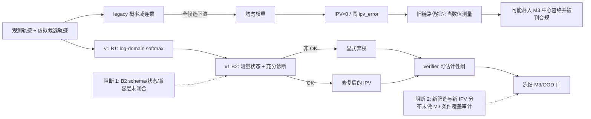

# RQ015 v1 双路独立复审交叉裁决

日期：2026-07-26  
复审对象：`reports/plans/RQ015_plan_v1_ipv_estimability_and_estimator_repair_20260726.md`  
冻结 SHA-256：`2c214b0dccaa126a009876c7aeec2d6895862e593a9478ba02adab139bf57cd6`  
复审状态：`COMPLETE`  
交叉裁决：**BLOCKED / REQUEST_CHANGES**  
`formal_g1_eligible=false`  
`execution_authorized=false`

## 1. 独立性与复审范围

两名复审者拿到同一份冻结 v1 与同一校验和清单，分别从以下两条路线独立工作；在各自
形成最终意见前未交换发现，也未读取对方复审结论：

1. 统计/科学契约路线：`codex_stats_review_v1_20260726.md`；
2. 执行/代码/治理路线：`codex_execution_review_v1_20260726.md`。

两路均核查了计划、BUILD_WHILE_DENY 草案模块和测试，并按各自重点追到当前生产消费者、
RQ009/M3 边界和 RQ014 管理执行面。两路完成后，主审才进行交叉裁决；主审补充项不是
第三张独立票，而是对两份意见的事实核验和冲突消解。

## 2. 双路结果

| 路线 | 独立结论 | 计数 | 最关键原因 |
|---|---|---:|---|
| A：统计/科学契约 | `BLOCKED` | 1 blocker / 2 major / 2 minor | B2 被写成已落地，但 schema、状态发射和数值消费者兼容层尚未兑现 |
| B：执行/代码/治理 | `BLOCKED` | 2 blockers / 1 major | B2 契约与草案对象不一致；现有 estimator/InterHub/verifier 路径仍只接受数值 IPV/error |

两路不是简单相加计数，因为主要 blocker 高度重合。独立收敛的共同结论是：

> log-domain 数学改写方向可信；当前阻断点是从“稳定算出权重”到“可审计地弃权并被所有
> 消费方正确处理”之间的契约仍未闭合。

两份原始复审的 SHA-256：

- stats：`a63c07db3e3bd87be037b7b3fe7fa474ac5b1eb45f2de9e35ca55cdab53d235e`
- execution：`0637f3c37a0ef2c7035c0499668f34458255e31f461c98798e7c9aa198e5a9b3`

## 3. 机制图：v1 想修什么，当前卡在哪里

图中两个阻断点性质不同：第一个是结果契约与工程接线问题；第二个是统计有效性问题。
即使第一个接通，也不能自动推出冻结 M3 在新 gate-pass 人群上仍保持原覆盖率。

## 4. 交叉裁决后的阻断项

### C-BLOCK-1 — B2 的“已落地”表述与实际交付不一致

计划 §4.2/§4.4b/§8 同时要求并声称版本化 schema、完整状态码、`grid_id`、非 OK 时
`ipv=NaN`、旧接口兼容层和消费者显式弃权。当前草案仍有以下缺口：

- `ReliabilityResult` 没有 `grid_id` 或独立 `schema_version`；
- 计划列出 `AT_GRID_BOUNDARY` 状态，代码却只有 `at_grid_boundary` 布尔量；
- `NOT_ATTEMPTED` 与 `SOLVER_FAILURE` 只是常量，没有当前入口可发射；
- 单一 `status + reason_code` 不能表达 `MODEL_MISFIT`、`FLAT_LIKELIHOOD` 与边界命中同时发生；
- `estimate_ipv_pair()`、InterHub 导出/绘图、verifier anchor 仍使用旧的纯数值接口。

这里并不是要求在 plan review 前擅自接入生产。最小修订有两条合法路径：

1. 将 §4.4b 改成“B1 原型 + B2 scaffold，均未完成/未接线”，把完整 adapter、schema 和
   integration tests 明列为 Phase B 交付；或
2. 真正补齐 B2，再如实保留“已落地”。

在二者之一完成前，不能把草案称为可部署弃权链。

### C-BLOCK-2 — D1/D2/D3 不是可执行分类器

计划以“legacy 近均匀 → new 集中”识别 D1，以 `min_mse` 小/大区分 D2/D3，但没有冻结：

- “近均匀”的数值规则；
- `min_mse` 小/大的阈值、单位、分层方式和冻结集；
- 多个状态同时成立时的优先级或多标签表达。

当前 `DEFAULT_MIN_MSE_MISFIT=None`，因此默认路径根本不会发射 D3。D1 规则还漏掉
“只有部分候选下溢”的情况：legacy 可将个别候选权重压成 0，但整体并不均匀，也不会走
全均匀兜底。D1 应由每候选的 legacy 下溢/非有限掩码或严格的新旧权重差定义，不能只看
是否命中均匀兜底。

在规则、冻结数据和误差控制未写清前，§8 要求输出 D1/D2/D3 比例不可复现。

### C-BLOCK-3 — “可估计性闸与 M3 正交”只在概念上成立，不保证统计覆盖

两道门回答的问题确实不同：可估计性闸问“当前 IPV 是否测出”，OOD 门问“当前上下文是否
落在规范模型支持域”。但这不意味着统计独立：

- 新弃权规则改变被评分人群；
- B1 会在 legacy 下溢行改变观测 IPV，可能同时改变 M3 的输入特征与最终偏离度；
- 冻结 M3/CQR 是在 legacy 标签与原 OOD 门下训练、校准和评估的；RQ009 的约 0.899
  覆盖是原评估总体上的边际结果，而且其子组覆盖和 LODO 范围本就不均匀。

因此，冻结 M3 可以保持字节不变，但原覆盖声明只能作为历史结果保留；不能直接移植为
“新增可估计性闸后的 verifier 仍近名义覆盖”。最小修订是把“可部署交付”降为待审候选，
并要求在 gate-pass × estimator-version 人群上进行 outcome-blind 的选择后覆盖审计。
如果 runtime 使用修复后的 IPV/特征且审计失败，则需要单独授权的重校准或重训决策；
不能由 RQ015 静默决定。

### C-BLOCK-4 — B2/B3 的数学与数据边界仍有错误或空白

1. `mse_per_candidate` 仅对当前 Gaussian squared-error likelihood 以及改变其 `sigma`
   是充分统计量；它通常不足以换成 Student-t。反例：残差 `(0, √2)` 与 `(1, 1)` 的
   MSE 都为 1，但在自由度 3、相同尺度的 Student-t 下，去掉公共常数后的对数似然分别约为
   `-1.02165` 与 `-1.15073`。若要支持重尾核，应保存逐步残差或足以重构该核似然的统计量；
   否则删去“换核函数无需重解”的泛化。
2. `median(sqrt(min_mse))` 是“获胜候选的稳健残差尺度”，不是自动成立的观测噪声标准差。
   它混合真实噪声、候选网格离散误差和模型偏差，需要明确只是 heuristic、定义选择目标，
   并显式限定只在 dev/guard 上拟合。当前计划只对 Phase A 阈值明确剔除 RQ007 sealed，
   没有把同一禁令明确扩展到 B3 sigma。

这两点应在 v1 文本冻结前修正，而不是留给执行者临场解释。

## 5. 主要但可在修订中关闭的问题

### 5.1 数值入口尚未 fail-closed

- `sigma` 未验证为有限正数：负值被静默接受，`inf` 产生均匀权重，`0/NaN` 以
  `AssertionError` 失败；
- 轨迹 shape 未严格一致时可发生广播，巨大但有限的坐标可在平方时溢出，随后同样以
  非类型化断言失败；
- 应在 softmax 前验证 shape、非空、有限平方距离和 `sigma>0`，并映射为明确的
  `NON_FINITE_INPUT`/`SOLVER_FAILURE` 或 `ValueError`，再加边界测试。

### 5.2 下溢阈值函数与计划数字不是同一个浮点边界

`underflow_rms_threshold()` 使用 `np.finfo(float).tiny`（最小正规数），得到：

| n | 当前函数：进入 subnormal 前 | 最小 subnormal/接近 exact-zero 边界 | 计划/测试声称 |
|---:|---:|---:|---:|
| 5 | 1.6915 m | 1.7336 m | ≈1.73 m |
| 11 | 1.1470 m | 1.1752 m | ≈1.18 m |

测试用 `abs=0.05` 同时容纳了两套定义，因此没有暴露偏差。应明确命名
“进入 subnormal”与“乘积舍入为 0/触发 fallback”两个阈值，并用相应精度测试。

### 5.3 抽样复算没有精度合同

“按数据源 × 几何 × 窗长，数万锚点”还不足以复现。至少应冻结抽样框、各层分配、随机种子、
代表性层与疑似下溢加密层、目标比例的置信区间/误差上限，以及 case/scene 聚类处理。

### 5.4 文档与证据链仍混用 v0/v1

- RQ015 knowledge README 第 3 行仍指向 v0，第 22 行仍写 `73.8%`，应为 v1 的 `71.65%`；
- 计划引用的 `reports/knowledge/ipv_estimator_divergence_investigation.md` 不存在，实际文件在
  `reports/knowledge/_analysis/`；
- “archived copy” 未给出可解析路径；
- §4.4b 的“B1/B2 已落地”和 §8 的验收顺序需与真实成熟度一致。

## 6. 已通过的部分

以下部分可以保留，不应在 v2 中推倒重来：

- warm-up 行已正确改记为 D0/`NOT_ATTEMPTED`，v0 的 K≥9 推断已证伪；
- 有效行画像可复现：7,086,138 个 agent-值中，`|IPV|<1e-9=41.2794%`、
  `ipv_error≥0.61=52.5810%`、`P(IPV=0|error≥0.61)=71.6527%`；
- `K_eff` 已如实限定为 RQ007 的 internal identifiability proxy，不冒充直接 IPV 误差；
- Gaussian log-domain 改写在未下溢行上的等价性成立；
- RQ007 held-out/sealed 不得用于阈值选择、冻结产物不得覆盖、RQ014 lane 不得混入新估计器，
  这些治理边界方向正确；
- Phase C 改为资格矩阵而非在 RQ015 内重估既有结论，方向正确。

## 7. 进入下一轮复审前的最小关闭清单

1. 将 B2 当前状态改为 scaffold，或补齐并测试 schema/status/adapter；
2. 冻结一个正交结果合同：主测量状态、可并存诊断 flags、reason codes、schema/grid/estimator 版本；
3. 冻结 D1/D2/D3 的数值规则、数据 split、抽样精度与多原因优先级；
4. 将 `mse_per_candidate` 的充分性限制在 Gaussian/sigma，或追加逐步残差；
5. 将 B3 明确为 dev/guard-only heuristic，并写明 sealed exclusion 与选择目标；
6. 把 M3 原覆盖限定为历史 ungated 结果，新增 gate-pass 条件覆盖/选择后有效性审计；
7. 加入 sigma/shape/overflow、partial-underflow、精确阈值和全链路 abstention integration tests；
8. 修复 README、证据路径和“archived copy”引用；
9. 维持 `execution_authorized=false`。RQ015 管理执行面未建立前，不做 HPC validate/submit。

以上关闭后才能重新启动同口径双路复审；两路均无 blocker 后，v1/v2 才有资格进入 Formal G1。

## 8. 本轮验证证据

- v1 checksum manifest：所列条目全部匹配；
- portrait scan：复算结果与 §2 的有效行画像一致；
- `PYTHONPATH=src .venv_ipv_local_test/bin/pytest -q tests/test_rq015_reliability_logdomain.py`
  → `7 passed`；
- `PYTHONPATH=src .venv_ipv_local_test/bin/pytest -q tests/test_ipv_estimator_parity.py`
  → `5 passed, 1 skipped`；
- 执行路线另在 verifier 环境复跑相同测试，并对 RQ014-only launcher 门做了 2 项聚焦测试，
  均通过；
- `git diff --check`：复审文件无格式错误；
- 未导入生产路径、未读取 rating、未触碰 sealed set、未提交 HPC 作业、未修改任何
  accepted `decision.md` 或冻结数据产物。
