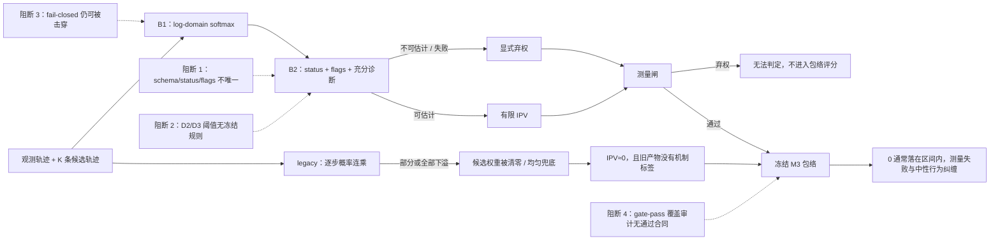

# RQ015 v1.1 双路独立复审交叉裁决

日期：2026-07-26  
复审对象：`reports/plans/RQ015_plan_v1_ipv_estimability_and_estimator_repair_20260726.md`  
冻结 SHA-256：`de68bd15eb560a428d3146b4f68a88263eaaf168d3e7880f53989d692a0f8d21`  
复审过程：`COMPLETE`  
最终交叉裁决：**BLOCKED / REQUEST_CHANGES**  
`formal_g1_eligible=false`  
`execution_authorized=false`

## 1. 双路独立性与结论演化

两名正式复审者拿到同一份冻结 v1.1 和同一份校验和清单，分别从以下两路独立工作；
首次定稿前未读取对方复审文件，也没有交换发现：

1. Lane A：统计口径、科学解释、M3 覆盖边界；
2. Lane B：代码、结果 schema、fail-closed、生产消费者和执行治理。

两路首次都给出 `PASS_WITH_CONDITIONS`。主审随后只做事实探针，不形成第三张审稿票；
探针发现的新增证据以完全相同、但按各自专业范围裁剪的清单分别交回两位复审者。
复议阶段两位仍未读取对方意见或本综合稿，并各自在原复审文件后追加审计可追溯的
`Post-Verdict Addendum`。两路最终都独立改判为 `BLOCKED`。

| 路线 | 首次意见 | 新证据复议后的最终意见 | 最终计数 | 决定性原因 |
|---|---|---|---:|---|
| A：统计/科学 | `PASS_WITH_CONDITIONS` | **`BLOCKED`** | 2 blocker / 3 major / 1 minor | B2 科学契约不唯一；`min_mse_misfit` 无冻结规则；M3 审计无可执行通过标准 |
| B：执行/代码/治理 | `PASS_WITH_CONDITIONS` | **`BLOCKED`** | 3 blocker / 3 major / 0 minor | fail-closed 可被探针击穿；极小正 σ 泄漏为断言；计划 schema 与返回对象不一致 |

最终复审文件及 SHA-256：

- Lane A：`codex_stats_review_v1p1_20260726.md`  
  `6896e3dfcea3638899c3de89b6dcb41f9cc574c602860f55b4de394094999a46`
- Lane B：`codex_execution_review_v1p1_20260726.md`  
  `e1ddaecaac766c61d5bb42bbebe1e4e7e87cc0bb1c99c53116218a6b5e4899fd`

两路共同认可：旧接口兼容桥尚未交付、RQ015 HPC lane 尚未建立，仍是真实的执行前置；
但 v1.1 已明确写成 `B2_SCAFFOLD_NOT_WIRED`、`execution_authorized=false`，所以这两项本身
不再是本轮拒绝方案文本的原因。本轮阻断来自方案和 scaffold **当前已经声称冻结或关闭**、
但仍然不唯一或可被反例击穿的部分。

## 2. 机制图：问题方向正确，但四个合同点仍未闭合



这个图也界定了本轮的证据边界：现有数据强烈支持“零值容易被 M3 包络吸收”，但旧产物
没有 `status/flags`，不能把所有零值直接等同于“没有测出”，更不能写成无例外的因果链。

## 3. M3 近零目标的直接量化：方向很强，但“每个”是错的

对冻结 RQ009 M3 test 预测文件做只读复算：

`data/derived/interhub/RQ009_dynamic_counterpart_conditioned_envelope/`
`RQ009_1_dynamic_envelope_20260625T121905Z_98c433de/04_calibration/predictions/`
`tier=M3/fold=test/predictions.parquet`

口径：`nominal=0.90`、`abstain=false`，支持域内共 `1,209,857` 行；判断校准区间
`[lo_cal, hi_cal]` 是否包含 0。

| 目标口径 | 行数 | 区间包含 0 | 不包含 0 | 包含率 |
|---|---:|---:|---:|---:|
| `y == 0` | 266,448 | 265,756 | 692 | **99.7403%** |
| `|y| < 1e-6` | 522,219 | 520,826 | 1,393 | **99.7333%** |

近零行可视化：

```text
区间包含 0    520,826  ███████████████████████████████████████▉  99.7333%
区间不含 0      1,393  ▏                                          0.2667%
```

所以，§7 的机制担忧不是空想：几乎所有支持域内近零目标都落在含 0 的 M3 区间中。
但 `1,393` 个反例足以否定“每个测不出的帧都被判合规”的全称表述；更重要的是，旧预测文件
无法区分 D1/D2/D3，也不能证明 `|y|<1e-6` 的每一行都属于“测不出”。可支持的表述应为：

> 在冻结 RQ009 M3 test 的支持域内，99.7333% 的近零目标区间包含 0；这说明旧的数值零值
> 与“落入规范包络”高度纠缠，但在新状态合同落盘前，不能把每个近零值归因于不可估计。

## 4. v1 相比上一轮确实关闭的内容

以下内容已取得实质进展，不应在下一版推倒重来：

- D0/warm-up 更正成立：`frame_index<4` 的 `0/1` 是未尝试估计占位，不是 K≥9 网格混入；
- 有效行画像仍可复现：7,086,138 个 agent-值中，`|IPV|<1e-9=41.2794%`、
  `ipv_error>=0.61=52.5810%`、`P(IPV=0 | error>=0.61)=71.6527%`；
- Gaussian 下 `w=softmax(-MSE/(2 sigma^2))` 的数学改写成立，未下溢行平价测试通过；
- `mse_per_candidate` 的充分性已收窄到 Gaussian/σ，换核需逐步残差，旧的过度泛化已删；
- B3 已被限定为 dev+guard-only heuristic，sealed 集禁止用于选择；
- B1/B2 已诚实标为未接生产的 prototype/scaffold；
- M3 的 `≈0.899` 已被限定为历史 ungated marginal coverage，未再直接写成新 gate-pass 覆盖；
- 生产兼容桥和 RQ015 管理执行面被明确列为未来 stop gate，且当前无计算授权。

测试通过只能证明这些被覆盖的路径，不等于科学阈值、schema 和所有数值边界都已冻结。

## 5. 交叉裁决后的阻断项

### C-BLOCK-1 — 没有唯一、可机器执行的 B2 结果合同

计划 §4.2 的显式字段表为：

`ipv, ipv_error, status, reason_code, K, grid_id, min_mse, loglike_gap,`
`at_grid_boundary, mse_per_candidate[K], estimator_version`

而 `ReliabilityResult` 还暴露 `weights`、`flags`、`k_eff`、`step_sq_residuals`、
`schema_version`、`sufficiency_scope`。更关键的是：

- §4.2 把 `AT_GRID_BOUNDARY` 列为 terminal status，并规定所有非 `OK` 的 `ipv=NaN`；
- §4.4b、代码和测试把它作为可与 `OK`、`MODEL_MISFIT` 共存的 diagnostic flag；
- 没有独立的 RQ015 schema 文件把字段类型、必填性、nullability、枚举、优先级和版本迁移钉死。

这不是排版差异：同一边界行在两套解释下会分别保留有限 IPV 或被弃权，直接改变聚合、
M3 anchor 和 verifier 输出。Formal G1 前必须冻结一个权威 schema，并让计划、对象和测试一致。

附带边界：§3 的 `ESTIMABLE: K_eff<=4` 与 `NOT_ESTIMABLE: K_eff>=0.93K` 在 `K<=4`
时可重叠。现有主要网格为 K=5/7，但公共合同要么限制 `K>=5`，要么规定互斥优先级。

### C-BLOCK-2 — D2/D3 分类仍由执行者临场选择

把 `min_mse_misfit` 改成必填参数，只能防止“忘记传值”，不能回答“应该传什么值”。
当前计划没有冻结：

- 阈值的量纲与统计定义；
- 使用哪个 dev/guard artifact、全局还是分层阈值；
- 阈值的选择目标、误差代价、敏感性和最终冻结收据；
- `LEGACY_DIVERGENCE_TOL=1e-6` 的依据和冻结规则。

测试中的 `MISFIT=4.0` 明确只是测试阈值，不是科学阈值。因而当前 D2/D3 比例仍不可复现。
同时，`D2_INTRINSIC_FLAT` 和“固有不可辨识/真实发现”超出了证据：它最多证明在当前
Gaussian likelihood、候选生成器和冻结网格内 flat。建议改为 `WITHIN_MODEL_FLAT`，把
物理层面的“固有不可辨识”留给额外模型/网格敏感性证据。

### C-BLOCK-3 — M3 gate-pass 覆盖审计不是可验收的统计合同

§4.6 已要求审计，但仍未给出：

- 固定的评估 split/行 ID 与 estimator lineage；
- 审计目标是 coverage、selective coverage 还是同时约束 abstention/width；
- nominal levels、容许偏差、置信区间方法和最低样本量；
- case/scene 聚类以及 source/geometry 子组的最低支持量；
- 明确的 pass/fail 与失败后的路由规则。

“outcome-blind coverage audit”本身也需拆开：门规则和分析方案可以在看结果前预注册，
但 coverage 的计算必然使用真实 `y`。建议写成“预注册、结果盲的 gate 选择 + held-out
post-selection coverage audit”。§4.6 将交付降为 audit-pending candidate，但 §7 又称
“本 RQ 的可部署交付”，仍需统一为“审计通过后才成为可部署候选”。

§7 表格的“M3 训练标签不改数值”也要限定为**冻结历史 M3 的训练标签不改**；B1 明确会改变
legacy-underflow 行上的新观测 IPV。历史模型字节不变与新 runtime measurement 版本变化
不是同一件事。

### C-BLOCK-4 — “fail-closed 已关闭”被直接探针否定

当前 18 项测试全部通过，但未覆盖以下入口：

| 探针 | 实际结果 | 应有合同 |
|---|---|---|
| 非有限 `ipv_range` | 可出现 `status=OK, ipv=NaN` | 输入拒绝或 typed non-OK |
| `grid_id=''` / 非字符串 | 被接受并原样返回 | 非空字符串校验 |
| `k_eff_flat_ratio=NaN/inf` | 可抑制 flat 判定并返回 `OK` | 有限且合法范围 |
| `legacy_divergence_tol=NaN/inf` | 可静默改变 D1 分类 | 有限非负 |
| `sigma=1e-200` 或 `1e-300` | 原始 `AssertionError` | typed input/failure result |

极小正 σ 的根因是 `sigma**2` 先下溢为 0，随后 `logw` 退化；“σ 有限且大于 0”不足以保证
数值域有效。需要验证平方后的分母或冻结可支持的 σ 下界，并用 typed error/status 退出。

此外，`estimate_reliability()` 为生成 legacy 诊断 flag 会对每行无条件执行 `legacy_var()`。
即使它不再决定新权重，未来若直接接生产仍会保留旧概率连乘的成本、警告和平台边界。
应把 legacy 比较限制在 shadow/audit 模式，或明确其上线成本与失败隔离合同。

## 6. 其他必须更正的 major/minor 项

### 6.1 “精确 0”边界早了约 0.5–0.8 mm

`boundary="zero"` 当前使用最小 subnormal `5e-324`，它是“仍可表示的最小正数”，不是
round-to-nearest 变成 0 的半最小 subnormal 边界。

| n | 当前函数 | 实际 round-to-zero 边界 | 差值 |
|---:|---:|---:|---:|
| 5 | 1.733618533 m | 1.734418003 m | 0.000799469 m |
| 11 | 1.175244798 m | 1.175780848 m | 0.000536050 m |

差值很小，不改变“legacy 下溢现实存在”的科学方向；但代码、测试和文档明确使用“舍入为
精确 0”，就应使用 half-min-subnormal 或重命名当前边界，不能把不同浮点边界混为一谈。

### 6.2 三句绝对化表述需要收窄

1. “B1 不改变任何科学结论”应改为“B1 在非下溢行保持数值平价；其本身不授权修改结论，
   但会改变 legacy-underflow 行的测量及下游样本/输入，须重新审计”；
2. “每个测不出的帧都被静默判合规”应换成 §3 的实测比例和证据限制；
3. “D2 固有不可辨识/真实发现”应限定为当前模型与网格内 flat。

### 6.3 冻结 provenance 被原路径覆盖破坏

`RQ015_plan_v1p1_checksums_20260726.sha256` 对当前 7 项全部通过；但旧的
`RQ015_plan_v1_checksums_20260726.sha256` 对 plan/module/test 三项失败，因为 v1.1 继续覆盖
了 v1 使用的同一路径。旧复审记录中的 plan SHA `2c214b0d...` 已无法从当前路径重放。

这不表示 v1.1 当前 hash 错误，但说明“冻结版本”没有保存不可变字节。下一次修订必须使用
新文件名/目录（例如 v1p2 或 v2）并保留 v1.1 快照，不再覆写既有 manifest 所指路径。

### 6.4 文档证据链仍有三处具体缺口

- §10 声称 `archived/report_process/RQ010B_ipv_rating_pilot_20260629/` 有 WOD adapter 副本；
  实际目录只有 README、analyze、infer、prepare 和 sbatch 文件，没有该副本；
- `estimate_ipv_pair` docstring 仍说 warm-up 为 NaN，实际仍是 legacy `0/1`；
- Phase A 可直接引用已冻结的 RQ007 `split_freeze.json` 和 case assignment，不应再让执行者
  “定位或重建”而产生新的 fold provenance。

## 7. 下一次复审前的最小关闭清单

1. **另存新版本，不覆写 v1.1**；保留当前 plan/module/test 字节与 v1p1 manifest；
2. 冻结一份机器可读的 B2 schema：完整字段、类型、枚举、nullability、status/flags 组合、
   `AT_GRID_BOUNDARY` 语义、K 适用范围及版本迁移；
3. 补齐 `ipv_range/grid_id/k_eff_flat_ratio/legacy_divergence_tol/tiny-sigma` 校验与回归测试；
4. 冻结 `min_mse_misfit` 与 D1 tolerance 的选择规则、数据 split、单位、敏感性和冻结收据；
5. 把 D2 改成当前模型/网格内的 flat，不作“固有”或物理不可辨识主张；
6. 冻结 M3 审计协议：目标 artifact、held-out split、nominal、CI/tolerance、聚类、子组、
   pass/fail 和失败路由；
7. 用本报告的计数替换“每个”，收窄 B1 与 D2 的绝对化语句；
8. 修正 exact-zero 边界、错误的 archived adapter 路径、warm-up docstring 和 RQ007 split 引用；
9. 继续保持生产桥与 RQ015 HPC lane 为执行 stop gate，`execution_authorized=false`；
10. 关闭后，重新对新的不可变 SHA 启动同口径双路独立复审。

## 8. 本轮验证证据

- 当前 plan SHA 与 v1p1 manifest 一致：7/7 `OK`；
- 旧 v1 manifest：plan/module/test 3 项 `FAILED`，记录为 provenance drift，不混作行为失败；
- `PYTHONPATH=src .venv_ipv_local_test/bin/pytest -q tests/test_rq015_reliability_logdomain.py`
  → `18 passed`；
- `PYTHONPATH=src .venv_ipv_local_test/bin/pytest -q tests/test_ipv_estimator_parity.py`
  → `5 passed, 1 skipped`；
- 聚焦 launcher 治理测试 → `4 passed, 72 deselected`；
- Python compile check 与 `git diff --check` 通过；
- M3 test nominal-0.90 支持域近零审计：`520,826/522,219=99.7333%` 区间包含 0；
- 入口和浮点边界探针已由独立数值核验复现；
- 未接生产路径、未读取 rating、未触碰 RQ007 sealed、未修改 accepted `decision.md`、
  未做 HPC validate/submit、未覆盖任何冻结数据产物。

## 9. 结论

v1.1 已经把上一版“B2 已部署”和“M3 覆盖可直接继承”等最危险的方向性错误大幅收窄，
数学改写与测量闸的研究方向成立。但它仍不是一个能交给执行者不带自由裁量地完成、并由
第三方复现验收的冻结方案。

因此双路最终结论一致：**BLOCKED / REQUEST_CHANGES**。在 §7 的最小清单关闭并对新 SHA
重新复审之前：`formal_g1_eligible=false`、`execution_authorized=false`。
