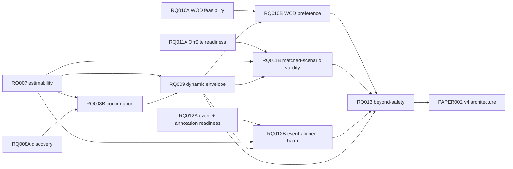

# RQ Research Program Progress Dashboard

Last synchronized: **2026-06-24**
Scope: `PAPER001/PAPER002` and `RQ001–RQ013`  
Machine-readable registry: [`rq_progress_registry.csv`](rq_progress_registry.csv)  
Central plan index: [`../plans/README.md`](../plans/README.md)

## Purpose

This dashboard is the shared program-level view for the human lead, ChatGPT, Claude,
Codex, and future reviewers. It tracks research status, dependencies, evidence state,
blocking conditions, and the next gate without replacing the detailed files inside each
RQ folder.

The evidence chain currently being pursued is:

```text
online IPV time-series
→ interaction-conditioned estimability
→ human temporal organization
→ dynamic counterpart-conditioned envelope
→ WOD-E2E human preference validity
→ OnSite matched-scenario validity and interaction consequences
→ incremental value relative to prespecified safety/kinematic baselines
```

## Source-of-truth order

When sources disagree, use this order:

1. human-accepted `reports/knowledge/<RQ>/decision.md`;
2. independently reviewed execution status and final report;
3. frozen plan and machine-readable analysis configuration;
4. synthesis/review notes;
5. this dashboard;
6. chat discussion or an uncommitted local note.

A chat update may be recorded as a proposed change, but it must not silently override an
accepted decision or a reviewed execution artifact.

## Status vocabulary

| Program status | Meaning |
|---|---|
| `planning` | Scope or plan is being drafted. |
| `approved` | Plan is approved and ready for execution. |
| `running` | Execution is active. |
| `review` | Results or a claimed implementation exist and require independent verification. |
| `accepted` | Paper-safe claims are frozen in `decision.md`. |
| `writing` | Accepted claims are being applied in the manuscript repository. |
| `done` | Research and paper handoff are complete. |
| `archived-review` | Preserved as robustness/history, not an active headline result. |
| `blocked` | A hard data, design, access, or evidence gate prevents progress. |

| Stage | Meaning |
|---|---|
| `S0 Scope` | Research question and boundaries are being defined. |
| `S1 Plan` | Initial plan, endpoints, gates, and deliverables are being drafted. |
| `S2 Inventory` | Data, provenance, access, fields, and feasibility are being audited. |
| `S3 Execute` | Data processing, modelling, annotation, or analysis is underway. |
| `S4 Review` | Independent review and falsification are underway. |
| `S5 Red team` | Blocking failure modes are being attacked and repaired. |
| `S6 Replicate` | Independent implementation or held-out replication is underway. |
| `S7 Decide` | Claims are being accepted, rejected, or deferred. |
| `S8 Paper handoff` | Accepted evidence is being transferred into the manuscript. |

## Executive board

| ID | Work group / topic | Status | Stage | Priority | Current evidence position | Hard blocker or boundary | Next gate |
|---|---|---:|---:|---:|---|---|---|
| **PAPER001** | Existing manuscript context | `reference` | S8 | P1 | Historical manuscript context and prior drafts retained | Not a claim-decision source; RQ decisions govern paper wording | Continue as archive/reference |
| **PAPER002** | Group 0 — dynamic-IPV v4 evidence architecture | `review` | S4 | **P0** | Human lead reports that the paper project was modified directly | The modified artifact has not yet been verified in the research dashboard; current visible paper-repository `main` still needs commit/branch reconciliation | Register the exact paper commit or branch and perform independent structure/claim review |
| **RQ001** | Legacy online interval deployability | `review` | S7 | P1 | Strong engineering prior for route-conditioned self-anchor interval; usable only as legacy evidence / M4 ablation under the new paper logic | Decision still pending; old target/model do not establish the new M3 dynamic norm | Freeze bounded decision and protocol crosswalk |
| **RQ002** | Self-anchor group-norm validity | `review` | S7 | P1 | Two reviews reject self-anchor-only normative authority and identify norm-laundering risk | Formal `decision.md` still pending | Freeze rejection/ablation boundary |
| **RQ003** | NSFC external evidence | `accepted` | S7 | P1 | Tier B feasibility, diagnostic-alignment, abstention, replication, and transfer-boundary evidence | No robust IPV-specific increment; H3 blind labels blocked; full universe not analysis-ready | Reuse only as pilot/boundary evidence |
| **RQ004** | Episode-level IPV state organization | `review` | S7 | P1 | Supports state-conditioned response-surface framing, not a universal law | Exact paper-safe decision not frozen | Freeze R1 episode-level claim boundary |
| **RQ005** | Manuscript evidence-gap and leakage governance | `review` | S7 | P1 | Supports framework, leakage contract, and claim downgrades | Decision not frozen | Freeze governance decision |
| **RQ006** | Sigma sensitivity | `archived-review` | S7 | P3 | Sigma=0.1 is healthier; IPV magnitude remains parameter-sensitive | Not a substantive verifier-validity result | Retain as robustness appendix evidence |
| **RQ007** | Group 1 — interaction-conditioned IPV estimability | `accepted` | S7 | **P0** | COMPLETE; decision frozen (C1-C3) in `reports/knowledge/RQ007_interaction_conditioned_ipv_estimability/decision.md`: dev/guard interaction-conditioned estimability, proximity-bounded residual, held-out sealed | Held-out confirmation pending (sealed split); claims provisional until confirmed | Use frozen C1-C3 with proximity-bounded caveat; feed RQ009 |
| **RQ008** | Group 2A/2B — InterHub temporal IPV discovery and confirmation | `accepted` | S7 | **P0** | RQ008A COMPLETE; negative discovery boundary frozen (0/24 directional structures survived) in `reports/knowledge/RQ008_interhub_temporal_ipv_discovery/decision.md`; confirmation hold-out unopened | Wave B requires Attack-10 (direction-sensitive) amendment + explicit authorization | Cite only as exploratory negative boundary; keep Wave B frozen |
| **RQ009** | Dynamic counterpart-conditioned human envelope | `planning` | S0 | P1 | New primary model is intended to be M3: context + counterpart current IPV; M4 self-history is ablation only | Depends on RQ007 estimability contract and selected RQ008 temporal variables | Draft after RQ007 inventory and RQ008 discovery protocol |
| **RQ010** | Group 4A/4B — WOD-E2E feasibility, tracking, and human preference validity | `accepted` | S7 | **P0** | decision frozen (feasibility boundary) in `reports/knowledge/RQ010_wod_e2e_tracking_feasibility/decision.md`; T2_FULL_TRACKING_REQUIRED; Gate010-0 PASS; HPC BLOCKED_PENDING_ACCESS; red-team CLEAR (run RQ010_1_wod_tracking_feasibility_20260623T073830+0800_14f21d3e) | M3 needs self-built multi-camera tracking; official sizes sign-in-gated; map geometry unavailable; RQ009 provisional | RQ010B: authorized pilot/data + clear tracking gate + frozen RQ009 |
| **RQ011** | Group 5A — OnSite full-universe and run-level readiness | `accepted` | S7 | **P0** | decision frozen (READY_WITH_FROZEN_EXCLUSIONS) in `reports/knowledge/RQ011_onsite_full_universe_readiness/decision.md`; re-run on complete data (run `RQ011_2_onsite_readiness_20260623T201415+0800_efdd75a5`): `READY_WITH_FROZEN_EXCLUSIONS`; 20 teams/300 cells; outcome universe full 300, replay universe 285 (T19 excluded, replay absent); 33 collisions recovered from diagnostic PDFs; independent re-verify + red-team (PASS_NO_BLOCKER) + replication (full agreement) + final review PASS; report `reports/studies/RQ011_onsite_full_universe_readiness/RQ011_2_onsite_readiness_20260623T201415+0800_efdd75a5/90_report/index.html`; supersedes suspended RQ011_1 (incomplete OneDrive sync) | Run-level & repeated-run not identifiable by design (one run/team); replay set carries moderate residual selection bias (T19 excluded); `script_version_seed` unavailable (not needed for matched-scenario) | RQ011B (if pursued): matched-scenario algorithm×scenario analysis on full-300 outcomes / 285 replay, with stated exclusions |
| **RQ012** | Group 6A — OnSite event ontology and blind-annotation readiness | `blocked` | S7 | **P0** | Wave-A readiness complete for run `RQ012_1_event_annotation_readiness_20260623T104749+0800_1f52ac37`: gates 012-0/012-1 pass, 012-2 text-cleared, 012-3 ready-pending-humans; report `reports/studies/RQ012_onsite_event_annotation_readiness/RQ012_1_event_annotation_readiness_20260623T104749+0800_1f52ac37/90_report/index.html` | `BLOCKED_FOR_HUMAN_LABELS`: final neutral media/card issuance, auditor sign-off, two accepted labels, kappa+AC1 agreement, upstream freezes, and explicit Gate 012B authorization absent | Complete human-label prerequisites; do not open RQ012B until explicit authorization |
| **RQ013** | Beyond-safety incremental validity | `planning` | S0 | P2 | RQ003 provides a negative/boundary prior | Must wait for frozen RQ009 predictions and independent WOD/OnSite outcomes from RQ010–RQ012 | Draft only after upstream gates pass |

## Active execution waves

### Wave A — start now

- **PAPER002:** verify the direct paper-project modification, register its exact commit/branch, and review the v4 structure and claim boundaries.
- **RQ007:** COMPLETE — knowledge `decision.md` frozen 2026-06-24 for C1-C3 (development/guard only; held-out sealed; proximity-bounded residual).
- **RQ008A:** COMPLETE — negative discovery boundary frozen 2026-06-24; 0/24 directional temporal structures survived; Wave B remains frozen pending Attack-10 amendment + explicit authorization.
- **RQ010A:** COMPLETE — feasibility decision frozen 2026-06-24; `T2_FULL_TRACKING_REQUIRED`; RQ010B blocked pending signed-in access, tracking pilot, and frozen RQ009.
- **RQ011A:** COMPLETE — re-run on complete data finished with `READY_WITH_FROZEN_EXCLUSIONS` (outcome full 300; replay 285, T19 excluded; run-level/repeated-run not identifiable by design); run `RQ011_2_onsite_readiness_20260623T201415+0800_efdd75a5`; report `reports/studies/RQ011_onsite_full_universe_readiness/RQ011_2_onsite_readiness_20260623T201415+0800_efdd75a5/90_report/index.html`. The earlier RQ011_1 was suspended (incomplete OneDrive sync) and is superseded.
- **RQ012A:** final reviewed Wave-A readiness package is complete: 9 automatic events; gates 012-0/012-1 pass, 012-2 text-cleared, 012-3 ready-pending-humans, and 012B blocked; run `RQ012_1_event_annotation_readiness_20260623T104749+0800_1f52ac37`; report `reports/studies/RQ012_onsite_event_annotation_readiness/RQ012_1_event_annotation_readiness_20260623T104749+0800_1f52ac37/90_report/index.html`; status remains `BLOCKED_FOR_HUMAN_LABELS`.

### Wave A plan documents

| RQ | Plan |
|---|---|
| RQ007 | `reports/plans/RQ007_plan_v0_interaction_conditioned_ipv_estimability_20260622.md` |
| RQ008 | `reports/plans/RQ008_plan_v0_interhub_temporal_ipv_discovery_20260622.md` |
| RQ010 | `reports/plans/RQ010_plan_v0_wod_e2e_tracking_feasibility_20260622.md` |
| RQ011 | `reports/plans/RQ011_plan_v0_onsite_full_universe_readiness_20260622.md` |
| RQ012 | `reports/plans/RQ012_plan_v0_onsite_event_annotation_readiness_20260622.md` |

### Wave B — start only after upstream gates

- **RQ008B:** held-out temporal confirmation after RQ007 freezes the estimability/valid-window contract.
- **RQ009:** M0–M5 dynamic envelope after RQ007 and RQ008 provide frozen inputs.
- **RQ010B:** WOD tracking implementation and preference analysis after the RQ010 feasibility gate and frozen RQ009 model.
- **RQ011B:** OnSite matched-scenario algorithm validity after the readiness gate and RQ009 prediction freeze.
- **RQ012B:** event-aligned harm analysis only after real human labels, RQ007 onset definitions, and RQ009 deviation definitions exist.

### Wave C — synthesis and manuscript use

- **RQ013:** beyond-safety incremental validity using frozen predictions and independent outcomes.
- Independent red team, replication, and cross-RQ claim review.
- PAPER002 final manuscript update using accepted `decision.md` files only.

## Dependency map



## How existing RQs feed the new paper logic

| Existing RQ | New role |
|---|---|
| RQ001 | Engineering prior, interval-method history, and M4 self-history ablation evidence; not the new M3 headline result. |
| RQ002 | Falsification evidence against self-anchor normative authority. |
| RQ003 | OnSite feasibility/Tier B boundary pilot and a source of negative-control lessons. |
| RQ004 | Episode-level state-organization evidence for the new R1. |
| RQ005 | Leakage, provenance, abstention, and claim-governance contract. |
| RQ006 | Estimator-parameter sensitivity and robustness boundary. |

## Synchronization protocol

When the user or an agent reports progress, update both this dashboard and
`rq_progress_registry.csv` using the following minimum fields:

```text
ID
program_status
stage
latest_artifact
latest_execution
blocker
next_action
last_updated
```

Rules:

1. Do not advance a status on the basis of a chat summary alone when a reviewed artifact is required.
2. Record `blocked` explicitly; do not reinterpret it as a null result.
3. `accepted` requires a claim decision in `reports/knowledge/<RQ>/decision.md`.
4. `writing` requires an accepted decision plus an explicit manuscript handoff.
5. Every status change must identify the artifact or human decision that caused the change.
6. Preserve negative, null, and failed results in the dashboard notes or linked RQ artifacts.
7. Dates use ISO `YYYY-MM-DD`; paths are repository-relative whenever possible.

## Current program-level blockers

- PAPER002 was reportedly modified directly in the paper project, but the exact commit/branch and independent review are not yet registered here.
- RQ001, RQ002, RQ004, and RQ005 have review material but no accepted `decision.md` claim slate.
- RQ007 decision frozen (accepted C1-C3, proximity-bounded, dev/guard; held-out sealed).
- RQ008 decision frozen (accepted negative discovery boundary; Wave B frozen pending Attack-10 amendment + authorization).
- RQ011 evidence.csv is empty and the final readiness leaf rests on a PI-authorized RT10 re-grade; RQ012 evidence.csv is empty (populate when 012B runs).
- RQ009 cannot start formal modelling before RQ007/RQ008 gates.
- RQ010B remains blocked because signed-in data/access, tracker quality, official scale, and frozen RQ009 are still pending.
- OnSite outcome/replay readiness is frozen at RQ011A, but run-level/repeated-run claims remain non-identifiable and RQ011B still needs separate authorization.
- No real two-human OnSite annotations currently exist.

## Changelog

| Date | Change |
|---|---|
| 2026-06-22 | Initialized program dashboard for PAPER001/PAPER002 and RQ001–RQ013; defined active waves, dependencies, synchronization rules, and current blockers. |
| 2026-06-22 | Created centralized `reports/plans/` and drafted Wave A plans for RQ007, RQ008, RQ010, RQ011, and RQ012; recorded PAPER002 as directly modified but pending artifact verification. |
| 2026-06-23 | Registered RQ012A Wave-A readiness complete but `BLOCKED_FOR_HUMAN_LABELS`: gates 012-0/012-1 pass, 012-2 text-cleared, 012-3 ready-pending-humans, 012B blocked; report `reports/studies/RQ012_onsite_event_annotation_readiness/RQ012_1_event_annotation_readiness_20260623T104749+0800_1f52ac37/90_report/index.html`. |
| 2026-06-24 | Froze knowledge-layer `decision.md` for RQ007 (accepted C1-C3, proximity-bounded), RQ008 (accepted negative discovery boundary), RQ010 (feasibility boundary, T2 tracking; RQ010B blocked-pending-access), RQ011 (READY_WITH_FROZEN_EXCLUSIONS), RQ012 (Wave-A readiness; BLOCKED_FOR_HUMAN_LABELS). Synced registry + dashboard + STUDIES.md; corrected stale RQ007/RQ008 `planning` rows to `accepted`. Flagged RQ011/RQ012 empty `evidence.csv` and the PI-authorized RQ011 RT10 re-grade. |
