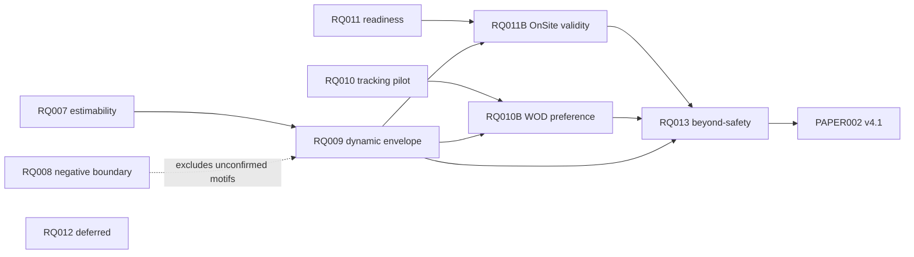

# RQ Research Program Progress Dashboard

Last synchronized: **2026-06-24**  
Scope: `PAPER001/PAPER002` and `RQ001–RQ013`  
Machine-readable registry: [`rq_progress_registry.csv`](rq_progress_registry.csv)  
Central plan index: [`../plans/README.md`](../plans/README.md)

## Purpose

This dashboard is the shared program-level view for the human lead, ChatGPT, Claude,
Codex, and future reviewers. It tracks research status, dependencies, evidence state,
blocking conditions, and the next gate without replacing the detailed files inside each
RQ folder.

The active evidence chain is now:

```text
online IPV time-series
→ interaction-conditioned estimability
→ estimability-aware dynamic counterpart-conditioned envelope
→ OnSite matched-scenario validity (first external priority)
→ WOD-E2E human-preference validity (parallel engineering path)
→ incremental value relative to prespecified safety/kinematic baselines
```

RQ008 remains a negative temporal-discovery boundary rather than a required positive link in
this chain.

## Source-of-truth order

When sources disagree, use this order:

1. human-accepted `reports/knowledge/<RQ>/decision.md`;
2. independently reviewed execution status and final report;
3. frozen plan and machine-readable analysis configuration;
4. synthesis/review notes;
5. this dashboard;
6. chat discussion or an uncommitted local note.

A chat update may record a PI decision, but it must not silently override an accepted decision
or a reviewed execution artifact.

## Status vocabulary

| Program status | Meaning |
|---|---|
| `planning` | Scope or plan is being drafted. |
| `approved` | PI has authorized launch; independent plan review remains the first execution gate. |
| `running` | Execution is active. |
| `review` | Results or a claimed implementation exist and require independent verification. |
| `accepted` | Paper-safe claims are frozen in `decision.md`. |
| `writing` | The verified manuscript baseline is active and is being updated from accepted evidence. |
| `done` | Research and paper handoff are complete. |
| `archived-review` | Preserved as robustness/history, not an active headline result. |
| `blocked` | A hard data, design, access, or evidence gate prevents progress. |

| Stage | Meaning |
|---|---|
| `S0 Scope` | Research question and boundaries are being defined. |
| `S1 Plan` | Initial plan, endpoints, gates, and deliverables are being drafted/reviewed. |
| `S2 Inventory` | Data, provenance, access, fields, and feasibility are being audited. |
| `S3 Execute` | Data processing, modelling, annotation, or analysis is underway. |
| `S4 Review` | Independent review and falsification are underway. |
| `S5 Red team` | Blocking failure modes are being attacked and repaired. |
| `S6 Replicate` | Independent implementation or held-out replication is underway. |
| `S7 Decide` | Claims are being accepted, rejected, or deferred. |
| `S8 Paper handoff` | Accepted evidence is being transferred into the manuscript. |

## Executive board

| ID | Work group / topic | Status | Stage | Priority | Current evidence position | Hard blocker or boundary | Next gate |
|---|---|---:|---:|---:|---|---|---|
| **PAPER001** | Existing manuscript context | `reference` | S8 | P1 | Historical manuscript context and prior drafts retained | Not a claim-decision source; RQ decisions govern paper wording | Continue as archive/reference |
| **PAPER002** | Dynamic-IPV v4.1 evidence architecture | `writing` | S8 | **P0** | Verified on paper-repository `main`: merge commit `c6783577`; `structure.md` is v4.1 estimability-aware dynamic norm, `claims_register.md` is v4.1, and `main.tex` uses the same narrative | Pending markers remain for unfinished R2/R3/R4–R6 evidence; paper is not submission-ready | Treat `c6783577` as the current manuscript baseline and reconcile all future Overleaf round-trips against `structure.md` |
| **RQ001** | Legacy online interval deployability | `review` | S7 | P1 | Engineering prior for route-conditioned self-anchor interval; usable only as M4 ablation/history | Decision pending; old target/model do not establish the new M3 norm | Freeze bounded decision and protocol crosswalk |
| **RQ002** | Self-anchor group-norm validity | `review` | S7 | P1 | Reviews reject self-anchor-only normative authority and identify norm laundering | Formal decision still pending | Freeze rejection/ablation boundary |
| **RQ003** | NSFC external evidence | `accepted` | S7 | P1 | Tier B feasibility and transfer-boundary evidence | No robust IPV-specific increment; prior H3 blind labels blocked | Reuse only within accepted Tier B boundary |
| **RQ004** | Episode-level IPV state organization | `review` | S7 | P1 | Supports state-conditioned response-surface framing, not a universal law | Exact paper-safe decision not frozen | Freeze R1 claim boundary |
| **RQ005** | Manuscript evidence-gap and leakage governance | `review` | S7 | P1 | Supports framework, leakage contract, and claim downgrades | Decision not frozen | Freeze governance decision |
| **RQ006** | Sigma sensitivity | `archived-review` | S7 | P3 | Sigma=0.1 is healthier; IPV magnitude remains parameter-sensitive | Not substantive verifier-validity evidence | Retain as robustness appendix evidence |
| **RQ007** | Interaction-conditioned IPV estimability | `accepted` | S7 | **P0** | C1–C3 frozen on development/guard; proximity-bounded residual; held-out sealed | Held-out confirmation remains unopened and irreversible once accessed | Keep sealed while RQ009 design/code/thresholds are frozen; request a separate PI decision at Gate 009-5 |
| **RQ008** | InterHub temporal IPV discovery | `accepted` | S7 | P2 | Negative discovery boundary frozen: 0/24 directional structures survived controls | PI decision: do not run RQ008B now; confirmation remains unopened | Do not use discovery motifs in RQ009; no further action unless PI later reopens RQ008B |
| **RQ009** | Estimability-aware dynamic counterpart-conditioned human envelope | `approved` | S1 | **P0** | PI authorized launch; plan and Claude→Codex prompt created. M3 is primary, M4 self-history is ablation; RQ008 motifs excluded | Independent plan review required; RQ007 sealed data unavailable until a separate authorization | Start plan review and pre-sealed implementation; stop at `READY_FOR_SEALED_TEST` until PI authorizes opening |
| **RQ010** | WOD-E2E tracking feasibility and human preference validity | `accepted` | S2 | P1 | Feasibility decision frozen: `T2_FULL_TRACKING_REQUIRED`; Route 4 preferred, Route 5 fallback | PI authorizes signed-in access/pilot in principle, but user must personally sign in/accept licence and make data available; exact scale/HPC remains unknown | Obtain signed-in manifest/size, then run ratings-blind pilot; do not block RQ009 or OnSite |
| **RQ011** | OnSite full-universe and run-level readiness | `accepted` | S7 | **P0** | `READY_WITH_FROZEN_EXCLUSIONS`; full_300 outcomes, clean_285 replay/IPV, T19 replay-only exclusion | No repeated runs/run-level/causal claims; moderate replay-selection caveat | OnSite is first external priority after RQ009 freezes its inference package; launch RQ011B then |
| **RQ012** | OnSite automatic-event harm (scope revised 2026-06-24: automatic events + official outcomes; human labels deprecated) | `accepted` | S7 | **P0** | **RQ012B COMPLETE.** W0 extractor-health done (`RQ012B_1_…38f47437`); deviation→harm done (`RQ012B_2_…8454ad93`): across the full behavioural interaction-failure battery (9 events + groupings + 4 official subscores; kinematic baseline; cluster-aware permutation; label/placebo/M2/exposure controls; BH-FDR) **no channel is IPV-specifically SUPPORTED** — abrupt/comfort NULL; near-miss context-explained (fails M2); only too-passive→deadlock (E16) survives all controls but UNDERPOWERED + BH-edge (bounded hint). 5-role validated; bilingual report `…/RQ012B_2_…/00_entry/index.html` | none (RQ012B complete; bounded/null) | Feed RQ013 as bounded/null prior; passivity→deadlock as a future powered test |
| **RQ013** | Beyond-safety incremental validity | `planning` | S0 | P2 | RQ003 provides a negative/boundary prior | Requires frozen RQ009 and independent external outcomes; human-label route is currently deferred | Draft after RQ009 and initial OnSite results; WOD may add human-preference evidence later |

## Current PI decisions

- **Defer two-human annotation.** RQ012 remains a protocol/scaffold only.
- **Launch RQ009.** Plan: `reports/plans/RQ009_plan_v0_dynamic_counterpart_conditioned_envelope_20260624.md`.
- **Do not run RQ008B.** The negative RQ008A boundary remains frozen.
- **Do not open RQ007 sealed data yet.** First freeze RQ009 completely; then ask for a separate irreversible opening decision.
- **Authorize WOD signed-in access and a small ratings-blind pilot in principle.** User action is still needed for account/licence/login.
- **Prioritize OnSite external validation after RQ009.** WOD proceeds in parallel but does not block it.
- **Use paper-repository `main` merge `c6783577` as the current v4.1 manuscript baseline.**

## Active execution waves

### Active now

- **RQ009:** independent plan review → inventory/measurement audit → split/feature freeze → M0–M5 implementation → conformal/abstention → controls → pre-opening review.
- **RQ010 pilot preparation:** obtain signed-in official manifest/size and prepare the ratings-blind tracker pilot after user completes login/licence access.
- **Paper baseline:** keep `structure.md` v4.1 and claims register synchronized with accepted RQ decisions; do not replace them with the v3 self-anchor narrative.

### Explicitly paused

- **RQ008B:** no execution and no confirmation-data access.
- **RQ012 human labels:** no media issuance, annotation, agreement, or Gate 012B work until PI revisits.
- **RQ007 held-out:** sealed until RQ009 reaches `READY_FOR_SEALED_TEST` and PI explicitly authorizes opening.

### After RQ009 freezes

1. **OnSite first:** RQ011B matched `algorithm × scenario` analysis using full_300 outcomes and clean_285 replay/IPV with the T19 caveat.
2. **WOD in parallel:** tracker pilot and quality gate; formal preference analysis only after tracking and RQ009 gates pass.
3. **RQ013 later:** baseline-relative incremental validity using available external outcomes.

## Active plan documents

| RQ | Plan | Main-agent prompt |
|---|---|---|
| RQ007 | `reports/plans/RQ007_plan_v0_interaction_conditioned_ipv_estimability_20260622.md` | `reports/plans/prompts/RQ007_prompt_claude_codex_orchestration_20260622.md` |
| RQ008 | `reports/plans/RQ008_plan_v0_interhub_temporal_ipv_discovery_20260622.md` | `reports/plans/prompts/RQ008_prompt_claude_codex_orchestration_20260622.md` |
| RQ009 | `reports/plans/RQ009_plan_v0_dynamic_counterpart_conditioned_envelope_20260624.md` | `reports/plans/prompts/RQ009_prompt_claude_codex_orchestration_20260624.md` |
| RQ010 | `reports/plans/RQ010_plan_v0_wod_e2e_tracking_feasibility_20260622.md` | `reports/plans/prompts/RQ010_prompt_claude_codex_orchestration_20260622.md` |
| RQ011 | `reports/plans/RQ011_plan_v0_onsite_full_universe_readiness_20260622.md` | `reports/plans/prompts/RQ011_prompt_claude_codex_orchestration_20260622.md` |
| RQ012 | `reports/plans/RQ012_plan_v0_onsite_event_annotation_readiness_20260622.md` | `reports/plans/prompts/RQ012_prompt_claude_codex_orchestration_20260622.md` |

## Dependency map



## Synchronization protocol

When the user or an agent reports progress, update both this dashboard and
`rq_progress_registry.csv` with:

```text
ID
program_status
stage
latest_artifact
latest_execution
blocker
next_action
last_updated
```

Rules:

1. Do not advance scientific status without the required reviewed artifact.
2. Record `blocked` explicitly; do not reinterpret it as a null result.
3. `accepted` requires a claim decision in `reports/knowledge/<RQ>/decision.md`.
4. `writing` requires a verified paper baseline or accepted manuscript handoff.
5. Every status change must identify the artifact or PI decision that caused it.
6. Preserve negative, null, failed, and deferred results.
7. Dates use ISO `YYYY-MM-DD`; paths are repository-relative whenever possible.

## Current program-level blockers

- RQ001, RQ002, RQ004, and RQ005 still lack accepted `decision.md` claim slates.
- RQ009 has PI authorization but has not yet passed independent plan review or reached its pre-opening freeze.
- RQ007 held-out confirmation remains sealed by design.
- RQ010 signed-in access, official data volume, tracker quality, and final HPC decision remain unresolved.
- RQ011B waits for the frozen RQ009 inference package.
- RQ012 substantive behavioural evidence is deferred because the PI has paused two-human annotation.
- RQ013 waits for RQ009 and external outcomes.

## Changelog

| Date | Change |
|---|---|
| 2026-06-22 | Initialized the program dashboard and Wave-A plans. |
| 2026-06-23 | Registered RQ012A readiness as `BLOCKED_FOR_HUMAN_LABELS`. |
| 2026-06-24 | Froze knowledge decisions for RQ007, RQ008, RQ010, RQ011, and RQ012. |
| 2026-06-24 | Recorded PI decisions: defer human annotation; launch RQ009; do not run RQ008B; keep RQ007 sealed until RQ009 pre-opening freeze; authorize WOD signed-in pilot in principle; prioritize OnSite; verify paper `main` at `c6783577` as v4.1 baseline. Added RQ009 plan and orchestration prompt. |
