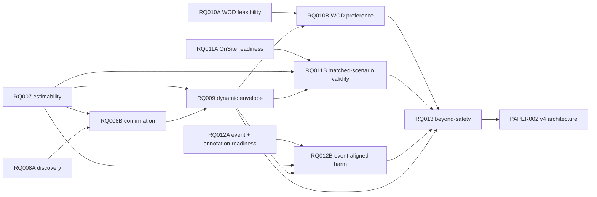

# RQ Research Program Progress Dashboard

Last synchronized: **2026-06-22**  
Scope: `PAPER001/PAPER002` and `RQ001–RQ013`  
Machine-readable registry: [`rq_progress_registry.csv`](rq_progress_registry.csv)

## Purpose

This dashboard is the shared program-level view for the human lead, ChatGPT, Claude,
Codex, and future reviewers. It tracks research status, dependencies, evidence state,
blocking conditions, and the next gate without replacing the detailed files inside each
RQ folder.

The evidence chain currently being pursued is:

```text
online IPV time-series
→ interaction-conditioned estimability
→ human temporal organization
→ dynamic counterpart-conditioned envelope
→ WOD-E2E human preference validity
→ OnSite matched-scenario validity and interaction consequences
→ incremental value relative to prespecified safety/kinematic baselines
```

## Source-of-truth order

When sources disagree, use this order:

1. human-accepted `reports/knowledge/<RQ>/decision.md`;
2. independently reviewed execution status and final report;
3. frozen plan and machine-readable analysis configuration;
4. synthesis/review notes;
5. this dashboard;
6. chat discussion or an uncommitted local note.

A chat update may be recorded as a proposed change, but it must not silently override an
accepted decision or a reviewed execution artifact.

## Status vocabulary

| Program status | Meaning |
|---|---|
| `planning` | Scope or plan is being drafted. |
| `approved` | Plan is approved and ready for execution. |
| `running` | Execution is active. |
| `review` | Results exist and require synthesis or independent review. |
| `accepted` | Paper-safe claims are frozen in `decision.md`. |
| `writing` | Accepted claims are being applied in the manuscript repository. |
| `done` | Research and paper handoff are complete. |
| `archived-review` | Preserved as robustness/history, not an active headline result. |
| `blocked` | A hard data, design, access, or evidence gate prevents progress. |

| Stage | Meaning |
|---|---|
| `S0 Scope` | Research question and boundaries are being defined. |
| `S1 Plan` | Initial plan, endpoints, gates, and deliverables are being drafted. |
| `S2 Inventory` | Data, provenance, access, fields, and feasibility are being audited. |
| `S3 Execute` | Data processing, modelling, annotation, or analysis is underway. |
| `S4 Review` | Independent review and falsification are underway. |
| `S5 Red team` | Blocking failure modes are being attacked and repaired. |
| `S6 Replicate` | Independent implementation or held-out replication is underway. |
| `S7 Decide` | Claims are being accepted, rejected, or deferred. |
| `S8 Paper handoff` | Accepted evidence is being transferred into the manuscript. |

## Executive board

| ID | Work group / topic | Status | Stage | Priority | Current evidence position | Hard blocker or boundary | Next gate |
|---|---|---:|---:|---:|---|---|---|
| **PAPER001** | Existing manuscript context | `reference` | S8 | P1 | Historical manuscript context and prior drafts retained | Not a claim-decision source; RQ decisions govern paper wording | Continue as archive/reference |
| **PAPER002** | Group 0 — dynamic-IPV v4 evidence architecture | `planning` | S0 | **P0** | New evidence chain agreed in discussion | `structure.md v4` and claims register do not yet exist | Approve v0 paper-governance plan |
| **RQ001** | Legacy online interval deployability | `review` | S7 | P1 | Strong engineering prior for route-conditioned self-anchor interval; usable only as legacy evidence / M4 ablation under the new paper logic | Decision still pending; old target/model do not establish the new M3 dynamic norm | Freeze bounded decision and protocol crosswalk |
| **RQ002** | Self-anchor group-norm validity | `review` | S7 | P1 | Two reviews reject self-anchor-only normative authority and identify norm-laundering risk | Formal `decision.md` still pending | Freeze rejection/ablation boundary |
| **RQ003** | NSFC external evidence | `accepted` | S7 | P1 | Tier B feasibility, diagnostic-alignment, abstention, replication, and transfer-boundary evidence | No robust IPV-specific increment; H3 blind labels blocked; full universe not analysis-ready | Reuse only as pilot/boundary evidence |
| **RQ004** | Episode-level IPV state organization | `review` | S7 | P1 | Supports state-conditioned response-surface framing, not a universal law | Exact paper-safe decision not frozen | Freeze R1 episode-level claim boundary |
| **RQ005** | Manuscript evidence-gap and leakage governance | `review` | S7 | P1 | Supports framework, leakage contract, and claim downgrades | Decision not frozen | Freeze governance decision |
| **RQ006** | Sigma sensitivity | `archived-review` | S7 | P3 | Sigma=0.1 is healthier; IPV magnitude remains parameter-sensitive | Not a substantive verifier-validity result | Retain as robustness appendix evidence |
| **RQ007** | Group 1 — interaction-conditioned IPV estimability | `planning` | S1 | **P0** | Existing `sigma01_ipv_timeseries.csv` provides the primary online IPV time-series input | Data dictionary, uncertainty meaning, interaction-opportunity definition, and estimability gate are not frozen | Approve v0 plan; begin provenance and field audit |
| **RQ008** | Group 2A/2B — InterHub temporal IPV discovery and confirmation | `planning` | S1 | **P0** | Existing time-series enables open temporal discovery | Discovery/confirmation split and valid-window contract not frozen; formal confirmation depends on RQ007 | Approve discovery plan and reserve untouched confirmation set |
| **RQ009** | Dynamic counterpart-conditioned human envelope | `planning` | S0 | P1 | New primary model is intended to be M3: context + counterpart current IPV; M4 self-history is ablation only | Depends on RQ007 estimability contract and selected RQ008 temporal variables | Draft after RQ007 inventory and RQ008 discovery protocol |
| **RQ010** | Group 4A/4B — WOD-E2E feasibility, tracking, and human preference validity | `planning` | S1 | **P0** | No local dataset execution exists yet | Dataset not downloaded; actor-track availability, access, licence, tracking need, and compute/HPC requirements unknown | Complete official-data and tracking-feasibility audit |
| **RQ011** | Group 5A — OnSite full-universe and run-level readiness | `planning` | S1 | **P0** | RQ003 top-five package is a useful pilot | Full-universe mapping, run identity, repeated-run status, and selection bias are unresolved | Approve audit plan; build canonical run crosswalk |
| **RQ012** | Group 6A — OnSite event ontology and blind-annotation readiness | `planning` | S1 | **P0** | Existing anonymized 30-case validation sample and templates can be reused | No real two-human annotations; event thresholds and log-field support not frozen | Approve event/annotation plan and coordinate real annotators |
| **RQ013** | Beyond-safety incremental validity | `planning` | S0 | P2 | RQ003 provides a negative/boundary prior | Must wait for frozen RQ009 predictions and independent WOD/OnSite outcomes from RQ010–RQ012 | Draft only after upstream gates pass |

## Active execution waves

### Wave A — start now

- **PAPER002:** create `structure.md v4`, claims register, v3→v4 crosswalk, and version-protection protocol.
- **RQ007:** audit `sigma01_ipv_timeseries.csv` and define interaction opportunity, uncertainty, and provisional estimability.
- **RQ008A:** perform open temporal discovery while preserving an untouched confirmation split.
- **RQ010A:** audit WOD-E2E release/access/schema; decide whether tracking is needed and whether HPC is required.
- **RQ011A:** audit OnSite full-universe mappings, run identities, available fields, and repeated-run feasibility.
- **RQ012A:** freeze automatic event ontology and organize real two-human blinded annotation.

### Wave B — start only after upstream gates

- **RQ008B:** held-out temporal confirmation after RQ007 freezes the estimability/valid-window contract.
- **RQ009:** M0–M5 dynamic envelope after RQ007 and RQ008 provide frozen inputs.
- **RQ010B:** WOD tracking implementation and preference analysis after the RQ010 feasibility gate and frozen RQ009 model.
- **RQ011B:** OnSite matched-scenario algorithm validity after the readiness gate and RQ009 prediction freeze.
- **RQ012B:** event-aligned harm analysis only after real human labels, RQ007 onset definitions, and RQ009 deviation definitions exist.

### Wave C — synthesis and manuscript use

- **RQ013:** beyond-safety incremental validity using frozen predictions and independent outcomes.
- Independent red team, replication, and cross-RQ claim review.
- PAPER002 manuscript handoff using accepted `decision.md` files only.

## Dependency map



## How existing RQs feed the new paper logic

| Existing RQ | New role |
|---|---|
| RQ001 | Engineering prior, interval-method history, and M4 self-history ablation evidence; not the new M3 headline result. |
| RQ002 | Falsification evidence against self-anchor normative authority. |
| RQ003 | OnSite feasibility/Tier B boundary pilot and a source of negative-control lessons. |
| RQ004 | Episode-level state-organization evidence for the new R1. |
| RQ005 | Leakage, provenance, abstention, and claim-governance contract. |
| RQ006 | Estimator-parameter sensitivity and robustness boundary. |

## Synchronization protocol

When the user or an agent reports progress, update both this dashboard and
`rq_progress_registry.csv` using the following minimum fields:

```text
ID
program_status
stage
latest_artifact
latest_execution
blocker
next_action
last_updated
```

Rules:

1. Do not advance a status on the basis of a chat summary alone when a reviewed artifact is required.
2. Record `blocked` explicitly; do not reinterpret it as a null result.
3. `accepted` requires a claim decision in `reports/knowledge/<RQ>/decision.md`.
4. `writing` requires an accepted decision plus an explicit manuscript handoff.
5. Every status change must identify the artifact or human decision that caused the change.
6. Preserve negative, null, and failed results in the dashboard notes or linked RQ artifacts.
7. Dates use ISO `YYYY-MM-DD`; paths are repository-relative whenever possible.

## Current program-level blockers

- The manuscript is still governed by a self-anchor v3 structure rather than the new dynamic-IPV v4 evidence architecture.
- RQ001, RQ002, RQ004, and RQ005 have review material but no accepted `decision.md` claim slate.
- RQ007 has not yet frozen how interaction opportunity and IPV estimability are defined.
- RQ008 lacks a committed discovery/confirmation split.
- RQ009 cannot start formal modelling before RQ007/RQ008 gates.
- WOD-E2E access, actor tracks, tracking need, and HPC requirements are unknown.
- OnSite full-universe/run-level analysis readiness is unresolved.
- No real two-human OnSite annotations currently exist.

## Changelog

| Date | Change |
|---|---|
| 2026-06-22 | Initialized program dashboard for PAPER001/PAPER002 and RQ001–RQ013; defined active waves, dependencies, synchronization rules, and current blockers. |
