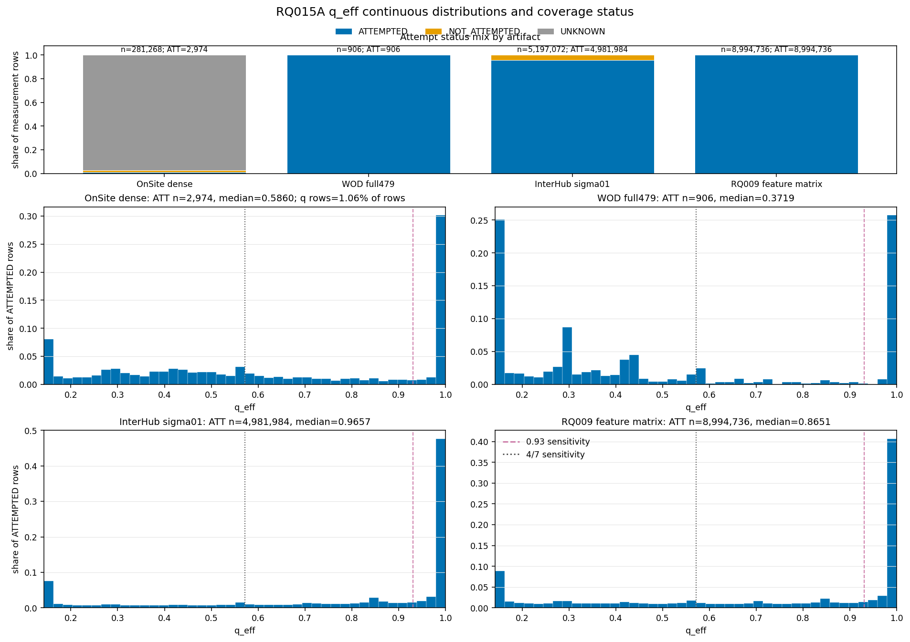
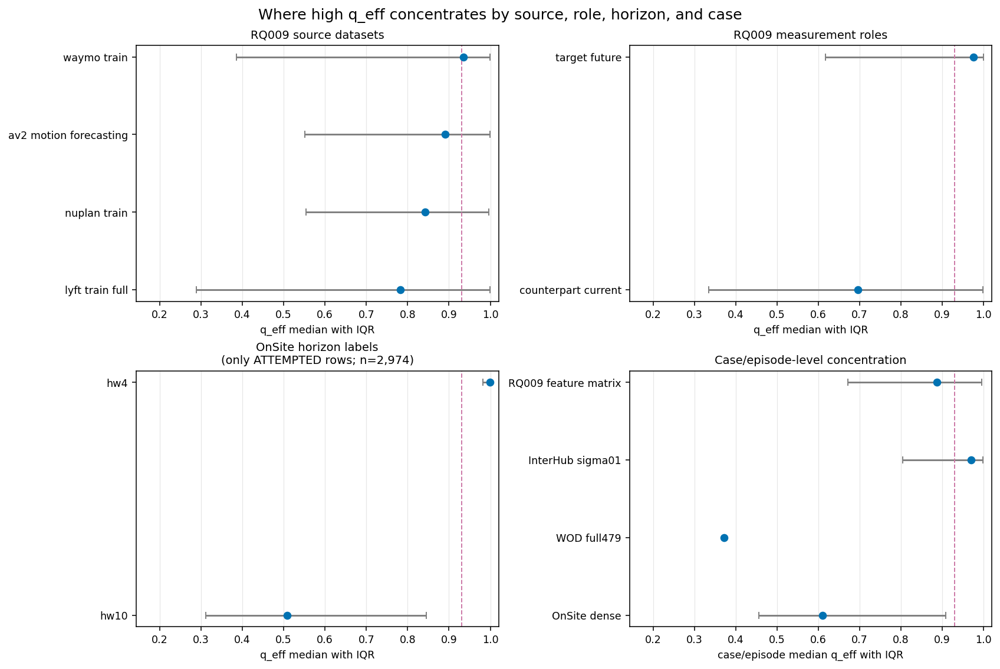
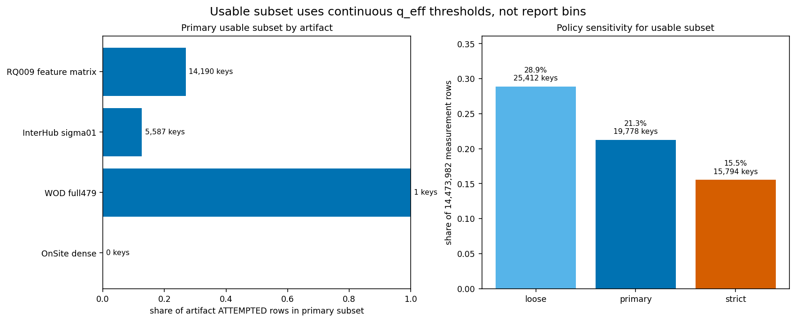
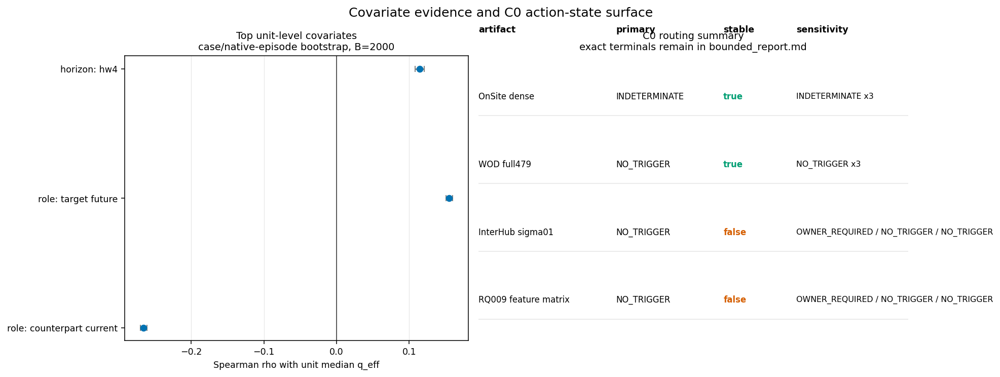

# RQ015A 候选权重集中度回溯审计科学报告

## 技术摘要

在 4 个可审计产物、14,473,982 个 measurement 行上，本报告只描述 `attempt_status` 与连续 `q_eff = K_eff/K` 的分布。`q_eff -> 1` 表示 7 个候选的权重摊平，这一帧的 IPV 数值不携带候选间的判别信息；`q_eff = 1/7` 表示权重集中到单一候选。本报告不衡量 IPV 数值精度，也不区分近均匀权重的成因；`portraits.json` 与 `c0_routing.json` 明示 `descriptive_only = true`，`run_receipt.json` 作为同一 PASS 回执提供 held-out 与 measurement-field metadata，本报告按 descriptive-only 边界处理。

- **sigma01 是最大披露点之一。** InterHub sigma01 的 `q_eff` 中位数为 0.9657（约 `K_eff = 6.76/7`），53.49% 的 ATTEMPTED 行满足 `q_eff >= 0.93` 这个敏感性切点；`rq009_feature_matrix` 的对应值为 0.8651 与 46.10%。换言之，过半的 sigma01 IPV 数值，其候选权重已近均匀。
- **OnSite 覆盖极低，任何分布只建立在 2,974 行上。** OnSite 共 281,268 行，其中 274,022 行为 `UNKNOWN` 且 `reason_code = EMPTY_CELL_UNEXPLAINED`；携带 IPV 数值的 ATTEMPTED 行为 2,974 行，占 OnSite 的 1.06%。空单元没有被读成 0，也没有被强行并入 warm-up。
- **两个最大产物的 C0 路由不稳定。** sigma01 与 `rq009_feature_matrix` 的 primary terminal 均为 `NO_AUDIT_TRIGGER_DETECTED`，但 `stable=false`；敏感性下均有一档进入 `OWNER_REANALYSIS_REQUIRED`。是否重估 RQ009 属 PI 决策，本报告只给证据与边界。
- **可用子集按连续 `q_eff` 给出。** 主判据筛出 19,778 个 case/episode key、34,283 个 unit row，覆盖 3,049,608 个 ATTEMPTED 行，占 14,473,982 行分母的 21.27%；默认清单已写入 `usable_subset.csv`。

## 覆盖披露：WOD 为部分覆盖，只纳入 full479 投影 906 行

本报告覆盖 4/6 产物：`interhub_sigma01_hw4_timeseries`、`rq009_feature_matrix`、`onsite_dense_timeseries` 与已取回的 `wod_rq010b_full479_audited`。**WOD 一支为部分覆盖**，仅包含 full479 投影数据 906 行；`phase1b/schemeB` 与 `rq014_g2r_anchor_scores` 经 PI 裁定不取回，因为没有本 RQ 主量所需的 error 列。M4_ONLY 自锚通道排除。`held_out_parsed_rows = 0`，台账 `rq007_split` 中 held-out 零出现。

| 分母 | ATTEMPTED | NOT_ATTEMPTED | UNKNOWN | 合计 |
| --- | --- | --- | --- | --- |
| 四个可审计产物合计 | 13,980,600 (96.59%) | 219,360 (1.52%) | 274,022 (1.89%) | 14,473,982 |
| OnSite dense | 2,974 (1.06%) | 4,272 (1.52%) | 274,022 (97.42%) | 281,268 |
| WOD full479 | 906 (100.00%) | 0 (0.00%) | 0 (0.00%) | 906 |
| InterHub sigma01 | 4,981,984 (95.86%) | 215,088 (4.14%) | 0 (0.00%) | 5,197,072 |
| RQ009 feature matrix | 8,994,736 (100.00%) | 0 (0.00%) | 0 (0.00%) | 8,994,736 |

## OnSite 覆盖披露：只有 1.06% 行携带 IPV 数值

OnSite 的 274,022 行 `UNKNOWN` 是 `ipv_error` 为 NULL 的空单元，`reason_code = EMPTY_CELL_UNEXPLAINED`，占 OnSite 行数的 97.42%。携带 IPV 数值的行只有 2,974 / 281,268 = 1.06%；因此 OnSite 的所有 `q_eff` 分布结论都只对这 2,974 行成立。OnSite 不进入主可用子集，不是因为其 IPV 数值全部无判别信息，而是因为 case/episode unit 的覆盖未达到主判据的 `attempted_share >= 0.80` 与 `q_n >= 30`。

## 主分布：四个产物均横跨 1/7 到 1.0

四个产物的非空 `q_eff` 均覆盖 `[1/7, 1.0]` 全域。下表只统计 ATTEMPTED 行；`q_eff >= 0.93` 是敏感性附注，不作为 `BINS_WITHHELD_UNSTABLE` 产物的主结论。

| 产物 | ATTEMPTED n | min | p25 | median | p75 | p90 | p95 | p99 | max | q_eff>=0.93 敏感性 |
| --- | --- | --- | --- | --- | --- | --- | --- | --- | --- | --- |
| OnSite dense | 2,974 | 0.1429 | 0.3596 | 0.5860 | 0.9982 | 1.0000 | 1.0000 | 1.0000 | 1.0000 | 32.72% |
| WOD full479 | 906 | 0.1429 | 0.1626 | 0.3719 | 0.9981 | 1.0000 | 1.0000 | 1.0000 | 1.0000 | 26.60% |
| InterHub sigma01 | 4,981,984 | 0.1429 | 0.5891 | 0.9657 | 0.9998 | 1.0000 | 1.0000 | 1.0000 | 1.0000 | 53.49% |
| RQ009 feature matrix | 8,994,736 | 0.1429 | 0.4320 | 0.8651 | 0.9996 | 1.0000 | 1.0000 | 1.0000 | 1.0000 | 46.10% |

## 分层结果：差异主要集中在角色、源数据和 OnSite horizon

RQ009 的源数据层面，`waymo_train` 的中位数最高（0.9345），比 `lyft_train_full` 高 0.1521；但更大的差异来自 measurement role：`target_future` 的中位数约 0.975，`counterpart_current` 约 0.70。也就是说，RQ009 不是所有行都同样接近均匀，角色层的差异比源数据层更大。

| source_dataset | n | median | IQR | q_eff>=0.93 敏感性 |
| --- | --- | --- | --- | --- |
| lyft_train_full | 1,440,460 | 0.7824 | 0.2882–0.9997 | 42.35% |
| nuplan_train | 2,492,064 | 0.8424 | 0.5536–0.9957 | 40.40% |
| av2_motion_forecasting | 409,264 | 0.8911 | 0.5512–0.9993 | 46.61% |
| waymo_train | 4,652,948 | 0.9345 | 0.3863–0.9999 | 50.26% |

| measurement_role | n | median | IQR | q_eff>=0.93 敏感性 |
| --- | --- | --- | --- | --- |
| counterpart_current | 4,497,368 | 0.6953 | 0.3342–0.9975 | 37.17% |
| target_future | 4,497,368 | 0.9753 | 0.6168–0.9998 | 55.02% |

OnSite 的 ATTEMPTED 行中，hw4 标签的 `q_eff` 更接近 1，但这只涉及 534 行；hw10 为 2,440 行，中位数 0.5085。因为 OnSite 总覆盖只有 1.06%，这个分层只能说明那 2,974 行内部的形状。

| horizon | ATTEMPTED n | median | IQR | q_eff>=0.93 敏感性 |
| --- | --- | --- | --- | --- |
| hw10 | 2,440 | 0.5085 | 0.3118–0.8448 | 22.09% |
| hw4 | 534 | 0.9996 | 0.9821–1.0000 | 81.27% |

case/episode 层面，sigma01 的 case median 中位数为 0.9695，且 57.62% 的 case/episode key 的中位数不低于 0.93；`rq009_feature_matrix` 的 case median 中位数为 0.8873，44.83% 不低于 0.93。这说明 sigma01 的近均匀形状更像贯穿大量 case 的现象；RQ009 同时存在一批较集中的 case。

| 产物 | case/episode keys | case median 的中位数 | case median IQR | case median >=0.93 | case median <=0.75 |
| --- | --- | --- | --- | --- | --- |
| OnSite dense | 267 | 0.6095 | 0.4552–0.9079 | 23.22% | 66.29% |
| WOD full479 | 1 | 0.3719 | 0.3719–0.3719 | 0.00% | 100.00% |
| InterHub sigma01 | 26,886 | 0.9695 | 0.8043–0.9985 | 57.62% | 20.57% |
| RQ009 feature matrix | 26,828 | 0.8873 | 0.6707–0.9946 | 44.83% | 33.36% |

## 可用子集：默认清单覆盖 19,778 个 case/episode key

主可用清单写在 `usable_subset.csv`。unit 粒度为 `artifact_id × case_or_episode_key × aggregation_configuration × aggregation_perspective × measurement_role`。主判据是政策选择，不是数据中发现的边界：`q_n >= 30`、`attempted_share >= 0.80`、unit median `q_eff <= 0.75`，且至少 60% 的 ATTEMPTED 行满足 `q_eff <= 0.75`。这个判据只用连续 `q_eff`；报告用 4/7 与 0.93 不进入主筛选。

| 产物 | unit rows | case/episode keys | ATTEMPTED rows | 占该产物 ATTEMPTED | unit median q_eff |
| --- | --- | --- | --- | --- | --- |
| OnSite dense | 0 | 0 | 0 | 0.00% |  |
| WOD full479 | 1 | 1 | 906 | 100.00% | 0.3719 |
| InterHub sigma01 | 7,206 | 5,587 | 630,247 | 12.65% | 0.3871 |
| RQ009 feature matrix | 27,076 | 14,190 | 2,418,455 | 26.89% | 0.4244 |

敏感性定义如下：loose 为 `q_n>=10, attempted_share>=0.50, median<=0.85, share(q_eff<=0.85)>=0.60`；strict 为 `q_n>=30, attempted_share>=0.80, median<=0.65, share(q_eff<=0.65)>=0.60`。

| policy | unit rows | case/episode keys | ATTEMPTED rows | 占可审计四产物合计行 | 占 ATTEMPTED 行 |
| --- | --- | --- | --- | --- | --- |
| loose | 47,523 | 25,412 | 4,133,659 | 28.87% | 29.57% |
| primary | 34,283 | 19,778 | 3,049,608 | 21.27% | 21.81% |
| strict | 25,877 | 15,794 | 2,226,665 | 15.53% | 15.93% |

## 协变因素：只描述共变，不作因果表述

Spearman 分析以 unit median `q_eff` 为响应量，unit 仍为上一节的 case/episode × configuration × perspective × role 粒度；bootstrap 按 case/native-episode 聚类，B=2000，seed=20260726。下表列出绝对值最大的三个因素。正值表示该因素与更高 `q_eff` 共变，负值表示该因素与更低 `q_eff` 共变。这里的因素是 ledger 标签层面的共变，不表示机制归因。

| factor | Spearman rho | 95% CI | 方向 |
| --- | --- | --- | --- |
| role: counterpart current | -0.266 | [-0.270, -0.261] | q_eff 较低共变 |
| role: target future | 0.155 | [0.150, 0.160] | q_eff 较高共变 |
| horizon: hw4 | 0.115 | [0.108, 0.121] | q_eff 较高共变 |

## C0 路由：primary 低于切点，但两个最大产物不稳定

逐产物 C0 的 primary terminal 与敏感性必须一起读。sigma01 与 `rq009_feature_matrix` 的 primary terminal 均为 `NO_AUDIT_TRIGGER_DETECTED`，reason code 为 `below_all_cuts`；但二者 `stable=false`，且敏感性下第一档为 `OWNER_REANALYSIS_REQUIRED`。因此本报告不能写作“未检出触发、一切正常”。

| 产物 | primary terminal | reason_code | stable | sensitivity_terminals |
| --- | --- | --- | --- | --- |
| OnSite dense | INDETERMINATE_UNKNOWN_PROVENANCE | unknown_share_ge_cut | true | INDETERMINATE_UNKNOWN_PROVENANCE / INDETERMINATE_UNKNOWN_PROVENANCE / INDETERMINATE_UNKNOWN_PROVENANCE |
| WOD full479 | NO_AUDIT_TRIGGER_DETECTED | below_all_cuts | true | NO_AUDIT_TRIGGER_DETECTED / NO_AUDIT_TRIGGER_DETECTED / NO_AUDIT_TRIGGER_DETECTED |
| InterHub sigma01 | NO_AUDIT_TRIGGER_DETECTED | below_all_cuts | false | OWNER_REANALYSIS_REQUIRED / NO_AUDIT_TRIGGER_DETECTED / NO_AUDIT_TRIGGER_DETECTED |
| RQ009 feature matrix | NO_AUDIT_TRIGGER_DETECTED | below_all_cuts | false | OWNER_REANALYSIS_REQUIRED / NO_AUDIT_TRIGGER_DETECTED / NO_AUDIT_TRIGGER_DETECTED |

按下游消费者汇总如下。RQ014 筛选的 anchor-score 产物没有进入 `q_eff` 台账，故该消费者的 C0 状态是 `NOT_APPLICABLE`；已取回的 WOD full479 仍在逐产物表中单列为 stable `NO_AUDIT_TRIGGER_DETECTED`。

| 下游消费者 | 证据产物 | primary | reason_code | stable | sensitivity_terminals |
| --- | --- | --- | --- | --- | --- |
| M3 训练标签 | InterHub sigma01 | NO_AUDIT_TRIGGER_DETECTED | below_all_cuts | false | OWNER_REANALYSIS_REQUIRED / NO_AUDIT_TRIGGER_DETECTED / NO_AUDIT_TRIGGER_DETECTED |
| RQ009 包络 | RQ009 feature matrix | NO_AUDIT_TRIGGER_DETECTED | below_all_cuts | false | OWNER_REANALYSIS_REQUIRED / NO_AUDIT_TRIGGER_DETECTED / NO_AUDIT_TRIGGER_DETECTED |
| RQ014 筛选 | rq014_g2r_anchor_scores 未纳入 q_eff 台账；WOD full479 作为已取回旁支单列报告 | NOT_APPLICABLE | PI_RULED_OUT_NO_ERROR_COLUMN_FOR_RQ014_ANCHOR_SCORES | not_applicable | NOT_APPLICABLE |

## bins 稳定性：三个产物只发布连续分布

policy bins（4/7 与 0.93）是报告用政策选择，不是数据中发现的边界。`onsite_dense_timeseries`、`interhub_sigma01_hw4_timeseries` 与 `rq009_feature_matrix` 均为 `BINS_WITHHELD_UNSTABLE`，只发布连续 `q_eff` 分布；这些产物的 `q_eff >= 0.93` 比例只作为敏感性附注。只有 `wod_rq010b_full479_audited` 为 `BINS_REPORTABLE`。

| 产物 | verdict | 最大极差(pp) | CONC 极差(pp) | INTER 极差(pp) | NEAR 极差(pp) |
| --- | --- | --- | --- | --- | --- |
| OnSite dense | BINS_WITHHELD_UNSTABLE | 21.02 | 18.49 | 21.02 | 2.52 |
| WOD full479 | BINS_REPORTABLE | 8.06 | 7.62 | 8.06 | 0.44 |
| InterHub sigma01 | BINS_WITHHELD_UNSTABLE | 13.62 | 8.75 | 13.62 | 4.88 |
| RQ009 feature matrix | BINS_WITHHELD_UNSTABLE | 15.29 | 10.85 | 15.29 | 4.44 |

## warm-up 占位与均匀回退分开呈现

warm-up 占位与均匀回退是两件不同的事。sigma01 的 215,088 个 NOT_ATTEMPTED 行全部为精确 `ipv_error = 1.0` 的 warm-up 占位；这不等同于 ATTEMPTED 行中的均匀回退。ATTEMPTED 的均匀回退以 `ipv_error ≈ 0.6220355269907728` 单列，且不与 `q_eff = 1.0` 或 UNKNOWN 空单元合并。

| 产物 | NOT_ATTEMPTED rows | 其中 ipv_error=1.0 | UNKNOWN empty cell | ATTEMPTED uniform fallback error | ATTEMPTED q_eff=1.0 |
| --- | --- | --- | --- | --- | --- |
| OnSite dense | 4,272 | 186 | 274,022 | 368 | 366 |
| WOD full479 | 0 | 0 | 0 | 223 | 223 |
| InterHub sigma01 | 215,088 | 215,088 | 0 | 195,983 | 173,622 |
| RQ009 feature matrix | 0 | 0 | 0 | 787,786 | 759,287 |

## 治理与回执披露

本轮为接出 execute 路径后已完成清单重签：`RQ015A_run_spec_v7_20260731.json` 的 `checksum_manifest` 指针由 `RQ015A_plan_v9_checksums_20260731.sha256` 改为 `RQ015A_plan_v10_checksums_20260731.sha256`；v9 字节未变，保留为历史。该字段原文写有 reserved for commander re-signing，本次重签是预留动作的执行。

`run_receipt.json` 顶层 `reads_measurement_fields = false` 是从 validate 路径继承来的误标；本次 execute 确实读取了 measurement 字段，真值记录在同一文件的 `metadata.execute_measurement_fields_read = true`。监督方查明契约只要求该字段为 bool，本轮按速度原则不修此布尔值，因为修正会连带测试、v10 到 v11 重签和 14,473,982 行重跑。该事项不是隐瞒，真值就在同一回执的 metadata 中。

## 限制与边界

1. 本报告覆盖 4/6 产物；**WOD 一支为部分覆盖**，只纳入 full479 投影 906 行，phase1b/schemeB 与 RQ014 anchor-score 产物不在 `q_eff` 台账内。本报告不得被引用为"全语料"或"全 WOD"结论。
2. 本报告只描述权重集中度与 attempt 三态，不评价 IPV 数值精度，不区分近均匀权重成因；这些边界属于后续 RQ015B。
3. `q_eff >= 0.93` 与 4/7 是 policy sensitivity，不是数据内生边界；三个 `BINS_WITHHELD_UNSTABLE` 产物不按分档下结论。
4. OnSite 的分布结论只基于 2,974 个 ATTEMPTED 行。UNKNOWN 空单元作为 `EMPTY_CELL_UNEXPLAINED` 保留，未被读成 0。
5. C0 路由带行动后果，但本报告只列证据、reason code、stable 标志与敏感性终态；是否重估 RQ009 由 PI 决定。

## 交付文件

- `bounded_report.md`
- `figures/fig1_main_qeff_distributions.png` / `.pdf`
- `figures/fig2_stratified_qeff.png` / `.pdf`
- `figures/fig3_usable_subset.png` / `.pdf`
- `figures/fig4_covariates_c0.png` / `.pdf`
- `usable_subset.csv`
